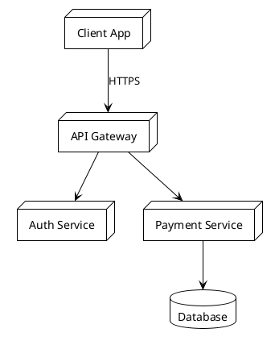
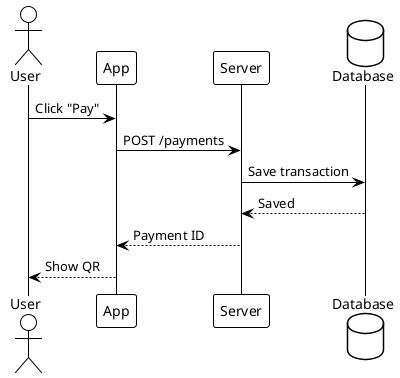
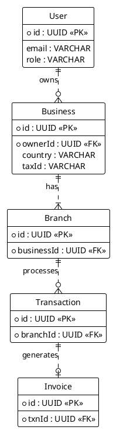
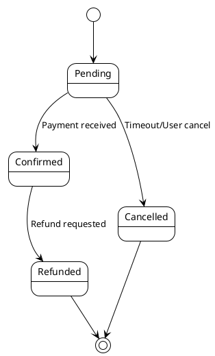
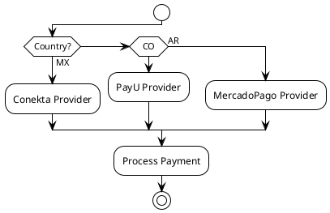
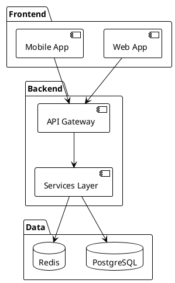
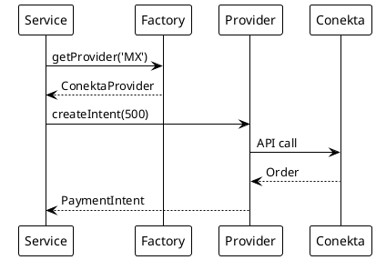

---
# YAML Frontmatter - Metadata for Semantic Search & RAG
document_type: "general"
module: "standards"
status: "approved"
version: "1.0.0"
last_updated: "2025-11-27"
author: "@Architect"

# Keywords for semantic search
keywords:
  - "standards"
  - "documentation"
  - "markdown"
  - "conventions"
  - "style-guide"
  - "plantuml"
  - "mermaid"

# Related documentation
related_docs:
  visual_identity: "docs/process/standards/VISUAL-IDENTITY.md"
  database_schema: ""
  api_design: ""
  feature_design: ""
  ux_flow: ""

# Document-specific metadata
doc_metadata:
  audience: "developers"
  complexity: "low"
  estimated_read_time: "25 min"
---

<!-- AI-INSTRUCTION: START -->
<!--
  This document defines the DOCUMENTATION STANDARDS. When creating new files:
  1. Preserve the Header Table and Metadata block.
  2. Fill in the "Agent Directives" to guide future AI interactions.
  3. Keep the structure strict for RAG (Retrieval Augmented Generation) efficiency.
-->
<!-- AI-INSTRUCTION: END -->

<table width="100%" border="0" cellspacing="0" cellpadding="0">
  <tr>
    <td width="120" align="center" valign="middle">
      
    </td>
    <td align="left" valign="middle">
      <h1 style="margin: 0; border-bottom: none;">Documentation Standards</h1>
      <p style="margin: 0; color: #6e7681; font-size: 1.1em;">Guidelines for creating clear, minimal, and functional documentation</p>
    </td>
  </tr>
</table>

<div align="center">

  <!-- METADATA BADGES -->
  
  
  

</div>

---

## Agent Directives (System Prompt)

_This section contains mandatory instructions for AI Agents (Copilot, Cursor, etc.) interacting with this document._

| Directive      | Instruction                                                          |
| :------------- | :------------------------------------------------------------------- |
| **Context**    | This document defines how to write documentation for this project.   |
| **Constraint** | Use Markdown (`.md`) only. No external diagram tools (use PlantUML). |
| **Pattern**    | Follow the `00-GENERAL-DOC-TEMPLATE.md` structure for all new files. |
| **Related**    | `docs/templates/00-GENERAL-DOC-TEMPLATE.md`                          |

---

## 1. Executive Summary

Establish clear, minimal, and functional documentation standards for the payment system project. All documentation must be accessible (viewable directly in GitHub/VSCode), minimal (no unnecessary decoration), functional (actionable information), and maintainable (easy to update).

## 2. Context & Motivation

Consistent documentation reduces cognitive load and ensures that information is easy to find and understand. By standardizing formats and tools, we enable better collaboration and automated validation of our documentation.

## 3. Core Content

### 3.1. Documentation Principles

#### Clarity Over Style

- Use plain language
- **NO EMOJIS** or decorative elements in documentation or code comments
- Focus on information density
- Structure over aesthetics

#### Native Formats Only

- Markdown (.md) for all documentation
- PlantUML for diagrams (renders in GitHub/VSCode with extension)
- No external diagram formats (no Mermaid, draw.io, etc.)
- Code examples in fenced blocks with language tags

#### Self-Contained Documents

Each document must be complete and understandable on its own:

- Include necessary context
- Link to related docs but don't require reading them
- Avoid "see X for details" without providing summary

#### Progressive Disclosure

Structure information from high-level to detailed:

```text
1. Overview (what/why)
2. Quick Start (immediate action)
3. Details (how it works)
4. Reference (complete specs)
```

### 3.2. Document Structure

#### Standard Template

All documents must follow the Master Template (`docs/templates/00-GENERAL-DOC-TEMPLATE.md`) to ensure AI compatibility and consistent branding.

```markdown
<!-- AI-INSTRUCTION: START -->

...

<!-- AI-INSTRUCTION: END -->

<table width="100%" border="0" cellspacing="0" cellpadding="0">
  ...
</table>

<div align="center">
  ...
</div>

---

## Agent Directives (System Prompt)

...

---

## 1. Executive Summary

...
```

#### File Naming

All filenames must be in **English** and use **UPPER-KEBAB-CASE** for consistency.

```
README.md                 # Project root
GETTING-STARTED.md        # General docs
SYSTEM-ARCHITECTURE.md    # Architecture docs
```

### 3.3. Diagram Standards (PlantUML)

#### Supported Types

Use PlantUML for all diagrams. Renders natively in VSCode (with extension) and is the industry standard for UML.

**Architecture Diagrams:**



**Sequence Diagrams:**



**Entity Relationships:**



**State Machines:**



**Flow Charts:**



#### Diagram Guidelines

1. **Keep it simple**: Max 10-12 nodes per diagram
2. **Meaningful labels**: Use clear, concise names
3. **Consistent naming**: Same entity = same name across diagrams
4. **Direction**: Top-to-bottom or left-to-right only
5. **Grouping**: Use packages or rectangles for logical grouping



### 3.4. Code Documentation

#### Inline Comments

**RULE:** Avoid comments unless absolutely necessary. Code should be self-documenting.

- **Forbidden:** Redundant comments that explain what the code is doing.
- **Allowed:** Comments that explain _why_ a complex decision was made.

```typescript
// Bad: Redundant
const total = a + b; // Add a and b

// Good: Explains why
const total = a + b; // Includes tax adjustment from config
```

#### Function Documentation

Use JSDoc format:

```typescript
/**
 * Creates a payment intent for the specified country.
 *
 * @param country - ISO country code (MX, CO, AR)
 * @param amount - Payment amount in local currency
 * @returns Payment intent with QR code data
 * @throws UnsupportedCountryException if country not configured
 */
async createPaymentIntent(country: string, amount: number): Promise<PaymentIntent> {
  // Implementation
}
```

#### README per Module

Each major module/feature should have a README:

```
src/modules/payments/
  README.md           # Module overview, responsibilities, usage
  payments.service.ts
  payments.controller.ts
  ...
```

**Module README Template:**

```markdown
# Payments Module

Handles payment processing across multiple countries using provider abstraction.

## Responsibilities

- Generate payment intents (QR, links)
- Process webhooks from payment providers
- Maintain transaction state
- Coordinate with billing module

## Usage

### Creating a Payment

[Code example]

### Handling Webhooks

[Code example]

## Architecture

[PlantUML diagram]

## Configuration

[Environment variables, options]
```

### 3.5. API Documentation

#### OpenAPI/Swagger

Generate API docs automatically from decorators:

```typescript
@ApiTags("payments")
@Controller("payments")
export class PaymentsController {
  @Post("create-intent")
  @ApiOperation({ summary: "Create payment intent" })
  @ApiResponse({
    status: 201,
    description: "Intent created",
    type: PaymentIntentDto,
  })
  @ApiResponse({ status: 400, description: "Invalid input" })
  async createIntent(@Body() dto: CreatePaymentDto): Promise<PaymentIntentDto> {
    // Implementation
  }
}
```

#### Endpoint Documentation Format

In markdown docs, use consistent format:

````markdown
### POST /api/payments/create-intent

Creates a new payment intent.

**Request:**

```json
{
  "amount": 500.0,
  "currency": "MXN",
  "customerId": "uuid-here"
}
```

**Response (201 Created):**

```json
{
  "intentId": "uuid",
  "qrCode": "base64-encoded-image",
  "expiresAt": "2025-10-22T12:00:00Z"
}
```

**Errors:**

- 400: Invalid amount or currency
- 404: Business not found
- 500: Provider unavailable
````

### 3.6. Architecture Decision Records (ADR)

Document significant decisions using ADR format.

**Location:** `docs/adr/NNN-short-title.md`

**Template:**

```markdown
# ADR-001: Multi-Country Payment Architecture

## Status

Accepted

## Context

Need to support multiple countries with different payment providers and regulations while maintaining single codebase.

## Decision

Implement Strategy Pattern with PaymentProviderFactory to abstract country-specific payment logic.

## Consequences

### Positive

- Single codebase for all countries
- Easy to add new countries
- Provider-agnostic business logic

### Negative

- Additional abstraction layer
- Must maintain common interface
- Testing complexity increases

## Alternatives Considered

1. Separate codebase per country (rejected: maintenance burden)
2. Config-driven approach without abstraction (rejected: leaky abstractions)
```

### 3.7. Versioning and Maintenance

#### Document Metadata

Include at bottom of documents:

```markdown
---

**Version:** 1.0.0
**Last Updated:** 2025-10-22
**Author:** Architecture Team
**Status:** Active | Draft | Deprecated
```

#### Update Policy

- Update inline when code changes
- Mark deprecated sections clearly
- Remove obsolete docs (don't leave stale info)

Example deprecation notice:

```markdown
> **DEPRECATED:** This approach was replaced in v2.0.0.
> See [NewApproach.md](NewApproach.md) for current implementation.
```

### 3.8. Tools and Extensions

#### Required VSCode Extensions

```json
{
  "recommendations": [
    "jebbs.plantuml",
    "yzhang.markdown-all-in-one",
    "davidanson.vscode-markdownlint",
    "shd101wyy.markdown-preview-enhanced"
  ]
}
```

#### Markdown Linting Rules

`.markdownlint.json`:

```json
{
  "default": true,
  "MD013": false,
  "MD033": false,
  "MD041": false
}
```

#### Git Hooks for Docs

Pre-commit hook to validate markdown:

```bash
#!/bin/sh
# .husky/pre-commit

# Validate markdown files
npx markdownlint 'docs/**/*.md'

# Check for broken links
npx markdown-link-check docs/**/*.md
```

## 4. Examples

### Good Documentation Example

````markdown
# Payment Provider Interface

All payment providers must implement this interface.

## Interface Definition

```typescript
interface IPaymentProvider {
  country: string;
  createIntent(amount: number): Promise<PaymentIntent>;
}
```

## Implementation Example

```typescript
class ConektaProvider implements IPaymentProvider {
  readonly country = "MX";

  async createIntent(amount: number): Promise<PaymentIntent> {
    const order = await this.conekta.orders.create({
      amount,
      currency: "MXN",
    });
    return this.mapToIntent(order);
  }
}
```

## Usage

```typescript
const factory = new PaymentProviderFactory();
const provider = factory.getProvider("MX");
const intent = await provider.createIntent(500);
```

## Flow


````

### Bad Documentation Example

BAD PRACTICE - Too verbose, decorative, external dependencies:\*\*

```markdown
# Payment Provider Interface

Welcome to the **amazing** payment provider documentation!

## What is this?

This is like, totally the best interface ever!

## Architecture

See `payment-arch.puml` and generate with PlantUML.

## Pro Tips

Remember to always...
```

## 5. Checklist for New Documents

Before committing documentation:

- [ ] Title is clear and descriptive
- [ ] No emojis or decorative elements
- [ ] All diagrams use PlantUML (no external formats)
- [ ] Code examples are tested and work
- [ ] Links are valid and relative
- [ ] Metadata footer included
- [ ] Passes markdownlint validation
- [ ] Renders correctly in GitHub preview

```

```
