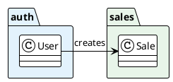
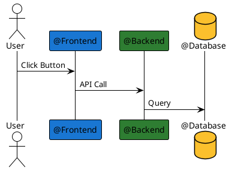

---
# YAML Frontmatter - Metadata for Semantic Search & RAG
document_type: "general"
module: "standards"
status: "approved"
version: "1.0.0"
last_updated: "2025-11-28"
author: "@Scribe"

# Keywords for semantic search
keywords:
  - "visual-identity"
  - "color-codes"
  - "branding"
  - "diagrams"
  - "plantuml"
  - "roles"
  - "agents"

# Related documentation
related_docs:
  standards: "docs/process/standards/STANDARDS.md"
  tooling: "docs/process/standards/TOOLING-STYLE-GUIDE.md"

# Document-specific metadata
doc_metadata:
  audience: "all"
  complexity: "low"
  estimated_read_time: "10 min"
---

<!-- AI-INSTRUCTION: START -->
<!--
  This document defines the VISUAL IDENTITY STANDARDS.
  1. Use these color codes for ALL diagrams (PlantUML).
  2. Use these colors for GitHub Labels and Documentation Badges.
  3. Respect the Agent Persona colors when generating UI or logs.
-->
<!-- AI-INSTRUCTION: END -->

<table width="100%" border="0" cellspacing="0" cellpadding="0">
  <tr>
    <td width="120" align="center" valign="middle">
      
    </td>
    <td align="left" valign="middle">
      <h1 style="margin: 0; border-bottom: none;">Visual Identity & Color Standards</h1>
      <p style="margin: 0; color: #6e7681; font-size: 1.1em;">Unified color system for Domains, Agents, and Diagrams</p>
    </td>
  </tr>
</table>

<div align="center">

  <!-- METADATA BADGES -->
  
  
  

</div>

---

## Agent Directives (System Prompt)

_This section contains mandatory instructions for AI Agents (Copilot, Cursor, etc.) interacting with this document._

| Directive      | Instruction                                                                                              |
| :------------- | :------------------------------------------------------------------------------------------------------- |
| **Context**    | Defines the canonical color codes for Modules, Roles, and Statuses.                                      |
| **Constraint** | **Consistency:** Always use the Hex codes defined here. Do not approximate.                              |
| **Pattern**    | **PlantUML:** Use `package "name" #HEXCODE { ... }` to colorize domains.                                 |
| **Rule**       | **Accessibility:** All text on these background colors MUST be dark (`#333333`) for contrast compliance. |

---

## 1. Executive Summary

This document establishes the **Visual Language** of the Payment System. By assigning specific colors to Domains (Schemas) and Roles (Agents), we reduce cognitive load and allow for instant visual recognition in diagrams, documentation, and issue tracking.

---

## 2. Domain Colors (Modules & Schemas)

These colors represent the functional areas of the system. Use them for:

- **PlantUML Packages:** Background color of the package.
- **GitHub Labels:** Background color of the label (e.g., `domain:sales`).
- **Documentation Badges:** Color of the badge.

| Domain            | Hex Code  | Tailwind Class | Meaning / Vibe                                  |
| :---------------- | :-------- | :------------- | :---------------------------------------------- |
| **Auth**          | `#E3F2FD` | `bg-blue-50`   | **Security, Trust, Identity.** Cool and stable. |
| **Business**      | `#ECEFF1` | `bg-gray-50`   | **Structure, Foundation.** Neutral and solid.   |
| **Communication** | `#F3E5F5` | `bg-purple-50` | **Messaging, Events.** Creative and active.     |
| **Inventory**     | `#FFF3E0` | `bg-orange-50` | **Physical Goods, Stock.** Tangible and warm.   |
| **Sales**         | `#E8F5E9` | `bg-green-50`  | **Revenue, Success, POS.** Positive flow.       |
| **Payments**      | `#E0F7FA` | `bg-cyan-50`   | **Gateways, Flow.** Fluid and transactional.    |
| **Billing**       | `#FFEBEE` | `bg-red-50`    | **Fiscal, Compliance.** Important and official. |

### 2.1. PlantUML Usage Example



---

## 3. Agent & Role Colors (Personas)

These colors identify the **Actors** in the system, whether human or AI. Use them for:

- **Chat Avatars:** Identifying the active AI agent.
- **Sequence Diagram Participants:** Coloring the actor/participant.
- **Jira/Linear Teams:** Tagging tasks by discipline.

| Role / Agent   | Hex Code  | Color Name | Responsibility                            |
| :------------- | :-------- | :--------- | :---------------------------------------- |
| **@Architect** | `#9C27B0` | **Purple** | System Design, Patterns, "The Vision".    |
| **@Backend**   | `#2E7D32` | **Green**  | Node.js, NestJS, Logic, Performance.      |
| **@Frontend**  | `#1976D2` | **Blue**   | Angular, UI/UX, State Management.         |
| **@Database**  | `#FBC02D` | **Gold**   | SQL, Schemas, Migrations, Data Integrity. |
| **@QA**        | `#D32F2F` | **Red**    | Testing, Bug Hunting, Quality Assurance.  |
| **@DevOps**    | `#455A64` | **Slate**  | CI/CD, Docker, Infrastructure, Cloud.     |
| **@Scribe**    | `#FFB300` | **Amber**  | Documentation, Changelogs, History.       |

### 3.1. Sequence Diagram Example



---

## 4. Status Colors (Lifecycle)

Standard colors for entity states and workflow statuses.

| Status               | Hex Code  | Usage                          |
| :------------------- | :-------- | :----------------------------- |
| **Draft / Pending**  | `#9E9E9E` | Initial state, not yet active. |
| **Active / Open**    | `#4CAF50` | Currently functioning, valid.  |
| **Warning / Review** | `#FF9800` | Needs attention, under review. |
| **Error / Failed**   | `#F44336` | Critical failure, blocked.     |
| **Closed / Done**    | `#2196F3` | Completed successfully.        |
| **Voided / Deleted** | `#B0BEC5` | Soft deleted or cancelled.     |

---

## 5. Implementation Guide

### 5.1. GitHub Labels

Create these labels in the repository:

- `domain:auth` (`#E3F2FD`)
- `domain:sales` (`#E8F5E9`)
- `role:frontend` (`#1976D2`)
- `role:backend` (`#2E7D32`)
- `status:approved` (`#4CAF50`)

### 5.2. Documentation Badges

Use Shields.io with custom colors:

```markdown


```

---

## 6. Accessibility Checklist

When using these colors:

1.  **Contrast:** Ensure text on top of these colors is readable.
    - For **Domain Colors** (Pastels): Use **Dark Text** (`#333333`).
    - For **Role Colors** (Vibrant): Use **White Text** (`#FFFFFF`).
2.  **Color Blindness:** Do not rely _only_ on color. Always include text labels or icons.
