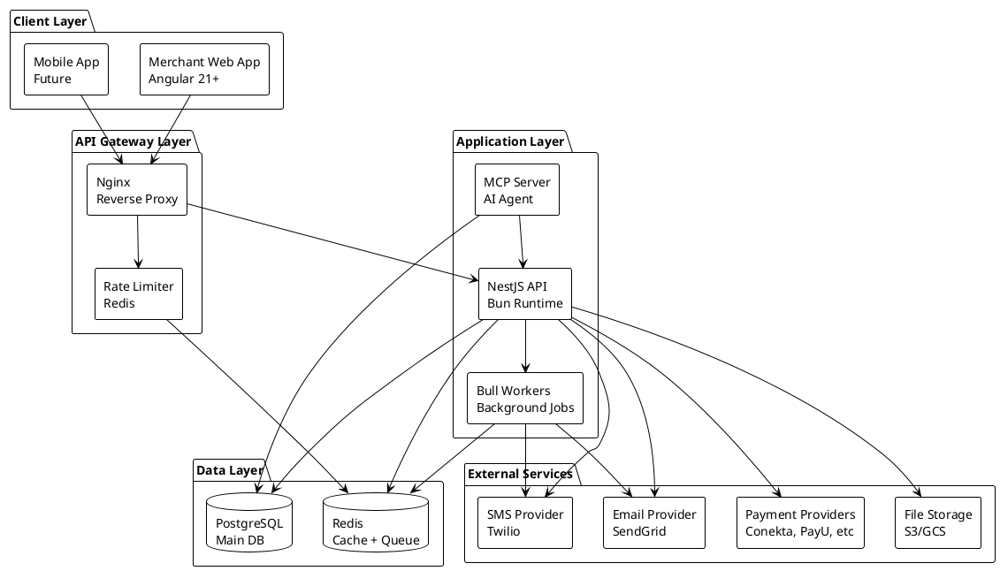
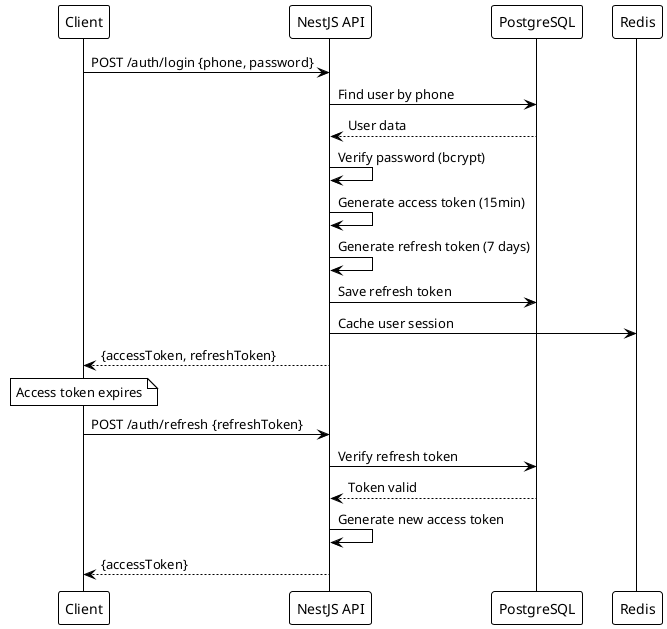

---
# YAML Frontmatter - Metadata for Semantic Search & RAG
document_type: "general"
module: "architecture"
status: "approved"
version: "1.0.0"
last_updated: "2025-11-27"
author: "@Architect"

# Keywords for semantic search
keywords:
  - "preliminary-design"
  - "architecture"
  - "base-architecture"
  - "module-structure"
  - "technical-decisions"
  - "blueprint"
  - "system-design"

# Related documentation
related_docs:
  database_schema: "docs/technical/backend/DATABASE-DESIGN.md"
  api_design: ""
  feature_design: ""
  ux_flow: ""

# Document-specific metadata
doc_metadata:
  audience: "developers"
  complexity: "high"
  estimated_read_time: "40 min"
---

<!--
  ~ PRELIMINARY DESIGN AND BASE ARCHITECTURE
  ~ ============================================================================
  ~
  ~ This document defines the complete preliminary architecture design, including
  ~ core patterns, module structure, and technical decisions before implementation.
  ~
  ~ ----------------------------------------------------------------------------
  ~
  ~ GUIDELINES:
  ~ - Use this design as the blueprint for system implementation.
  ~ - Adhere to the defined module structure and naming conventions.
  ~ - Follow the security and integration patterns specified.
  ~
  ~ ============================================================================
  -->

# Preliminary Design and Base Architecture

<div align="center">


</div>

Complete preliminary architecture design defining core patterns, module structure, and technical decisions before implementation.

---

## Agent Directives (System Prompt)

_This section contains mandatory instructions for AI Agents (Copilot, Cursor, etc.) interacting with this document._

| Directive      | Instruction                                                         |
| :------------- | :------------------------------------------------------------------ |
| **Context**    | This document defines the preliminary design and base architecture. |
| **Constraint** | Use this design as the blueprint for system implementation.         |
| **Pattern**    | Adhere to the defined module structure and naming conventions.      |

---

## Table of Contents

- [System Architecture](#system-architecture)
- [Module Design](#module-design)
- [Database Design](#database-design)
- [API Design](#api-design)
- [Security Architecture](#security-architecture)
- [Integration Patterns](#integration-patterns)
- [Performance Strategy](#performance-strategy)

---

## System Architecture

### High-Level Architecture



### Technology Decisions

| Layer          | Technology               | Rationale                                                                        |
| -------------- | ------------------------ | -------------------------------------------------------------------------------- |
| **Frontend**   | Angular 21+ Standalone   | Zoneless signals, modern reactive patterns, enterprise-ready                     |
| **Backend**    | NestJS 10+ (Bun Runtime) | TypeScript, modular architecture, built-in DI, extensive ecosystem, fast startup |
| **Runtime**    | Bun 1.0+                 | High performance, built-in bundler/test runner, TypeScript support               |
| **Database**   | PostgreSQL 16+           | JSONB for flexibility, full-text search, ACID compliance, proven at scale        |
| **Cache**      | Redis 7+                 | In-memory speed, pub/sub for real-time, job queue support                        |
| **ORM**        | Prisma 5+                | Type-safe, migration system, introspection, excellent DX                         |
| **Queue**      | Bull MQ                  | Redis-based, reliable, retry logic, job scheduling                               |
| **Auth**       | JWT + Refresh            | Stateless, scalable, industry standard                                           |
| **API Docs**   | Swagger/OpenAPI          | Auto-generated from decorators, interactive testing                              |
| **Testing**    | Bun Test + Playwright    | Unit/integration (Bun), E2E (Playwright)                                         |
| **Monitoring** | Grafana + Prometheus     | Metrics visualization, alerting, open source                                     |

---

## Module Design

### Core Modules

```text
apps/backend/src/
├── main.ts                          # Bootstrap application
├── app.module.ts                    # Root module
├── common/                          # Shared utilities
│   ├── decorators/
│   │   ├── current-user.decorator.ts
│   │   └── roles.decorator.ts
│   ├── guards/
│   │   ├── jwt-auth.guard.ts
│   │   └── roles.guard.ts
│   ├── interceptors/
│   │   ├── logging.interceptor.ts
│   │   └── transform.interceptor.ts
│   ├── filters/
│   │   └── http-exception.filter.ts
│   └── pipes/
│       └── validation.pipe.ts
├── config/                          # Configuration
│   ├── app.config.ts
│   ├── database.config.ts
│   ├── redis.config.ts
│   └── payment.config.ts
└── modules/                         # Feature modules
    ├── auth/                        # Authentication & Authorization
    ├── users/                       # User management
    ├── business/                    # Business/merchant management
    ├── branches/                    # Branch management
    ├── payments/                    # Payment processing (CORE)
    ├── inventory/                   # Product & stock management
    ├── sales/                       # Sales transactions
    ├── billing/                     # Invoices & receipts
    ├── cash-register/               # Cash register operations
    ├── analytics/                   # Reports & metrics
    ├── notifications/               # SMS/Email/Push
    └── webhooks/                    # External webhook handlers
```

### Module Template Structure

Every feature module follows this exact structure:

```text
modules/feature-name/
├── feature-name.module.ts           # Module definition
├── feature-name.controller.ts       # REST endpoints
├── feature-name.service.ts          # Business logic
├── feature-name.repository.ts       # Complex queries (optional)
├── dto/
│   ├── create-feature.dto.ts        # Creation input
│   ├── update-feature.dto.ts        # Update input
│   ├── feature-query.dto.ts         # Query parameters
│   └── feature-response.dto.ts      # API response
├── entities/
│   └── feature.entity.ts            # Prisma model type
├── interfaces/
│   └── feature.interface.ts         # TypeScript interfaces
├── exceptions/
│   └── feature.exception.ts         # Custom exceptions
├── events/
│   ├── feature.events.ts            # Event definitions
│   └── feature.listener.ts          # Event handlers
└── tests/
    ├── feature.service.spec.ts      # Unit tests
    ├── feature.controller.spec.ts   # Controller tests
    └── feature.e2e-spec.ts          # E2E tests
```

### Payments Module (Reference Implementation)

> **Most critical module - sets pattern for all others**

```text
modules/payments/
├── payments.module.ts
├── payments.controller.ts           # Public endpoints
├── payments.service.ts              # Orchestration logic
├── payments.repository.ts           # Complex transaction queries
├── dto/
│   ├── create-payment-intent.dto.ts
│   ├── confirm-payment.dto.ts
│   ├── refund-payment.dto.ts
│   ├── payment-query.dto.ts
│   └── payment-response.dto.ts
├── entities/
│   ├── transaction.entity.ts        # From Prisma
│   └── payment-method.entity.ts
├── interfaces/
│   ├── payment-provider.interface.ts # IPaymentProvider contract
│   └── payment-intent.interface.ts
├── providers/                        # Country adapters
│   ├── mexico/
│   │   ├── conekta-provider.service.ts
│   │   └── conekta.config.ts
│   ├── colombia/
│   │   ├── payu-provider.service.ts
│   │   └── payu.config.ts
│   ├── argentina/
│   │   ├── mercadopago-provider.service.ts
│   │   └── mercadopago.config.ts
│   └── chile/
│       ├── khipu-provider.service.ts
│       └── khipu.config.ts
├── factories/
│   └── payment-provider.factory.ts  # Selects adapter by country
├── events/
│   ├── payment.events.ts            # Domain events
│   └── payment.listener.ts          # Side effects handler
└── tests/
    ├── payments.service.spec.ts
    ├── payments.controller.spec.ts
    ├── conekta-provider.spec.ts
    └── payments.e2e-spec.ts
```

**Key Design Decisions:**

1. **IPaymentProvider Interface:** ALL payment operations go through abstraction
2. **Factory Pattern:** Country determined at runtime from business entity
3. **Event-Driven Side Effects:** Notifications/analytics don't block main flow
4. **Repository for Complex Queries:** Service stays focused on orchestration
5. **Provider Isolation:** Each country adapter is independent module

---

## Database Design

### Prisma Schema Structure

**File:** `apps/backend/prisma/schema.prisma`

```prisma
// Configuration
generator client {
  provider = "prisma-client-js"
}

datasource db {
  provider = "postgresql"
  url      = env("DATABASE_URL")
}

// Enums
enum UserRole {
  ADMIN
  MERCHANT
  EMPLOYEE
  CUSTOMER
}

enum KYCLevel {
  LEVEL_0  // Phone only
  LEVEL_1  // + ID
  LEVEL_2  // + Tax info
}

enum TransactionStatus {
  PENDING
  CONFIRMED
  FAILED
  REFUNDED
}

enum PaymentMethodType {
  QR_STATIC
  QR_DYNAMIC
  PAYMENT_LINK
  BANK_TRANSFER
}

// Core Entities
model User {
  id            String    @id @default(uuid())
  phone         String    @unique
  email         String?   @unique
  passwordHash  String
  role          UserRole  @default(MERCHANT)
  kycLevel      KYCLevel  @default(LEVEL_0)

  firstName     String?
  lastName      String?

  isActive      Boolean   @default(true)
  emailVerified Boolean   @default(false)
  phoneVerified Boolean   @default(false)

  createdAt     DateTime  @default(now())
  updatedAt     DateTime  @updatedAt
  deletedAt     DateTime?

  // Relations
  businesses    Business[]
  refreshTokens RefreshToken[]

  @@index([phone])
  @@index([email])
  @@map("users")
}

model RefreshToken {
  id           String   @id @default(uuid())
  userId       String
  token        String   @unique
  expiresAt    DateTime

  createdAt    DateTime @default(now())

  user         User     @relation(fields: [userId], references: [id], onDelete: Cascade)

  @@index([userId])
  @@index([token])
  @@map("refresh_tokens")
}

model Business {
  id              String   @id @default(uuid())
  ownerId         String

  name            String
  legalName       String?
  taxId           String?  @unique  // RFC (MX), NIT (CO), CUIT (AR), RUT (CL)
  country         String   // MX, CO, AR, CL
  industry        String?

  address         String?
  city            String?
  state           String?
  postalCode      String?

  phone           String?
  email           String?
  website         String?

  isActive        Boolean  @default(true)

  createdAt       DateTime @default(now())
  updatedAt       DateTime @updatedAt
  deletedAt       DateTime?

  // Relations
  owner           User         @relation(fields: [ownerId], references: [id])
  branches        Branch[]
  transactions    Transaction[]
  sales           Sale[]
  products        Product[]
  paymentMethods  PaymentMethod[]

  @@index([ownerId])
  @@index([country])
  @@index([taxId])
  @@map("businesses")
}

model Branch {
  id          String   @id @default(uuid())
  businessId  String

  name        String
  address     String
  city        String
  state       String?
  postalCode  String?

  phone       String?

  isActive    Boolean  @default(true)

  createdAt   DateTime @default(now())
  updatedAt   DateTime @updatedAt
  deletedAt   DateTime?

  // Relations
  business    Business      @relation(fields: [businessId], references: [id], onDelete: Cascade)
  sales       Sale[]
  cashRegisters CashRegister[]

  @@index([businessId])
  @@map("branches")
}

model Product {
  id          String   @id @default(uuid())
  businessId  String

  name        String
  sku         String?
  barcode     String?

  description String?
  category    String?

  price       Decimal  @db.Decimal(10, 2)
  cost        Decimal? @db.Decimal(10, 2)

  stock       Int      @default(0)
  minStock    Int      @default(0)

  imageUrl    String?

  isActive    Boolean  @default(true)

  createdAt   DateTime @default(now())
  updatedAt   DateTime @updatedAt
  deletedAt   DateTime?

  // Relations
  business    Business    @relation(fields: [businessId], references: [id], onDelete: Cascade)
  saleItems   SaleItem[]

  @@unique([businessId, sku])
  @@unique([businessId, barcode])
  @@index([businessId])
  @@index([barcode])
  @@map("products")
}

model Transaction {
  id              String            @id @default(uuid())
  businessId      String

  amount          Decimal           @db.Decimal(10, 2)
  currency        String            // MXN, COP, ARS, CLP

  status          TransactionStatus @default(PENDING)

  paymentMethod   String            // QR, LINK, TRANSFER
  country         String            // MX, CO, AR, CL

  // Provider-specific data
  providerAdapter String            // ConektaPaymentProvider, etc
  providerData    Json              // External provider response
  providerRef     String?           // External transaction ID

  // Metadata
  description     String?
  metadata        Json?             // Additional custom data

  // QR/Link specific
  qrCodeUrl       String?
  paymentLink     String?

  // Timestamps
  confirmedAt     DateTime?
  failedAt        DateTime?
  refundedAt      DateTime?

  createdAt       DateTime          @default(now())
  updatedAt       DateTime          @updatedAt

  // Relations
  business        Business          @relation(fields: [businessId], references: [id])
  sale            Sale?
  webhookEvents   WebhookEvent[]

  @@index([businessId])
  @@index([status])
  @@index([providerRef])
  @@index([createdAt])
  @@map("transactions")
}

model Sale {
  id             String   @id @default(uuid())
  businessId     String
  branchId       String?
  transactionId  String?  @unique

  subtotal       Decimal  @db.Decimal(10, 2)
  tax            Decimal  @db.Decimal(10, 2) @default(0)
  discount       Decimal  @db.Decimal(10, 2) @default(0)
  total          Decimal  @db.Decimal(10, 2)

  customerName   String?
  customerPhone  String?
  customerEmail  String?

  notes          String?

  createdAt      DateTime @default(now())
  updatedAt      DateTime @updatedAt

  // Relations
  business       Business     @relation(fields: [businessId], references: [id])
  branch         Branch?      @relation(fields: [branchId], references: [id])
  transaction    Transaction? @relation(fields: [transactionId], references: [id])
  items          SaleItem[]
  invoice        Invoice?

  @@index([businessId])
  @@index([branchId])
  @@index([createdAt])
  @@map("sales")
}

model SaleItem {
  id         String  @id @default(uuid())
  saleId     String
  productId  String

  quantity   Int
  unitPrice  Decimal @db.Decimal(10, 2)
  total      Decimal @db.Decimal(10, 2)

  // Relations
  sale       Sale    @relation(fields: [saleId], references: [id], onDelete: Cascade)
  product    Product @relation(fields: [productId], references: [id])

  @@index([saleId])
  @@index([productId])
  @@map("sale_items")
}

model Invoice {
  id              String   @id @default(uuid())
  saleId          String   @unique

  invoiceNumber   String   @unique

  // Country-specific fiscal data
  fiscalData      Json     // SAT (MX), DIAN (CO), AFIP (AR) response

  pdfUrl          String?
  xmlUrl          String?  // Mexico CFDi, etc

  status          String   // ISSUED, CANCELED

  createdAt       DateTime @default(now())
  canceledAt      DateTime?

  // Relations
  sale            Sale     @relation(fields: [saleId], references: [id])

  @@index([invoiceNumber])
  @@index([saleId])
  @@map("invoices")
}

model PaymentMethod {
  id              String            @id @default(uuid())
  businessId      String

  type            PaymentMethodType

  name            String            // "QR Tienda Principal", "Link WhatsApp"
  description     String?

  // For static QR
  qrCodeUrl       String?
  qrImageUrl      String?

  // For payment links
  linkTemplate    String?           // Base URL template

  isActive        Boolean           @default(true)

  createdAt       DateTime          @default(now())
  updatedAt       DateTime          @updatedAt

  // Relations
  business        Business          @relation(fields: [businessId], references: [id], onDelete: Cascade)

  @@index([businessId])
  @@map("payment_methods")
}

model CashRegister {
  id          String    @id @default(uuid())
  branchId    String

  name        String

  openedAt    DateTime?
  closedAt    DateTime?

  openingCash Decimal   @db.Decimal(10, 2) @default(0)
  closingCash Decimal?  @db.Decimal(10, 2)

  expectedCash Decimal? @db.Decimal(10, 2)
  difference   Decimal? @db.Decimal(10, 2)

  notes       String?

  createdAt   DateTime  @default(now())
  updatedAt   DateTime  @updatedAt

  // Relations
  branch      Branch    @relation(fields: [branchId], references: [id], onDelete: Cascade)

  @@index([branchId])
  @@index([openedAt])
  @@map("cash_registers")
}

model WebhookEvent {
  id             String   @id @default(uuid())
  transactionId  String?

  provider       String   // conekta, payu, mercadopago
  eventType      String   // payment.confirmed, payment.failed, etc

  payload        Json     // Raw webhook payload
  signature      String?  // Webhook signature for verification

  processed      Boolean  @default(false)
  processedAt    DateTime?

  createdAt      DateTime @default(now())

  // Relations
  transaction    Transaction? @relation(fields: [transactionId], references: [id])

  @@index([transactionId])
  @@index([provider])
  @@index([processed])
  @@index([createdAt])
  @@map("webhook_events")
}
```

### Database Indexes Strategy

**Primary Indexes (created above):**

- Foreign keys: All relations indexed
- Query patterns: `businessId`, `status`, `createdAt`
- Unique constraints: `phone`, `email`, `taxId`, `invoiceNumber`

**Additional Indexes (create after data analysis):**

- Composite indexes for common queries
- Full-text search indexes for product search
- Partial indexes for active records only

---

## API Design

### REST API Conventions

**Base URL:** `/api/v1`

**Authentication:** JWT Bearer token in `Authorization` header

**Standard Endpoints Pattern:**

```text
Resource: /api/v1/resource

GET    /resource           # List (paginated)
GET    /resource/:id       # Get by ID
POST   /resource           # Create
PUT    /resource/:id       # Full update
PATCH  /resource/:id       # Partial update
DELETE /resource/:id       # Delete (soft delete)

Nested: /resource/:id/nested
GET    /resource/:id/nested        # List nested
POST   /resource/:id/nested        # Create nested
GET    /resource/:id/nested/:nid   # Get nested by ID
```

### Response Format

**Success Response:**

```json
{
  "data": {
    "id": "uuid",
    "name": "Resource Name",
    "value": 42
  }
}
```

**List Response (Paginated):**

```json
{
  "data": [
    { "id": "uuid-1", "name": "Item 1" },
    { "id": "uuid-2", "name": "Item 2" }
  ],
  "meta": {
    "total": 100,
    "page": 1,
    "limit": 20,
    "totalPages": 5
  }
}
```

**Error Response:**

```json
{
  "statusCode": 400,
  "message": "Validation failed",
  "errors": [
    {
      "field": "email",
      "message": "email must be a valid email address"
    }
  ]
}
```

### Payment API Endpoints (Core)

```text
POST   /payments/intent                # Create payment intent (QR/Link)
GET    /payments/:id                   # Get payment status
POST   /payments/:id/confirm           # Manual confirmation (testing)
POST   /payments/:id/refund            # Refund payment
GET    /payments                       # List payments (filtered)

POST   /webhooks/conekta               # Conekta webhook
POST   /webhooks/payu                  # PayU webhook
POST   /webhooks/mercadopago           # Mercado Pago webhook
POST   /webhooks/khipu                 # Khipu webhook
```

---

## Security Architecture

### Authentication Flow



### Authorization Levels

**Role-Based Access Control (RBAC):**

| Role         | Access                                             |
| ------------ | -------------------------------------------------- |
| **ADMIN**    | Full system access, user management, system config |
| **MERCHANT** | Own business data, create sales, manage inventory  |
| **EMPLOYEE** | Branch-level access, create sales, view reports    |
| **CUSTOMER** | Future use (if customer portal added)              |

**Resource Ownership:**

- Users can only access their own businesses
- Employees can only access assigned branches
- Cross-business access blocked at guard level

### Input Validation

**Layers of Validation:**

1. **DTO Validation (class-validator):** Type checking, format validation
2. **Business Rule Validation (Service):** Amount limits, status transitions
3. **Database Constraints:** Unique constraints, foreign keys
4. **Sanitization:** Strip HTML, prevent XSS

### Secrets Management

**Environment Variables (never commit):**

- `JWT_SECRET` - Random 256-bit key
- `JWT_REFRESH_SECRET` - Different random key
- `DATABASE_URL` - PostgreSQL connection string
- `REDIS_URL` - Redis connection string
- Payment provider API keys
- SMS/Email API keys

**Encryption at Rest:**

- Password hashing: bcrypt (cost factor 12)
- Sensitive PII: AES-256-GCM encryption
- Database encryption: PostgreSQL native encryption

---

## Integration Patterns

### Payment Provider Integration

**Interface Contract:**

```typescript
export interface IPaymentProvider {
  readonly country: string;
  readonly currency: string;

  createPaymentIntent(dto: CreatePaymentDto): Promise<PaymentIntent>;
  generateQRCode(intentId: string): Promise<QRCodeData>;
  confirmPayment(intentId: string): Promise<PaymentConfirmation>;
  refund(transactionId: string, amount: number): Promise<RefundResult>;
  verifyWebhookSignature(payload: string, signature: string): boolean;
}

export interface PaymentIntent {
  id: string;
  amount: number;
  currency: string;
  qrCodeUrl: string;
  paymentLink: string;
  expiresAt: Date;
  providerData: Record<string, any>;
}

export interface QRCodeData {
  format: "SPEI" | "PSE" | "PIX" | "QR";
  content: string;
  imageUrl: string;
}

export interface PaymentConfirmation {
  transactionId: string;
  status: "CONFIRMED" | "FAILED";
  confirmedAt: Date;
  providerRef: string;
}

export interface RefundResult {
  refundId: string;
  amount: number;
  status: "PROCESSED" | "PENDING" | "FAILED";
  providerRef: string;
}
```

### Webhook Processing

**Generic Webhook Handler:**

```typescript
@Controller("webhooks")
export class WebhooksController {
  constructor(
    private factory: PaymentProviderFactory,
    private webhookService: WebhookService,
  ) {}

  @Post(":provider")
  async handleWebhook(
    @Param("provider") provider: string,
    @Body() payload: any,
    @Headers("signature") signature: string,
  ): Promise<void> {
    // 1. Log webhook receipt
    await this.webhookService.logWebhook(provider, payload);

    // 2. Verify signature
    const providerInstance = this.factory.getProviderByName(provider);
    const isValid = providerInstance.verifyWebhookSignature(
      JSON.stringify(payload),
      signature,
    );

    if (!isValid) {
      throw new UnauthorizedException("Invalid webhook signature");
    }

    // 3. Process webhook (idempotent)
    await this.webhookService.process(provider, payload);

    // 4. Return success (providers expect 200)
    return;
  }
}
```

---

## Performance Strategy

### Caching Strategy

**Redis Cache Layers:**

1. **User Sessions:** 15 min TTL (access token lifetime)
2. **Business Data:** 1 hour TTL (rarely changes)
3. **Product Catalog:** 5 min TTL (inventory changes frequently)
4. **Analytics Queries:** 1 hour TTL (not real-time critical)

**Cache Invalidation:**

- Write-through: Update cache when database updated
- Event-based: Clear cache on specific events
- TTL-based: Expire automatically

### Database Optimization

**Query Optimization:**

- Use Prisma's `select` and `include` to fetch only needed fields
- Paginate all list endpoints (default 20, max 100)
- Use database indexes for filter fields
- Avoid N+1 queries with `include` relations

**Connection Pooling:**

```typescript
// Prisma client configuration
datasource db {
  provider = "postgresql"
  url      = env("DATABASE_URL")

  // Connection pool settings
  connection_limit = 10
  pool_timeout = 10
}
```

### Background Jobs

**Bull Queue Jobs:**

1. **Email Sending:** Async, retry 3 times
2. **SMS Sending:** Async, retry 3 times
3. **Invoice Generation:** Async, retry 3 times
4. **Analytics Aggregation:** Scheduled daily
5. **Webhook Retry:** Exponential backoff

**Job Priorities:**

- Critical: Payment confirmations (priority 10)
- High: User notifications (priority 5)
- Normal: Reports generation (priority 1)

---

**Version:** 1.0.0
**Last Updated:** 2025-11-01
**Status:** Preliminary - Foundation for Implementation
