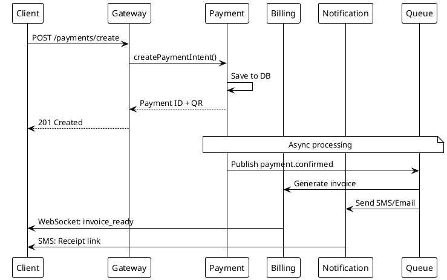
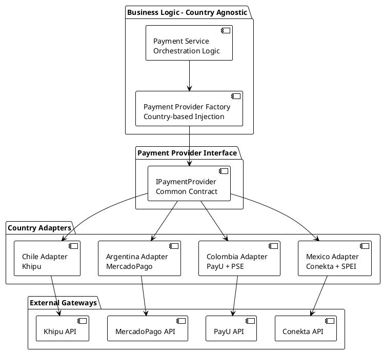
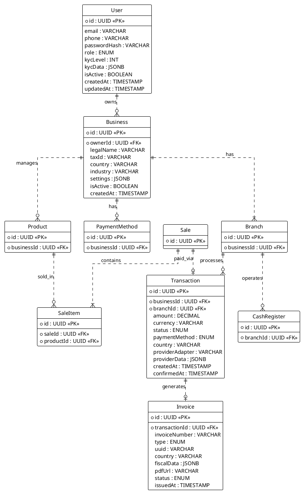
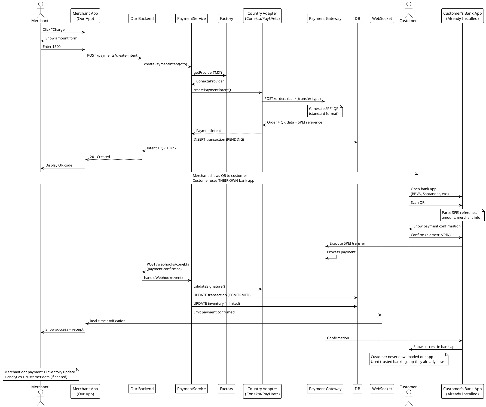
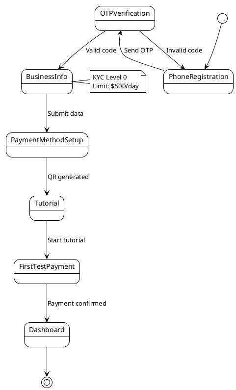
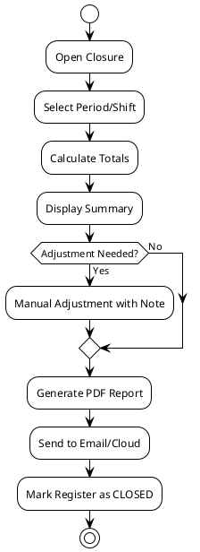
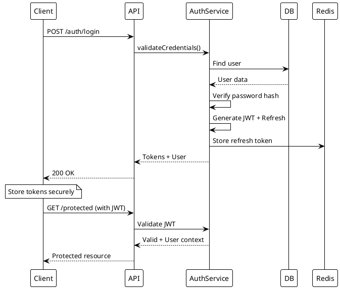

---
# YAML Frontmatter - Metadata for Semantic Search & RAG
document_type: "general"
module: "architecture"
status: "approved"
version: "1.0.0"
last_updated: "2025-11-27"
author: "@Architect"

# Keywords for semantic search
keywords:
  - "architecture"
  - "system-design"
  - "technology-stack"
  - "platform"
  - "modules"
  - "nestjs"
  - "angular"
  - "postgresql"
  - "monorepo"

# Related documentation
related_docs:
  database_schema: "docs/technical/backend/DATABASE-DESIGN.md"
  api_design: ""
  feature_design: ""
  ux_flow: ""

# Document-specific metadata
doc_metadata:
  audience: "developers"
  complexity: "high"
  estimated_read_time: "30 min"
---

<!--
  ~ SYSTEM ARCHITECTURE
  ~ ============================================================================
  ~
  ~ This document defines the high-level architecture of the system, including
  ~ the technology stack, core modules, data model, and critical flows.
  ~
  ~ ----------------------------------------------------------------------------
  ~
  ~ GUIDELINES:
  ~ - Keep the architecture diagrams up to date.
  ~ - Document any major architectural changes.
  ~ - Ensure the technology stack reflects the current implementation.
  ~
  ~ ============================================================================
  -->

# System Architecture

<div align="center">


</div>

**Platform-First Architecture:** A unified ecosystem where a single user identity can access multiple specialized business products (Restaurant, Retail, Services).

**Philosophy:** "One Account, Infinite Possibilities."

---

## Agent Directives (System Prompt)

_This section contains mandatory instructions for AI Agents (Copilot, Cursor, etc.) interacting with this document._

| Directive      | Instruction                                                                      |
| :------------- | :------------------------------------------------------------------------------- |
| **Context**    | This document defines the high-level architecture, tech stack, and core modules. |
| **Constraint** | All architectural changes MUST be reflected here first.                          |
| **Pattern**    | Follow the 'Platform vs Product' pattern defined in the text.                    |
| **Related**    | `docs/technical/backend/DATABASE-DESIGN.md`                                      |

---

## Table of Contents

- [Overview](#overview)
- [Platform Strategy](#platform-strategy)
- [Technology Stack](#technology-stack)
- [System Architecture](#system-architecture)
- [Multi-Country Design](#multi-country-design)
- [Core Modules](#core-modules)
- [Data Model](#data-model)
- [Critical Flows](#critical-flows)
- [Security](#security)

---

## Overview

### Core Value Proposition

**For Merchants:**

- **Unified Identity:** One account to manage multiple businesses of different types.
- **Specialized Tools:** Interfaces adapted to the specific business type (Restaurant vs Retail).
- **Shared Ecosystem:** Centralized payments, notifications, and analytics across all products.

**For Customers:**

- Fast payments with any bank account
- Automatic receipts and invoices
- Financial control (categorized expense history)

---

## Platform Strategy

We differentiate between the **Platform** (Shared Services) and the **Products** (Vertical Experiences).

### 1. The Platform (Shared Layer)

Common infrastructure used by all products:

- **Identity:** Auth, User Profiles, KYC.
- **Payments:** Gateway abstraction, Transaction processing.
- **Communication:** SMS, Email, Push Notifications.
- **Billing:** Fiscal compliance and invoicing.

### 2. The Products (Vertical Layer)

Specialized experiences activated by the `Business.type` field:

| Product        | Target                       | Key Features                                                       |
| :------------- | :--------------------------- | :----------------------------------------------------------------- |
| **Restaurant** | Cafes, Bars, Restaurants     | Table management, Kitchen Display System (KDS), Tips, Split bills. |
| **Retail**     | Shops, Grocery, Boutiques    | Barcode scanning, Inventory variants, Quick checkout.              |
| **Service**    | Consultants, Salons, Repairs | Appointment scheduling, Hourly billing, Service catalog.           |

---

## Technology Stack

### Backend

- **Runtime:** Bun 1.3+
- **Framework:** NestJS 10+
- **Language:** TypeScript 5.3+ (strict mode)
- **ORM:** Prisma 5+
- **Database:** PostgreSQL 16+
- **Cache/Queue:** Redis 7+ with Bull MQ
- **Authentication:** Passport.js + JWT
- **Validation:** class-validator + class-transformer
- **Testing:** Jest + Supertest
- **Documentation:** Swagger/OpenAPI (auto-generated)

### Frontend (PWA)

- **Framework:** Angular 21+
- **Architecture:** Progressive Web App (PWA)
- **Offline Storage:** IndexedDB (via Dexie.js)
- **Sync Strategy:** Background Sync with Conflict Resolution
- **Components:** Standalone (no NgModules)
- **Features:** Signals, control flow syntax, inject()
- **State:** NgRx Signal Store
- **UI:** Angular Material 18+ or PrimeNG
- **Forms:** Reactive Forms with typed validators
- **HTTP:** HttpClient with interceptors
- **Testing:** Vitest + Playwright

### Infrastructure

- **Containerization:** Docker + Docker Compose (Base image: `oven/bun:1`)
- **Orchestration:** Kubernetes (production)
- **CI/CD:** GitHub Actions
- **Monitoring:** Grafana + Prometheus + Loki
- **APM:** OpenTelemetry + Jaeger

### Quality Tools

- **Linting:** ESLint + Prettier
- **Git Hooks:** Husky + lint-staged
- **Commits:** Conventional Commits
- **Coverage:** 80% minimum

---

## System Architecture

### High-Level Architecture

```plantuml
@startuml
!theme plain
package "Presentation Layer" {
  [Web Application
Angular 19] as WebApp
  [Mobile Application
Ionic + Angular] as MobileApp
  [Admin Dashboard] as Dashboard
}

package "API Layer" {
  [API Gateway
JWT Auth, Rate Limiting] as Gateway
}

package "Business Logic Layer" {
  [Auth Module
Login, KYC, Roles] as Auth
  [Payment Module
Multi-Country Abstraction] as Payment
  [Business Module
Merchants, Branches] as Business
  [Sales Module
Transactions, Cash Register] as Sales
  [Billing Module
Invoices, Receipts] as Billing
  [Inventory Module
Products, Stock, Recipes] as Inventory
  [Notifications Module
SMS, Email, Push] as Notifications
  [Analytics Module
Reports, Metrics] as Analytics
}

package "Data Layer" {
  database "PostgreSQL
Primary Data" as DB
  database "Redis
Cache + Queue" as Cache
}

package "External Integrations" {
  [Payment Gateways
Conekta, PayU, MercadoPago] as PaymentGateways
  [Fiscal Services
SAT, DIAN, AFIP] as FiscalServices
  [Communications
Twilio, SendGrid, Firebase] as CommsProviders
}

WebApp --> Gateway
MobileApp --> Gateway
Dashboard --> Gateway

Gateway --> Auth
Gateway --> Payment
Gateway --> Business
Gateway --> Sales
Gateway --> Billing

Payment --> PaymentGateways
Billing --> FiscalServices
Notifications --> CommsProviders

Auth --> DB
Payment --> DB
Business --> DB
Sales --> DB
Billing --> DB

Payment --> Cache
Notifications --> Cache
Auth --> Cache
@enduml
```

### Module Communication



---

## Multi-Country Design

### Payment Abstraction Pattern

Strategy + Factory pattern enables same application to operate in multiple countries by swapping only the payment provider layer.



### Provider Interface

All payment providers implement this interface:

```typescript
interface IPaymentProvider {
  readonly country: string;
  readonly currency: string;
  readonly supportedMethods: PaymentMethod[];

  createPaymentIntent(params: CreatePaymentDTO): Promise<PaymentIntent>;
  generateQRCode(intentId: string): Promise<QRCodeData>;
  generatePaymentLink(intentId: string): Promise<string>;
  confirmPayment(intentId: string): Promise<PaymentConfirmation>;
  refund(transactionId: string, amount: number): Promise<RefundResult>;
  getTransactionStatus(transactionId: string): Promise<TransactionStatus>;
}
```

### Factory Implementation

```typescript
@Injectable()
export class PaymentProviderFactory {
  constructor(
    @Inject("PAYMENT_PROVIDERS")
    private providers: Map<string, IPaymentProvider>,
  ) {}

  getProvider(country: string): IPaymentProvider {
    const provider = this.providers.get(country.toUpperCase());
    if (!provider) {
      throw new UnsupportedCountryException(country);
    }
    return provider;
  }
}
```

### Country-Specific Configuration

```typescript
// config/payment.config.ts
export default {
  MX: {
    adapter: "ConektaPaymentProvider",
    apiKey: process.env.CONEKTA_API_KEY,
    webhookSecret: process.env.CONEKTA_WEBHOOK_SECRET,
    features: ["qr", "spei", "oxxo"],
  },
  CO: {
    adapter: "PayUPaymentProvider",
    apiKey: process.env.PAYU_API_KEY,
    merchantId: process.env.PAYU_MERCHANT_ID,
    features: ["qr", "pse", "card"],
  },
  // ... other countries
};
```

---

## Core Modules

### Authentication Module

**Responsibilities:**

- User registration and login
- JWT token management (access + refresh)
- Role-based access control (RBAC)
- Progressive KYC verification
- Session management

**KYC Levels:**

- Level 0: Phone only - $500/day limit
- Level 1: + ID document - $5,000/day limit
- Level 2: + Address proof + tax data - Unlimited + invoicing

### Payment Module

**Responsibilities:**

- Payment intent creation
- QR code generation (static/dynamic)
- Payment link generation
- Webhook processing
- Transaction state management
- Provider coordination

**Structure:**

```
src/modules/payments/
├── payments.module.ts
├── payments.controller.ts
├── payments.service.ts
├── interfaces/
│   └── payment-provider.interface.ts
├── factories/
│   └── payment-provider.factory.ts
├── providers/
│   ├── mexico/conekta-provider.service.ts
│   ├── colombia/payu-provider.service.ts
│   └── argentina/mercadopago-provider.service.ts
├── dto/
│   ├── create-payment.dto.ts
│   └── payment-intent.dto.ts
└── entities/
    └── transaction.entity.ts
```

### Business Module

**Responsibilities:**

- Merchant registration and management
- Branch management
- Employee/cashier management
- Business configuration

### Sales Module

**Responsibilities:**

- Sale registration
- Cash register operations
- Shift closures
- Cash reconciliation

### Billing Module

**Responsibilities:**

- Receipt generation (PDF)
- Electronic invoicing (CFDI for Mexico, equivalents for other countries)
- Fiscal compliance per country
- Invoice storage and retrieval

### Inventory Module

**Responsibilities:**

- Product catalog management (Items, Services, Composite)
- Stock tracking (Multi-branch)
- Recipe & Pack management (Product Components)
- Low stock alerts & Overselling detection
- Product categories & Modifiers

### Notifications Module

**Responsibilities:**

- Multi-channel messaging (SMS, Email, Push, WhatsApp)
- Template management
- Async delivery via Bull Queue
- Retry logic

### Analytics Module

**Responsibilities:**

- Real-time dashboards
- Sales reports
- Export functionality (CSV, PDF, Excel)
- Basic ML predictions

---

## Data Model

### Core Entities



### Key Design Decisions

**UUIDs for Primary Keys:**

- Better for distributed systems
- No sequential disclosure
- Merge-friendly across environments

**JSONB Fields:**

- `providerData`: Store country-specific payment data
- `fiscalData`: Store country-specific fiscal information
- `kycData`: Store progressive verification documents
- `settings`: Store business-specific configurations

**Soft Deletes:**

- All entities include optional `deletedAt` timestamp
- Preserve data for auditing and compliance

**Timestamps:**

- Mandatory `createdAt` and `updatedAt` on all entities
- Specific timestamps for state changes (`confirmedAt`, `issuedAt`, etc.)

---

## Critical Flows

### Flow 1: Payment by Dynamic QR (No Customer App Required)

**Critical Design: Customer uses their existing banking app (BBVA, Santander, Banorte, etc.). No customer onboarding needed.**



**Why This Works:**

1. **Open Standards:** QR uses SPEI (Mexico), PSE (Colombia), PIX (Brazil), etc. - all banks support these.
2. **Zero Customer Friction:** Customer already trusts and uses their bank app daily.
3. **Immediate Activation:** Merchant can accept payments from 100% of customers day 1.
4. **No Two-Sided Network:** Don't need to convince customers to download anything.
5. **Lower CAC:** Only acquire merchants ($85), not customers ($0).

**Target Time:** < 30 seconds end-to-end

### Flow 2: Merchant Onboarding



**Steps:**

1. User provides phone number + country
2. System sends OTP via SMS
3. User verifies OTP
4. System creates User (role=MERCHANT, kycLevel=0)
5. User provides business data (name, tax ID, industry)
6. System creates Business + default Branch
7. System generates static QR via PaymentProviderFactory
8. User completes interactive tutorial (test payment)
9. User redirected to dashboard

### Flow 3: Cash Register Closure



**Calculation includes:**

- Total sales
- Cash vs digital payments
- Refunds
- Platform commissions
- Expected vs actual cash
- Discrepancies with notes

---

## Security

### Authentication Flow



### Security Requirements

**Transport Security:**

- TLS 1.3 for all communications
- Certificate pinning for mobile apps
- HSTS headers enabled

**Data Security:**

- AES-256 encryption for sensitive data at rest
- No credit card data stored (tokenization only)
- PII encrypted in database

**Authentication:**

- JWT access tokens (15min expiry)
- Refresh tokens (7 day expiry with rotation)
- Multi-device session management
- Account lockout after 5 failed attempts

**Authorization:**

- Role-based access control (RBAC)
- Permission-based guards on endpoints
- Row-level security for multi-tenant data

**Rate Limiting:**

- 100 requests/minute per user
- 1000 requests/minute per IP
- Exponential backoff for retries

**Input Validation:**

- DTO validation with class-validator
- SQL injection prevention (Prisma parameterized queries)
- XSS prevention (sanitization + CSP headers)

**Audit Trail:**

- Immutable transaction logs
- User action tracking
- Webhook payload archival

### Compliance

**PCI DSS:**

- No card data storage
- Use payment gateway tokenization
- Secure transmission only

**KYC/AML:**

- Progressive verification levels
- Document storage with encryption
- Compliance with local regulations

**Data Privacy:**

- GDPR/LFPDPPP compliance
- Right to data export
- Right to be forgotten (with transaction preservation)
- Explicit consent management

**Fiscal Compliance:**

- Country-specific electronic invoicing
- Tax calculation per jurisdiction
- Audit-ready reports

---

## MVP Scope

### Phase 1 (1-3 months)

**Included:**

- Merchant registration and login (mobile app)
- Static QR generation
- Payment link creation
- Single payment gateway integration (Stripe or Conekta)
- Webhook payment confirmation
- Simple PDF receipt generation
- Basic sales history
- Simple web dashboard (daily reports)

**Excluded:**

- Advanced inventory management
- Electronic invoicing (SAT/DIAN/AFIP)
- Multi-branch support
- NFC payments
- Complex roles and permissions
- Customer loyalty programs

### Success Metrics

- 3 pilot merchants
- 50+ transactions per merchant in first month
- 95%+ payment success rate
- < 60 seconds average payment time
- NPS > 30

---

## Adding New Country

To add support for a new country (e.g., Chile):

**1. Create Provider:**

```typescript
// src/modules/payments/providers/chile/khipu-provider.service.ts
@Injectable()
export class KhipuPaymentProvider implements IPaymentProvider {
  readonly country = "CL";
  readonly currency = "CLP";
  readonly supportedMethods = ["qr", "bank_transfer"];

  async createPaymentIntent(params: CreatePaymentDTO): Promise<PaymentIntent> {
    // Khipu-specific implementation
  }

  // ... implement other methods
}
```

**2. Register in Module:**

```typescript
// payments.module.ts
{
  provide: 'PAYMENT_PROVIDERS',
  useFactory: () => {
    const map = new Map();
    map.set('MX', new ConektaPaymentProvider());
    map.set('CO', new PayUPaymentProvider());
    map.set('AR', new MercadoPagoPaymentProvider());
    map.set('CL', new KhipuPaymentProvider()); // New
    return map;
  }
}
```

**3. Add Configuration:**

```typescript
// config/payment.config.ts
CL: {
  adapter: 'KhipuPaymentProvider',
  apiKey: process.env.KHIPU_API_KEY,
  features: ['qr', 'bank_transfer']
}
```

**4. Frontend Environment:**

```typescript
// environments/environment.cl.ts
export const environment = {
  country: "CL",
  currency: "CLP",
  apiUrl: "https://api-cl.example.com",
};
```

**Estimated effort:** 3-5 days (adapter + tests + docs)

---

## Reference Documentation

- [Project Structure](../../process/standards/PROJECT-STRUCTURE.md)
- [Documentation Standards](STANDARDS.md)
- [API Specification](api/openapi.yaml)
- [Prisma Schema](../apps/backend/prisma/schema.prisma)
- [Architecture Decision Records](adr/)

---

**Version:** 2.0.0
**Last Updated:** 2025-10-22
**Author:** Architecture Team
**Status:** Active
