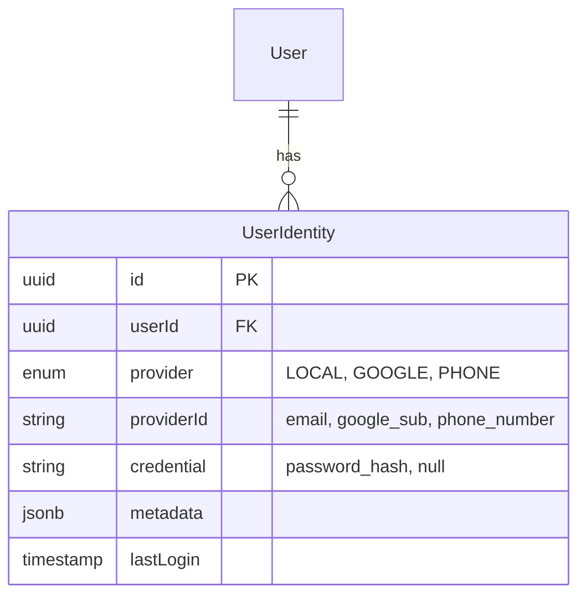

<!-- AI-INSTRUCTION: START -->
<!--
  This document is a TEMPLATE for Architecture Decision Records (ADR).
  1. Preserve the Header Table and Metadata block.
  2. Fill in the "Agent Directives" to guide future AI interactions.
  3. Keep the structure strict for RAG (Retrieval Augmented Generation) efficiency.
-->
<!-- AI-INSTRUCTION: END -->

<table width="100%" border="0" cellspacing="0" cellpadding="0">
  <tr>
    <td width="120" align="center" valign="middle">
      <!--  -->
      <!-- Logo placeholder -->
    </td>
    <td align="left" valign="middle">
      <h1 style="margin: 0; border-bottom: none;">ADR-001: Authentication Strategy (Internal vs External)</h1>
      
Architecture Decision Record

    </td>
  </tr>
</table>

  <!-- METADATA BADGES -->
  
  
  

---

## 🤖 Agent Directives (System Prompt)

_This section contains mandatory instructions for AI Agents (Copilot, Cursor, etc.) interacting with this document._

| Directive      | Instruction                                                                                          |
| :------------- | :--------------------------------------------------------------------------------------------------- |
| **Context**    | This document records the decision to build an internal authentication system instead of using BaaS. |
| **Constraint** | Do NOT suggest Firebase/Supabase/Auth0 unless the business model changes drastically.                |
| **Pattern**    | Use NestJS + Passport.js + Argon2 for all authentication flows.                                      |
| **Related**    | `docs/technical/backend/DATABASE-DESIGN.md`                                                          |

---

## 1. Context & Problem Statement

The system requires user authentication via multiple channels:

1.  **Email/Password** (Traditional)
2.  **Phone Number** (OTP - Critical for mobile-first merchants)
3.  **Social Login** (Google - Low friction)

We need to decide whether to build this internally or use an external provider (BaaS).

## 2. Decision Drivers

- **Cost:** We aim for zero fixed costs per user to support our "no monthly fee" business model.
- **Data Sovereignty:** We need absolute control over user data and KYC status for financial compliance.
- **Flexibility:** We need to link multiple login methods to a single "Business" entity and support complex role switching.

## 3. Considered Options

- **Option 1: External Provider (Firebase/Supabase/Auth0)**
  - Fast implementation.
  - Handles SMS delivery.
  - Vendor lock-in and scaling costs.
- **Option 2: Internal (NestJS + Passport.js)**
  - Full control and zero marginal cost.
  - Seamless integration with PostgreSQL.
  - Requires implementing security and SMS gateway manually.

## 4. Decision Outcome

Chosen option: **Option 2: Internal (NestJS + Passport.js)**, because it aligns with our philosophy of minimizing fixed costs and maximizing control over financial data.

### 4.1. Positive Consequences

- **No Vendor Bills:** We only pay for infrastructure (which we already have) and SMS (per usage).
- **Extensibility:** We can add any custom logic to the login flow (e.g., fraud checks, custom KYC).
- **Data Ownership:** All user data resides in our database, simplifying backups and compliance.

### 4.2. Negative Consequences

- **Development Effort:** We must implement password hashing, session management, and OAuth handshakes.
- **Security Responsibility:** We are fully responsible for securing credentials (using Argon2, secure cookies/tokens).

## 5. Pros and Cons of the Options

### Option 1: External Provider (Firebase/Supabase)

- **Pros:**
  - Speed to market.
  - Built-in security features (MFA, anomaly detection).
- **Cons:**
  - Cost scales with MAUs (Monthly Active Users).
  - Data residency concerns.
  - Complex integration with custom relational data.

### Option 2: Internal (NestJS + Passport.js)

- **Pros:**
  - Zero marginal cost per user.
  - Full control over the database schema.
  - No external dependencies for core login logic.
- **Cons:**
  - Higher initial development effort.
  - Maintenance of auth logic.

## 6. Technical Implementation Strategy

To support multiple login methods without "column bloat" in the `User` table, we will adopt an **Identity-based Data Model**:

1.  **`User` Table:** Represents the _Profile_ and _Identity_ of the person.
2.  **`UserIdentity` Table:** Represents the _Credentials_ (Password, Google ID, Phone Number).

