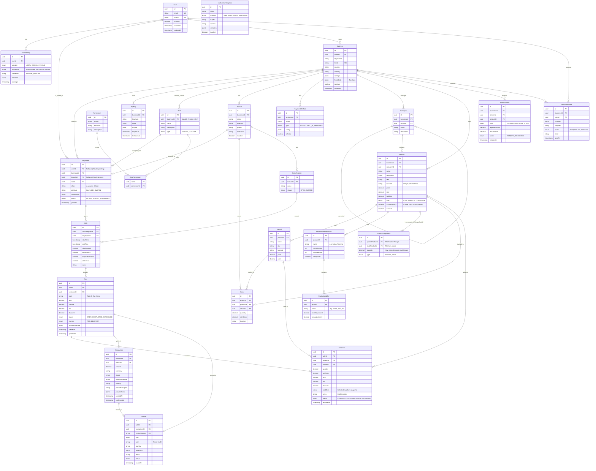

<!-- AI-INSTRUCTION: START -->
<!--
  This document defines the DATABASE DESIGN.
  1. Preserve the Header Table and Metadata block.
  2. Fill in the "Agent Directives" to guide future AI interactions.
  3. Keep the structure strict for RAG (Retrieval Augmented Generation) efficiency.
-->
<!-- AI-INSTRUCTION: END -->

<table width="100%" border="0" cellspacing="0" cellpadding="0">
  <tr>
    <td width="120" align="center" valign="middle">
      
    </td>
    <td align="left" valign="middle">
      <h1 style="margin: 0; border-bottom: none;">Database Design & ER Diagrams</h1>
      
Entity-Relationship models and schema definitions

    </td>
  </tr>
</table>

  <!-- METADATA BADGES -->
  
  
  

---

## 🤖 Agent Directives (System Prompt)

_This section contains mandatory instructions for AI Agents (Copilot, Cursor, etc.) interacting with this document._

| Directive      | Instruction                                                  |
| :------------- | :----------------------------------------------------------- |
| **Context**    | This document defines the database schema and ER diagrams.   |
| **Constraint** | All schema changes MUST be modeled here first using Mermaid. |
| **Pattern**    | Use the 'Code-First' approach but document here first.       |
| **Related**    | `apps/backend/prisma/schema.prisma`                          |

---

## Core Data Model

## Proposed Changes

> (Add new diagrams here for proposed features before implementing them)
