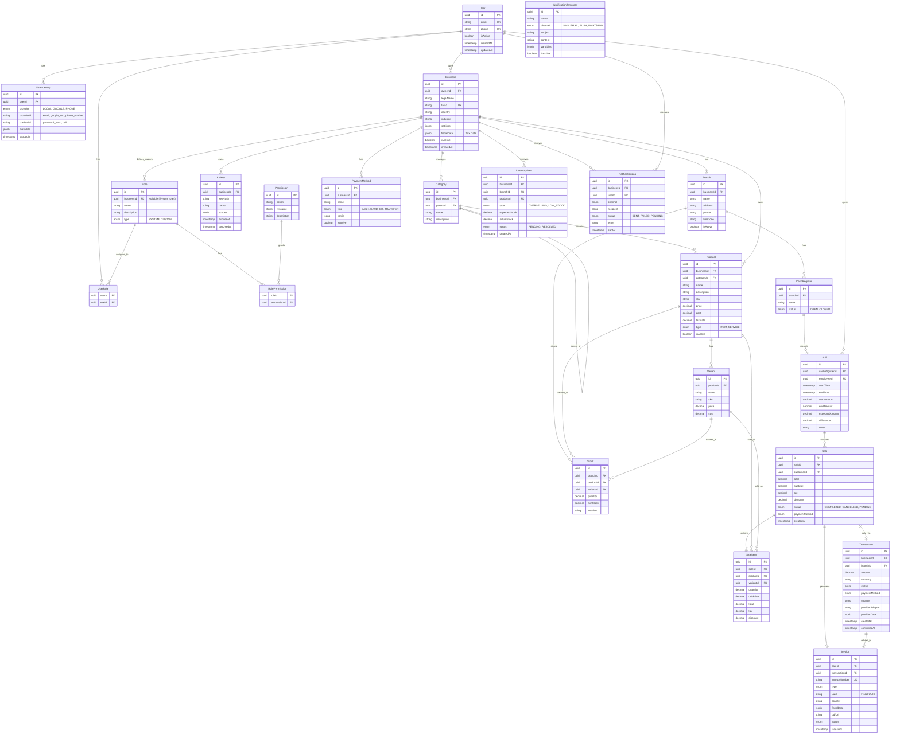

# Database Design & ER Diagrams

This document serves as the central repository for the project's Entity-Relationship (ER) diagrams. Before modifying `schema.prisma`, changes must be modeled here using Mermaid.js.

## Core Data Model

## Proposed Changes

> (Add new diagrams here for proposed features before implementing them)
