<!-- AI-INSTRUCTION: START -->
<!--
  This document defines the DATABASE DESIGN.
  1. Preserve the Header Table and Metadata block.
  2. Fill in the "Agent Directives" to guide future AI interactions.
  3. Keep the structure strict for RAG (Retrieval Augmented Generation) efficiency.
-->
<!-- AI-INSTRUCTION: END -->

<table width="100%" border="0" cellspacing="0" cellpadding="0">
  <tr>
    <td width="120" align="center" valign="middle">
      
    </td>
    <td align="left" valign="middle">
      <h1 style="margin: 0; border-bottom: none;">Database Design & ER Diagrams</h1>
      
Entity-Relationship models and schema definitions

    </td>
  </tr>
</table>

  <!-- METADATA BADGES -->
  
  
  

---

## 🤖 Agent Directives (System Prompt)

_This section contains mandatory instructions for AI Agents (Copilot, Cursor, etc.) interacting with this document._

| Directive      | Instruction                                                   |
| :------------- | :------------------------------------------------------------ |
| **Context**    | This document defines the database schema and ER diagrams.    |
| **Constraint** | All schema changes MUST be modeled here first using PlantUML. |
| **Pattern**    | Use the 'Code-First' approach but document here first.        |
| **Related**    | `apps/backend/prisma/schema.prisma`                           |

---

## Core Data Model

```plantuml
@startuml

' CONFIGURACIÓN VISUAL (Clean & Modern)
!theme plain
hide circle
skinparam linetype ortho
skinparam class {
    BackgroundColor White
    ArrowColor #333
    BorderColor #333
}

' --- CLUSTER: IDENTIDAD Y ACCESO ---

entity "User" as user {
  *id : UUID <<PK>>
  --
  email : VARCHAR <<UK>>
  emailVerified : TIMESTAMP
  phone : VARCHAR <<UK>>
  phoneVerified : TIMESTAMP
  firstName : VARCHAR
  lastName : VARCHAR
  displayName : VARCHAR
  avatarUrl : VARCHAR
  locale : VARCHAR
  kycLevel : INT
  kycData : JSONB
  preferences : JSONB
  isActive : BOOLEAN
  createdAt : TIMESTAMP
  updatedAt : TIMESTAMP
}

entity "UserIdentity" as identity {
  *id : UUID <<PK>>
  --
  *userId : UUID <<FK>>
  provider : ENUM (LOCAL, GOOGLE, PHONE)
  providerId : VARCHAR
  credential : VARCHAR
  accessToken : VARCHAR
  refreshToken : VARCHAR
  metadata : JSONB
  lastLogin : TIMESTAMP
}

entity "ApiKey" as apikey {
  *id : UUID <<PK>>
  --
  *businessId : UUID <<FK>>
  keyHash : VARCHAR
  scopes : JSONB
  expiresAt : TIMESTAMP
}

' --- CLUSTER: ORGANIZACIÓN Y ROLES ---

entity "Business" as business {
  *id : UUID <<PK>>
  --
  *ownerId : UUID <<FK>>
  legalName : VARCHAR
  taxId : VARCHAR <<UK>>
  country : VARCHAR
  type : ENUM (RETAIL, RESTAURANT, SERVICE)
  features : JSONB
  isActive : BOOLEAN
}

entity "Employee" as employee {
  *id : UUID <<PK>>
  --
  userId : UUID <<FK>>
  *businessId : UUID <<FK>>
  branchId : UUID <<FK>>
  *roleId : UUID <<FK>>
  alias : VARCHAR
  pinCode : VARCHAR
  status : ENUM (ACTIVE, INVITED)
}

entity "Role" as role {
  *id : UUID <<PK>>
  --
  businessId : UUID <<FK>>
  name : VARCHAR
  type : ENUM (SYSTEM, CUSTOM)
}

entity "RolePermission" as role_perm {
  *roleId : UUID <<FK>>
  *permissionId : UUID <<FK>>
}

entity "Permission" as perm {
  *id : UUID <<PK>>
  --
  action : VARCHAR
  resource : VARCHAR
}

' --- CLUSTER: COMUNICACIÓN ---

entity "NotificationLog" as notif {
  *id : UUID <<PK>>
  --
  userId : UUID <<FK>>
  businessId : UUID <<FK>>
  channel : ENUM
  recipient : VARCHAR
  status : ENUM
}

' --- CLUSTER: INVENTORY ---

entity "Category" as category {
  *id : UUID <<PK>>
  --
  *businessId : UUID <<FK>>
  parentId : UUID <<FK>>
  name : VARCHAR
}

entity "Product" as product {
  *id : UUID <<PK>>
  --
  *businessId : UUID <<FK>>
  categoryId : UUID <<FK>>
  name : VARCHAR
  sku : VARCHAR
  barcode : VARCHAR
  price : DECIMAL
  cost : DECIMAL
  type : ENUM
  trackInventory : BOOLEAN
}

entity "Variant" as variant {
  *id : UUID <<PK>>
  --
  *productId : UUID <<FK>>
  name : VARCHAR
  sku : VARCHAR
  price : DECIMAL
}

entity "Stock" as stock {
  *id : UUID <<PK>>
  --
  *branchId : UUID <<FK>>
  *productId : UUID <<FK>>
  variantId : UUID <<FK>>
  quantity : DECIMAL
  minStock : DECIMAL
}

entity "InventoryAlert" as alert {
  *id : UUID <<PK>>
  --
  *businessId : UUID <<FK>>
  *branchId : UUID <<FK>>
  *productId : UUID <<FK>>
  type : ENUM
  status : ENUM
}

' --- CLUSTER: SALES ---

entity "Branch" as branch {
  *id : UUID <<PK>>
  --
  *businessId : UUID <<FK>>
  name : VARCHAR
  address : VARCHAR
}

entity "CashRegister" as register {
  *id : UUID <<PK>>
  --
  *branchId : UUID <<FK>>
  name : VARCHAR
  status : ENUM
}

entity "Shift" as shift {
  *id : UUID <<PK>>
  --
  *cashRegisterId : UUID <<FK>>
  *employeeId : UUID <<FK>>
  startTime : TIMESTAMP
  endTime : TIMESTAMP
}

entity "Sale" as sale {
  *id : UUID <<PK>>
  --
  *shiftId : UUID <<FK>>
  customerId : UUID <<FK>>
  total : DECIMAL
  status : ENUM
  paymentMethod : ENUM
}

entity "SaleItem" as sale_item {
  *id : UUID <<PK>>
  --
  *saleId : UUID <<FK>>
  *productId : UUID <<FK>>
  variantId : UUID <<FK>>
  quantity : DECIMAL
  unitPrice : DECIMAL
}

entity "Transaction" as txn {
  *id : UUID <<PK>>
  --
  *businessId : UUID <<FK>>
  branchId : UUID <<FK>>
  saleId : UUID <<FK>>
  amount : DECIMAL
  status : ENUM
  providerAdapter : VARCHAR
}

entity "Invoice" as invoice {
  *id : UUID <<PK>>
  --
  *saleId : UUID <<FK>>
  transactionId : UUID <<FK>>
  invoiceNumber : VARCHAR
  uuid : VARCHAR
  status : ENUM
}

entity "PaymentMethod" as pay_method {
  *id : UUID <<PK>>
  --
  *businessId : UUID <<FK>>
  name : VARCHAR
  type : ENUM
}

' --- RELACIONES (Notación Pata de Gallo) ---

' Identity
user ||..o{ identity : "tiene"
user ||..o{ business : "posee"
user ||..o{ employee : "trabaja como"
user ||..o{ notif : "recibe"

' Business Core
business ||..o{ employee : "emplea"
business ||..o{ branch : "tiene"
business ||..o{ pay_method : "configura"
business ||..o{ apikey : "tiene"
business ||..o{ notif : "genera"

' Roles
role ||..o{ employee : "asignado a"
role ||..|{ role_perm : "tiene"
perm ||..|{ role_perm : "pertenece a"
business ||..o{ role : "define"

' Inventory
business ||..o{ category : "gestiona"
category ||..o{ category : "padre de"
category ||..o{ product : "contiene"
business ||..o{ product : "vende"
product ||..o{ variant : "tiene"
branch ||..o{ stock : "almacena"
product ||..o{ stock : "inventariado en"
variant ||..o{ stock : "inventariado en"
business ||..o{ alert : "recibe"
branch ||..o{ alert : "genera"
product ||..o{ alert : "genera"

' Sales
branch ||..o{ register : "tiene"
register ||..o{ shift : "registra"
employee ||..o{ shift : "abre"
shift ||..o{ sale : "incluye"
sale ||..|{ sale_item : "contiene"
product ||..o{ sale_item : "vendido como"
variant ||..o{ sale_item : "vendido como"
sale ||..o| txn : "pagado con"
business ||..o{ txn : "procesa"
branch ||..o{ txn : "procesa"

' Billing
sale ||..o| invoice : "factura"
txn ||..o| invoice : "relacionado con"

@enduml
```

## Platform vs Product Architecture

This database design supports a **"Platform with Multiple Products"** strategy. This allows a single user to have a unified identity while accessing different business tools (Restaurant, Retail, Service) based on their context.

### 1. Global Identity (The "Who")

The `User` entity represents the human being. This data is **immutable** across products.

- **Single Sign-On:** A user logs in once via `UserIdentity` (Google, Phone, Password).
- **Global Profile:** Name, email, phone are stored here.

### 2. Contextual Profile (The "Where")

The `Employee` entity represents the user's role within a specific `Business`.

- **Context Switching:** A user can be an "Owner" in Business A (Restaurant) and a "Cashier" in Business B (Retail).
- **Separation of Concerns:** Permissions and roles are linked to the `Employee` record, not the `User`.

### 3. Business Types (The "What")

The `Business` entity determines the product experience via the `type` and `features` fields.

| Field      | Description                            | Example                                      |
| :--------- | :------------------------------------- | :------------------------------------------- |
| `type`     | Defines the primary vertical.          | `RESTAURANT`, `RETAIL`, `SERVICE`            |
| `features` | JSON flags to toggle specific modules. | `{ "kitchenDisplay": true, "tables": true }` |

**Frontend Behavior:**

- If `type === 'RESTAURANT'`, the app loads the Table Management and Kitchen modules.
- If `type === 'RETAIL'`, the app loads the Barcode Scanner and Quick POS modules.

## Proposed Changes

> (Add new diagrams here for proposed features before implementing them)
