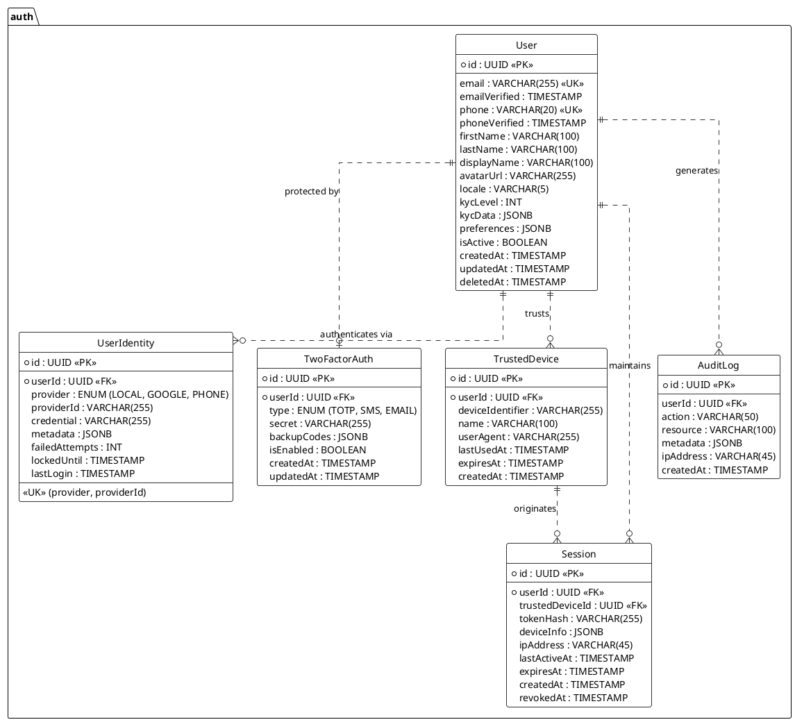

---
# YAML Frontmatter - Metadata for Semantic Search & RAG
document_type: "database-schema"
module: "authentication"
status: "approved"
version: "1.0.0"
last_updated: "2025-11-27"
author: "@Architect"

# Keywords for semantic search
keywords:
  - "database"
  - "schema"
  - "authentication"
  - "identity"
  - "iam"
  - "security"
  - "users"
  - "roles"
  - "permissions"
  - "audit-log"

# Related documentation
related_docs:
  api_design: ""
  feature_design: "docs/technical/backend/features/FEAT-001-AUTH-MODULE.md"
  ux_flow: ""
  sync_strategy: ""

# Database metadata
database:
  engine: "PostgreSQL"
  min_version: "16.0"
  prisma_version: "5.0+"

# Schema statistics
schema_stats:
  total_tables: 5
  total_indexes: 8
  total_constraints: 12
  estimated_rows: "1K-10K"
---

<!-- AI-INSTRUCTION: START -->
<!--
  This document defines the AUTH SCHEMA.
  1. Preserve the Header Table and Metadata block.
  2. Fill in the "Agent Directives" to guide future AI interactions.
  3. Keep the structure strict for RAG (Retrieval Augmented Generation) efficiency.
-->
<!-- AI-INSTRUCTION: END -->

<table width="100%" border="0" cellspacing="0" cellpadding="0">
  <tr>
    <td width="120" align="center" valign="middle">
      
    </td>
    <td align="left" valign="middle">
      <h1 style="margin: 0; border-bottom: none;">Auth Schema (Identity & Security)</h1>
      
Identity Access Management (IAM) Data Model

    </td>
  </tr>
</table>

  <!-- METADATA BADGES -->
  
  
  

---

## Agent Directives (System Prompt)

_This section contains mandatory instructions for AI Agents (Copilot, Cursor, etc.) interacting with this document._

| Directive      | Instruction                                                                                                  |
| :------------- | :----------------------------------------------------------------------------------------------------------- |
| **Context**    | This schema defines the core Identity and Access Management (IAM) layer for the entire platform.             |
| **Constraint** | **PII Protection:** Passwords MUST be hashed (Argon2id). Emails/Phones must be unique.                       |
| **Pattern**    | **Identity Separation:** `User` is the profile, `UserIdentity` is the credential. One User, Many Identities. |
| **Rule**       | **Immutability:** `AuditLog` records are append-only. NEVER update or delete them.                           |
| **Related**    | `apps/backend/src/modules/auth/`                                                                             |

---

## 1. Executive Summary

The **Auth Schema** is the foundation of the platform's security architecture. It is designed to support **Multi-Tenant** and **Multi-Product** access with a unified identity.

Key capabilities include:

1.  **Unified Identity:** A single `User` record can access multiple businesses and roles.
2.  **Multi-Provider Auth:** Supports Passwordless (Phone/OTP), Social Login (Google), and Traditional Password login simultaneously for the same user.
3.  **Adaptive Security:** Implements Multi-Factor Authentication (MFA) and Trusted Devices to balance security with user experience.
4.  **Session Control:** Granular session management allows users to "Log out of all devices" or revoke specific suspicious sessions.
5.  **Compliance:** Built-in Audit Logging for all security-critical actions.

---

## 2. Entity-Relationship Diagram

---

## 3. Detailed Entity Definitions

### 3.1. User (The Global Profile)

Represents a human being in the system. This entity is **global** and unique across the entire platform. It does not contain credentials (passwords) or business-specific roles.

| Attribute     | Type      | Description                            | Rules & Constraints                                  |
| :------------ | :-------- | :------------------------------------- | :--------------------------------------------------- |
| `id`          | UUID      | Primary Key.                           | Generated via `uuidv7` (time-sortable).              |
| `email`       | VARCHAR   | User's email address.                  | **Unique**. Must be lowercase.                       |
| `phone`       | VARCHAR   | User's mobile number (E.164 format).   | **Unique**. Used for OTP and MFA.                    |
| `kycLevel`    | INT       | Know Your Customer verification level. | `0`=Phone Only, `1`=ID Verified, `2`=Fiscal Data.    |
| `kycData`     | JSONB     | Encrypted KYC documents/metadata.      | **Sensitive**. Access strictly audited.              |
| `preferences` | JSONB     | User settings (theme, notifications).  | Default: `{ theme: 'system', notifications: true }`. |
| `deletedAt`   | TIMESTAMP | Soft delete timestamp.                 | Used for GDPR "Right to be Forgotten".               |

**Business Rules:**

- **Uniqueness:** A user cannot register twice with the same email or phone.
- **Immutability:** `id` never changes.
- **Verification:** `emailVerified` and `phoneVerified` are required for certain actions (e.g., creating a business).

### 3.2. UserIdentity (The Credential)

Decouples the "Person" from the "Login Method". This allows a single user to have multiple ways to log in (e.g., "Sign in with Google" AND "Sign in with Password").

| Attribute        | Type      | Description                         | Rules & Constraints                                |
| :--------------- | :-------- | :---------------------------------- | :------------------------------------------------- |
| `userId`         | UUID      | Foreign Key to `User`.              |                                                    |
| `provider`       | ENUM      | The authentication provider.        | `LOCAL` (Password), `GOOGLE`, `PHONE` (OTP).       |
| `providerId`     | VARCHAR   | The external ID.                    | Google `sub` ID, or Phone Number, or Email.        |
| `credential`     | VARCHAR   | The secret.                         | **LOCAL:** Argon2id Hash. **GOOGLE:** Null/Token.  |
| `metadata`       | JSONB     | Provider-specific data.             | e.g., Google profile picture, access tokens.       |
| `failedAttempts` | INT       | Counter for brute-force protection. | Resets on successful login. Lock after 5 attempts. |
| `lockedUntil`    | TIMESTAMP | Temporary lockout timestamp.        | If `NOW() < lockedUntil`, login is blocked.        |
| `lastLogin`      | TIMESTAMP | Timestamp of last successful login. | Used for security auditing.                        |

**Business Rules:**

- **Composite Unique Key:** `(provider, providerId)` must be unique.
- **Security:** `credential` MUST NEVER store plain-text passwords.
- **Brute Force:** System must increment `failedAttempts` on error and set `lockedUntil` (e.g., 15 mins) when threshold is reached.

### 3.3. TwoFactorAuth (MFA)

Stores the configuration for Multi-Factor Authentication.

| Attribute     | Type    | Description                        | Rules & Constraints                         |
| :------------ | :------ | :--------------------------------- | :------------------------------------------ |
| `type`        | ENUM    | The MFA method.                    | `TOTP` (Authenticator App), `SMS`, `EMAIL`. |
| `secret`      | VARCHAR | The shared secret key.             | **MUST be encrypted at rest** (AES-256).    |
| `backupCodes` | JSONB   | List of single-use recovery codes. | Hashed before storage (like passwords).     |
| `isEnabled`   | BOOLEAN | Master switch for MFA.             | If `true`, login requires 2nd step.         |

**Business Rules:**

- **Encryption:** The `secret` is never stored in plain text to prevent leaks if the DB is compromised.
- **Recovery:** Users must generate backup codes when enabling MFA.

### 3.4. TrustedDevice

Represents a device (browser/phone) that the user has explicitly trusted.

| Attribute          | Type      | Description                       | Rules & Constraints                       |
| :----------------- | :-------- | :-------------------------------- | :---------------------------------------- |
| `deviceIdentifier` | VARCHAR   | Unique fingerprint of the device. | Generated via client-side fingerprinting. |
| `lastUsedAt`       | TIMESTAMP | Last time this device logged in.  | Used for auto-expiry.                     |
| `expiresAt`        | TIMESTAMP | When the trust expires.           | Typically 30-90 days.                     |

**Business Rules:**

- **MFA Bypass:** Logins from a valid `TrustedDevice` can optionally skip MFA (adaptive security).
- **Revocation:** Users can remove a device from their "Trusted" list in settings.

### 3.5. Session

Tracks active login sessions. This is the "State" of a logged-in user.

| Attribute      | Type      | Description                     | Rules & Constraints                                        |
| :------------- | :-------- | :------------------------------ | :--------------------------------------------------------- |
| `tokenHash`    | VARCHAR   | Hash of the Refresh Token.      | **Security:** Never store the raw token.                   |
| `deviceInfo`   | JSONB     | User Agent, OS, Browser.        | Displayed in "Active Sessions" UI.                         |
| `ipAddress`    | VARCHAR   | IP of the login origin.         | Used for geo-location and risk analysis.                   |
| `lastActiveAt` | TIMESTAMP | Last time the session was used. | Used for sliding expiration (e.g., expire after 30m idle). |
| `revokedAt`    | TIMESTAMP | Timestamp of revocation.        | If present, the session is invalid.                        |

**Business Rules:**

- **Token Rotation:** Refresh tokens are rotated on use. The old hash is invalidated.
- **Remote Logout:** Setting `revokedAt = NOW()` immediately kills the session on the next request.
- **Idle Timeout:** Sessions older than `lastActiveAt + 30m` should be considered expired even if `expiresAt` is future.

### 3.6. AuditLog

An immutable record of security-critical events.

| Attribute  | Type    | Description        | Rules & Constraints                                    |
| :--------- | :------ | :----------------- | :----------------------------------------------------- |
| `action`   | VARCHAR | The event type.    | `LOGIN_SUCCESS`, `LOGIN_FAILED`, `PASSWORD_CHANGE`.    |
| `resource` | VARCHAR | The target entity. | `User:123`, `Business:456`.                            |
| `metadata` | JSONB   | Contextual data.   | `{ "reason": "Wrong Password", "browser": "Chrome" }`. |

**Business Rules:**

- **Retention:** Logs are kept for 1 year (compliance).
- **Write-Only:** No application user (even Admin) can delete or modify these logs via the API.

---

## 4. Security & Compliance

### 4.1. PII Protection

- **Passwords:** Hashed using **Argon2id** (memory-hard function).
- **MFA Secrets:** Encrypted using **AES-256-GCM** with a rotating key management system (KMS).
- **KYC Data:** Stored in `kycData` (JSONB) but encrypted at the application level before insertion.

### 4.2. GDPR & Privacy

- **Right to be Forgotten:** The `deletedAt` column on the `User` table triggers a "Soft Delete". A background job (30 days later) anonymizes PII (scrambles email/phone) but keeps the ID for referential integrity in financial records (`Transaction`, `Invoice`).

---

## 5. Performance & Indexing Strategy

To ensure high performance and prevent "blocks" (deadlocks/slow queries), the following indexing strategy is mandatory.

| Table          | Index Columns            | Type   | Purpose                                                  |
| :------------- | :----------------------- | :----- | :------------------------------------------------------- |
| `User`         | `email`                  | UNIQUE | Fast login lookup.                                       |
| `User`         | `phone`                  | UNIQUE | Fast OTP lookup.                                         |
| `UserIdentity` | `userId`                 | BTREE  | Fast retrieval of identities for a user.                 |
| `UserIdentity` | `(provider, providerId)` | UNIQUE | Prevent duplicate social links.                          |
| `Session`      | `tokenHash`              | HASH   | O(1) lookup for session validation.                      |
| `Session`      | `userId`                 | BTREE  | "Log out all devices" query.                             |
| `AuditLog`     | `userId`                 | BTREE  | Security audit history lookup.                           |
| `AuditLog`     | `createdAt`              | BRIN   | Efficient range queries for logs (e.g., "Last 30 days"). |

**Idempotency Guarantees:**

- **Registration:** The `UNIQUE` constraint on `User.email` and `User.phone` acts as the final idempotency guard. If the API receives two requests simultaneously, the database will reject the second one.
- **Linking Providers:** The `UNIQUE (provider, providerId)` constraint prevents linking the same Google account to multiple users.
