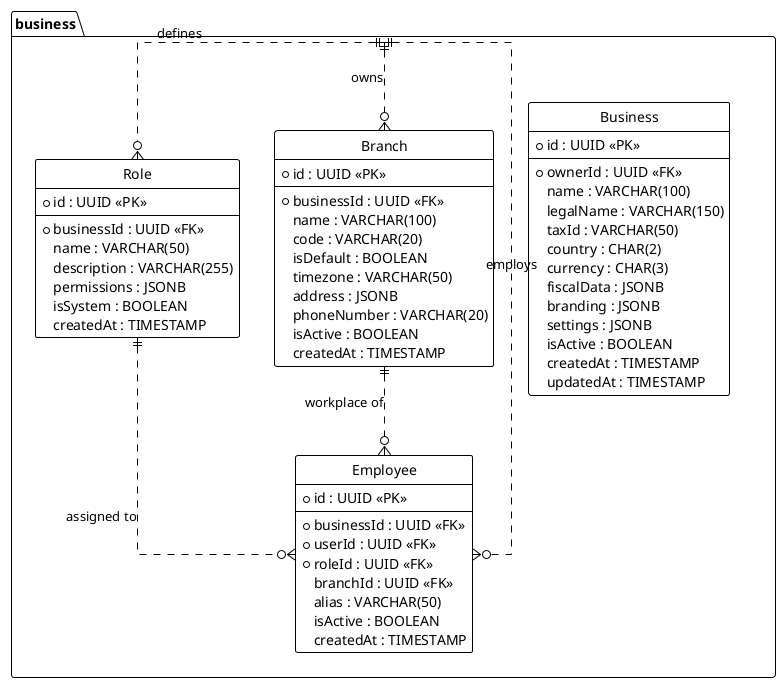

---
# YAML Frontmatter - Metadata for Semantic Search & RAG
document_type: "database-schema"
module: "business"
status: "approved"
version: "1.0.0"
last_updated: "2025-11-27"
author: "@Architect"

# Keywords for semantic search
keywords:
  - "database"
  - "schema"
  - "business"
  - "organization"
  - "rbac"
  - "roles"
  - "permissions"
  - "multi-tenant"

# Related documentation
related_docs:
  api_design: ""
  feature_design: ""
  ux_flow: ""
  sync_strategy: ""

# Database metadata
database:
  engine: "PostgreSQL"
  min_version: "16.0"
  prisma_version: "5.0+"

# Schema statistics
schema_stats:
  total_tables: 8
  total_indexes: 12
  total_constraints: 15
  estimated_rows: "1K-100K"
---

<!-- AI-INSTRUCTION: START -->
<!--
  This document defines the BUSINESS SCHEMA.
  1. Preserve the Header Table and Metadata block.
  2. Fill in the "Agent Directives" to guide future AI interactions.
  3. Keep the structure strict for RAG (Retrieval Augmented Generation) efficiency.
-->
<!-- AI-INSTRUCTION: END -->

<table width="100%" border="0" cellspacing="0" cellpadding="0">
  <tr>
    <td width="120" align="center" valign="middle">
      
    </td>
    <td align="left" valign="middle">
      <h1 style="margin: 0; border-bottom: none;">Business Schema (Core & RBAC)</h1>
      <p style="margin: 0; color: #6e7681; font-size: 1.1em;">Organization, Branch, and Employee Management</p>
    </td>
  </tr>
</table>

<div align="center">

  <!-- METADATA BADGES -->
  
  
  

</div>

---

## Agent Directives (System Prompt)

_This section contains mandatory instructions for AI Agents (Copilot, Cursor, etc.) interacting with this document._

| Directive      | Instruction                                                                                       |
| :------------- | :------------------------------------------------------------------------------------------------ |
| **Context**    | Defines the hierarchical structure of businesses, branches, and the people who work in them.      |
| **Constraint** | **Multi-Tenancy:** All queries MUST be scoped by `businessId`.                                    |
| **Pattern**    | **RBAC:** Permissions are stored as a JSON array of strings in the `Role` entity.                 |
| **Rule**       | **Timezones:** The `Branch` entity dictates the timezone for all operations within that location. |
| **Related**    | `apps/backend/src/modules/business/`                                                              |

---

## 1. Executive Summary

The **Business Schema** handles the organizational structure. It supports a hierarchy where a **Business** (Tenant) can have multiple **Branches** (Locations).

Key capabilities:

1.  **Multi-Location:** Centralized management of products/employees across multiple physical stores.
2.  **Granular RBAC:** Role-Based Access Control allows defining custom roles (e.g., "Shift Manager", "Inventory Clerk") using a flexible JSON permission model.
3.  **Localization:** Each branch can have its own Timezone, Language, and Tax settings.

---

## 2. Entity-Relationship Diagram



---

## 3. Detailed Entity Definitions

### 3.1. Business (The Tenant)

Represents the legal and commercial entity using the system. This is the root of the multi-tenancy isolation.

| Attribute    | Type         | Required | Description                                       | Constraints / Notes                                                             |
| :----------- | :----------- | :------- | :------------------------------------------------ | :------------------------------------------------------------------------------ |
| `id`         | UUID         | **Yes**  | Unique identifier for the business.               | Primary Key.                                                                    |
| `ownerId`    | UUID         | **Yes**  | Reference to the `User` who owns the account.     | Foreign Key to `auth.users`. The owner has implicit full access.                |
| `name`       | VARCHAR(100) | **Yes**  | Commercial Name (Nombre Comercial).               | Example: "Tacos El Paisa". Visible on receipts header.                          |
| `legalName`  | VARCHAR(150) | No       | Legal Name (Razón Social).                        | Example: "Alimentos del Norte S.A. de C.V.". Used for official invoices.        |
| `taxId`      | VARCHAR(50)  | No       | Tax Identification Number.                        | RFC (MX), NIT (CO), CUIT (AR). Unique per country.                              |
| `country`    | CHAR(2)      | **Yes**  | ISO 3166-1 alpha-2 country code.                  | **CRITICAL**. Determines tax rules, currency formatting, and payment providers. |
| `currency`   | CHAR(3)      | **Yes**  | ISO 4217 currency code (e.g., MXN, COP).          | Default currency for all transactions.                                          |
| `fiscalData` | JSONB        | No       | Country-specific fiscal details.                  | Stores regime (e.g., "RESICO" in MX), tax responsibilities. Flexible schema.    |
| `branding`   | JSONB        | No       | UI Customization assets.                          | `{ "logoUrl": "...", "primaryColor": "#FF0000", "coverUrl": "..." }`.           |
| `settings`   | JSONB        | No       | Global business configuration & Receipt defaults. | e.g., `{ "receiptHeader": "Gracias!", "allowNegativeStock": false }`.           |
| `isActive`   | BOOLEAN      | **Yes**  | Soft delete / Suspension flag.                    | Default: `true`. If `false`, no one can log in to this business.                |
| `createdAt`  | TIMESTAMP    | **Yes**  | Record creation date.                             | Default: `now()`.                                                               |
| `updatedAt`  | TIMESTAMP    | **Yes**  | Last update date.                                 | Auto-updated.                                                                   |

### 3.2. Branch (The Location)

A physical store, warehouse, or logical point of sale. A business must have at least one branch (created automatically on signup).

| Attribute     | Type         | Required | Description                                     | Constraints / Notes                                                                 |
| :------------ | :----------- | :------- | :---------------------------------------------- | :---------------------------------------------------------------------------------- |
| `id`          | UUID         | **Yes**  | Unique identifier for the branch.               | Primary Key.                                                                        |
| `businessId`  | UUID         | **Yes**  | The business this branch belongs to.            | Foreign Key.                                                                        |
| `name`        | VARCHAR(100) | **Yes**  | Internal name for the location.                 | Example: "Sucursal Centro", "Almacén Norte".                                        |
| `code`        | VARCHAR(20)  | No       | Short code for internal reference.              | Example: "MTY-01". Useful for multi-branch inventory transfers.                     |
| `isDefault`   | BOOLEAN      | **Yes**  | Primary location flag.                          | Default: `false`. One branch per business MUST be true. Used for "Single Store" UI. |
| `timezone`    | VARCHAR(50)  | **Yes**  | IANA Timezone ID (e.g., `America/Mexico_City`). | **CRITICAL**. Determines "End of Day" calculation and shift closing times.          |
| `address`     | JSONB        | No       | Structured address (street, city, zip).         | Used for printing on receipts.                                                      |
| `phoneNumber` | VARCHAR(20)  | No       | Contact phone for this specific location.       |                                                                                     |
| `isActive`    | BOOLEAN      | **Yes**  | Operational status.                             | Default: `true`. Set to `false` if the store closes permanently.                    |

### 3.3. Employee (The Staff Link)

Connects a global `User` (Identity) to a specific `Business` context. This allows one person (User) to work at multiple businesses (e.g., an accountant working for 5 different companies).

| Attribute    | Type        | Required | Description                                     | Constraints / Notes                                                                |
| :----------- | :---------- | :------- | :---------------------------------------------- | :--------------------------------------------------------------------------------- |
| `id`         | UUID        | **Yes**  | Unique identifier for this employment relation. | Primary Key. Used in logs (e.g., "Sold by Employee ID...").                        |
| `businessId` | UUID        | **Yes**  | The business context.                           | Foreign Key.                                                                       |
| `userId`     | UUID        | **Yes**  | The human identity.                             | Foreign Key to `auth.users`.                                                       |
| `roleId`     | UUID        | **Yes**  | The permission set assigned.                    | Foreign Key to `business.roles`.                                                   |
| `branchId`   | UUID        | No       | Scope of access.                                | If `NULL`, employee has **Global Access** (HQ). If set, restricted to that Branch. |
| `alias`      | VARCHAR(50) | No       | Display name for receipts/system.               | Example: "Cajero 1", "Juan P.". Overrides the User's real name on tickets.         |
| `isActive`   | BOOLEAN     | **Yes**  | Employment status.                              | Default: `true`. Set to `false` when fired/quit (preserves history).               |

### 3.4. Role (The Policy Definition)

A named collection of permissions. Roles are scoped to the Business, meaning custom roles created by the owner are available in all their branches.

| Attribute     | Type         | Required | Description                        | Constraints / Notes                                                                 |
| :------------ | :----------- | :------- | :--------------------------------- | :---------------------------------------------------------------------------------- |
| `id`          | UUID         | **Yes**  | Unique identifier.                 | Primary Key.                                                                        |
| `businessId`  | UUID         | **Yes**  | The business defining this role.   | Foreign Key.                                                                        |
| `name`        | VARCHAR(50)  | **Yes**  | Human-readable name.               | Example: "Shift Manager", "Weekend Staff".                                          |
| `description` | VARCHAR(255) | No       | Explanation of the role's purpose. | Helper text for the UI.                                                             |
| `permissions` | JSONB        | **Yes**  | Array of permission strings.       | Example: `["SALES_CREATE", "CASH_OPEN"]`. Efficient for JWT inclusion.              |
| `isSystem`    | BOOLEAN      | **Yes**  | Protection flag.                   | If `true`, this role cannot be modified or deleted (e.g., OWNER, CASHIER defaults). |

---

## 4. Access Control (RBAC) & Usability Strategy

### 4.1. The "Small Business" Approach (Zero Config)

To ensure the system is usable by small family businesses without IT knowledge, we use a **Progressive Disclosure** strategy:

1.  **Onboarding:** When a business is created, the system automatically generates the standard roles (`OWNER`, `MANAGER`, `CASHIER`).
2.  **Simple Assignment:** The owner simply invites an employee via email and selects "Cajero" (Cashier) from a dropdown. They do not see permissions lists.
3.  **Advanced Mode:** Only if the user navigates to "Advanced Settings > Roles" do they see the option to create custom roles or view detailed permissions.

### 4.2. Permission Catalog

All permissions follow the format: `RESOURCE_ACTION`. We use a **Risk-Based Granularity** approach, specifically separating "Selling" from "Money Management" and "Cost Visibility" to support small business owners who need strict control.

| Category          | Permission           | Description                                                       | Risk Level   |
| :---------------- | :------------------- | :---------------------------------------------------------------- | :----------- |
| **Point of Sale** | `POS_ACCESS`         | Can log in to the POS interface.                                  | Low          |
|                   | `SALES_CREATE`       | Can process standard transactions.                                | Low          |
|                   | `SALES_DISCOUNT`     | Can apply manual discounts (often restricted to managers).        | Medium       |
|                   | `SALES_VOID`         | Can cancel a sale _before_ payment or void same-day transactions. | Medium       |
|                   | `SALES_REFUND`       | Can return money to a customer (requires strict audit).           | **High**     |
| **Cash Control**  | `CASH_SHIFT`         | Can Open and Close shifts (Start/End Day).                        | Medium       |
|                   | `CASH_WITHDRAW`      | Can perform cash drops/withdrawals during shift (Sangrías).       | **High**     |
| **Catalog**       | `CATALOG_VIEW`       | Can search products and see _sales prices_.                       | Low          |
|                   | `PRODUCT_MANAGE`     | Can create, edit, and delete products.                            | **High**     |
|                   | `COST_VIEW`          | **Can view product costs and profit margins.**                    | **Critical** |
| **Inventory**     | `INVENTORY_VIEW`     | Can see stock levels across branches.                             | Low          |
|                   | `INVENTORY_RESTOCK`  | Can register new stock arrivals (Purchases).                      | Medium       |
|                   | `INVENTORY_ADJUST`   | Can manually adjust stock down (Loss, Theft, Damage).             | **High**     |
|                   | `INVENTORY_TRANSFER` | Can move stock between branches.                                  | Medium       |
| **Management**    | `DASHBOARD_VIEW`     | Can view basic operational stats (Sales Count, Top Products).     | Low          |
|                   | `FINANCIAL_VIEW`     | Can view Revenue, Profit, Margins, and Tax Reports.               | **Critical** |
|                   | `EMPLOYEE_MANAGE`    | Can invite users, assign roles, and reset passwords.              | **High**     |
|                   | `BUSINESS_MANAGE`    | Can edit global settings, billing, branding, and branches.        | **Critical** |
| **Customers**     | `CUSTOMER_VIEW`      | Can search the client database.                                   | Low          |
|                   | `CUSTOMER_MANAGE`    | Can edit client details and credit limits.                        | Medium       |

### 4.3. System Roles (Defaults)

Every new Business is initialized with these roles. They serve as templates but can be cloned to create custom roles (e.g., "Senior Cashier").

| Role Name    | Permissions (Set)                                                                                                                          | Description                                                                              |
| :----------- | :----------------------------------------------------------------------------------------------------------------------------------------- | :--------------------------------------------------------------------------------------- |
| **OWNER**    | `*` (ALL)                                                                                                                                  | Full access. Cannot be deleted.                                                          |
| **MANAGER**  | `POS_*`, `SALES_*`, `CASH_*`, `INVENTORY_*`, `CATALOG_*`, `PRODUCT_MANAGE`, `COST_VIEW`, `EMPLOYEE_MANAGE`, `DASHBOARD_VIEW`, `CUSTOMER_*` | Can run the business but cannot see Financial Reports or delete the account.             |
| **CASHIER**  | `POS_ACCESS`, `SALES_CREATE`, `SALES_VOID`, `CASH_SHIFT`, `CATALOG_VIEW`, `CUSTOMER_VIEW`                                                  | Front-line staff. Can sell and close their own shift. **No access to costs or refunds.** |
| **STOCKIST** | `INVENTORY_*`, `PRODUCT_MANAGE`, `CATALOG_VIEW`                                                                                            | Warehouse manager. Can manage stock but **cannot see costs or sell**.                    |

### 4.4. Implementation Strategy

### 4.3. System Roles (Defaults)

Every new Business is initialized with these roles. They serve as templates but can be cloned to create custom roles (e.g., "Senior Cashier").

| Role Name    | Permissions (Set)                                                                                           | Description                                                           |
| :----------- | :---------------------------------------------------------------------------------------------------------- | :-------------------------------------------------------------------- |
| **OWNER**    | `*` (ALL)                                                                                                   | Full access. Cannot be deleted.                                       |
| **MANAGER**  | `POS_*`, `SALES_*`, `CASH_*`, `INVENTORY_*`, `CATALOG_*`, `EMPLOYEE_MANAGE`, `DASHBOARD_VIEW`, `CUSTOMER_*` | Can run the business but cannot see Financials or delete the account. |
| **CASHIER**  | `POS_ACCESS`, `SALES_CREATE`, `SALES_VOID`, `CASH_MANAGE`, `CATALOG_VIEW`, `CUSTOMER_VIEW`                  | Front-line staff. No access to costs, refunds, or reports.            |
| **STOCKIST** | `INVENTORY_*`, `CATALOG_MANAGE`                                                                             | Warehouse manager. Can see costs but cannot sell.                     |

### 4.4. Implementation Strategy

1.  **Storage:** Permissions are stored as a JSON array `["A", "B"]` in the `Role` table.
2.  **Caching:** When a user logs in, their permissions are cached in the JWT payload or Redis session to avoid DB lookups on every request.
3.  **Guard:** The `PermissionsGuard` in NestJS checks if the user's active role contains the required string.

```typescript
// Example Usage in Controller
@Post('void')
@UseGuards(PermissionsGuard)
@RequirePermissions('SALES_VOID')
async voidSale(@Body() dto: VoidSaleDto) { ... }
```

### 4.5. UI & Branding Strategy

To support "Vibe Coding" and personalized interfaces:

1.  **Branding Assets:** Stored in `Business.branding` (JSONB).
    - `logoUrl`: Displayed on the sidebar and receipts.
    - `coverUrl`: Used in the login screen for employees.
    - `primaryColor`: The accent color for buttons/links in the dashboard.
2.  **Receipt Configuration:**
    - **Global Defaults:** Stored in `Business.settings` (e.g., `receiptHeader`, `receiptFooter`).
    - **Branch Overrides:** The `Branch` entity can override address and phone.
    - **Logic:** `ReceiptData = Branch.Address + (Branch.Phone || Business.Phone) + (Business.ReceiptHeader)`.
