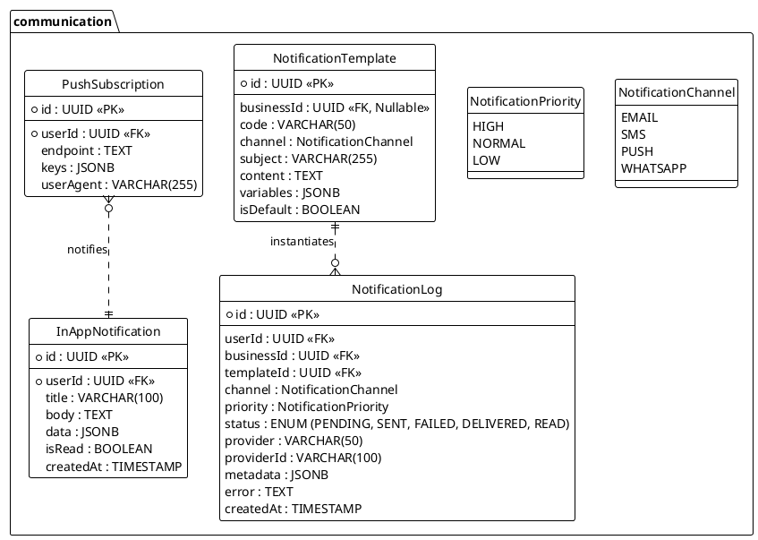

---
# YAML Frontmatter - Metadata for Semantic Search & RAG
document_type: "database-schema"
module: "communication"
status: "ready"
version: "1.0.0"
last_updated: "2025-11-27"
author: "@Backend"

# Keywords for semantic search
keywords:
  - "communication"
  - "notifications"
  - "email"
  - "sms"
  - "push-notifications"
  - "templates"

# Related documentation
related_docs:
  database_schema: ""
  api_design: ""
  feature_design: ""
  ux_flow: ""

# Database metadata
database:
  engine: "PostgreSQL"
  prisma_version: "5.0+"
  schema_stats:
    tables: 4
    indexes: 8
    constraints: 12
    estimated_rows: 100000
---

<!-- AI-INSTRUCTION: START -->
<!--
  This document defines the COMMUNICATION SCHEMA.
  /* Lines 4-6 omitted */
  3. Keep the structure strict for RAG (Retrieval Augmented Generation) efficiency.
-->
<!-- AI-INSTRUCTION: END -->

<table width="100%" border="0" cellspacing="0" cellpadding="0">
  <tr>
    <td width="120" align="center" valign="middle">
      
    </td>
    <td align="left" valign="middle">
      <h1 style="margin: 0; border-bottom: none;">Communication Schema</h1>
      
Notifications, Templates, and Push Messaging

    </td>
  </tr>
</table>

  <!-- METADATA BADGES -->
  
  
  

---

## Agent Directives (System Prompt)

_This section contains mandatory instructions for AI Agents (Copilot, Cursor, etc.) interacting with this document._

| Directive      | Instruction                                                                                               |
| :------------- | :-------------------------------------------------------------------------------------------------------- |
| **Context**    | Manages all outbound communication (Email, SMS, Push, WhatsApp) and internal alerts.                      |
| **Constraint** | **No Raw HTML:** Content MUST be generated from `NotificationTemplate`.                                   |
| **Pattern**    | **Hot/Cold Storage:** `InAppNotification` is for UI display (Hot). `NotificationLog` is for audit (Cold). |
| **Rule**       | **Priority:** `HIGH` priority messages (OTP, Payment Links) bypass marketing queues.                      |
| **Related**    | `apps/backend/src/modules/notifications/`                                                                 |

---

## 1. Executive Summary

The **Communication Schema** centralizes how the platform talks to users. It abstracts the provider (SendGrid, Twilio, Meta/WhatsApp) from the business logic.

Key capabilities:

1. **Omnichannel:** Send one event ("Payment Link"), deliver via the user's preferred channel (WhatsApp > SMS > Email).
2. **Business Customization:** Merchants can override default templates with their own branding (Logo, Colors).
3. **Priority Queues:** Ensures critical messages (2FA, Payment Requests) are delivered instantly, even during high traffic.
4. **Real-Time & Secure:** Supports WebSocket pushes for `InAppNotification` and stores cryptographic proofs of delivery in `NotificationLog.metadata`.

---

## 2. Entity-Relationship Diagram

---

## 3. Detailed Entity Definitions

### 3.1. NotificationTemplate

Stores the blueprints for messages. Supports global defaults and business-specific overrides. This allows the system to be **agnostic** of the content format until runtime.

| Attribute    | Type    | Description                       | Rules & Constraints                                                         |
| :----------- | :------ | :-------------------------------- | :-------------------------------------------------------------------------- |
| `id`         | UUID    | Unique identifier.                | Primary Key.                                                                |
| `businessId` | UUID    | The tenant owning this template.  | If `NULL`, it is a **System Default** template used as fallback.            |
| `code`       | VARCHAR | Unique slug per Business/Channel. | e.g., `PAYMENT_LINK`, `RECEIPT`, `WELCOME`. Used by code to trigger events. |
| `channel`    | ENUM    | The delivery medium.              | `EMAIL`, `SMS`, `PUSH`, `WHATSAPP`.                                         |
| `subject`    | VARCHAR | Email subject or Push title.      | Supports Handlebars syntax for variables (e.g., `Welcome {{name}}`).        |
| `content`    | TEXT    | The body template.                | **MJML** for Email (responsive), Plain text for SMS/WhatsApp.               |
| `variables`  | JSONB   | Expected dynamic fields.          | Schema definition for validation (e.g., `["customerName", "amount"]`).      |
| `isDefault`  | BOOLEAN | Fallback flag.                    | Only one default per `code` + `channel` allowed globally.                   |

### 3.2. InAppNotification (The Bell Icon)

Stores persistent alerts shown in the application UI. These are delivered in **Real-Time** via WebSockets/SSE when the user is online.

| Attribute   | Type      | Description        | Rules & Constraints                                             |
| :---------- | :-------- | :----------------- | :-------------------------------------------------------------- |
| `id`        | UUID      | Unique identifier. | Primary Key.                                                    |
| `userId`    | UUID      | The recipient.     | Foreign Key to `auth.User`.                                     |
| `title`     | VARCHAR   | Short headline.    | Max 100 chars.                                                  |
| `body`      | TEXT      | Detailed message.  | Plain text only. No HTML allowed for security (XSS prevention). |
| `data`      | JSONB     | Action payload.    | e.g., `{ "link": "/orders/123", "action": "APPROVE" }`.         |
| `isRead`    | BOOLEAN   | Read status.       | Used to calculate the "Unread Badge" count.                     |
| `createdAt` | TIMESTAMP | Creation time.     | Used for sorting in the notification center.                    |

### 3.3. NotificationLog

The **Audit Trail** for all sent messages. Critical for debugging delivery issues and proving **Read Confirmation**.

| Attribute    | Type      | Description                 | Rules & Constraints                                                         |
| :----------- | :-------- | :-------------------------- | :-------------------------------------------------------------------------- |
| `id`         | UUID      | Unique identifier.          | Primary Key.                                                                |
| `userId`     | UUID      | The recipient.              | Foreign Key to `auth.User`.                                                 |
| `businessId` | UUID      | The context of the message. | Foreign Key to `business.Business`.                                         |
| `templateId` | UUID      | The template used.          | Foreign Key to `NotificationTemplate`.                                      |
| `channel`    | ENUM      | The channel used.           | `EMAIL`, `SMS`, `PUSH`, `WHATSAPP`.                                         |
| `priority`   | ENUM      | Queue priority.             | `HIGH` (OTP, Payments) bypasses `LOW` (Marketing) queues.                   |
| `status`     | ENUM      | Current delivery state.     | `PENDING` -> `SENT` -> `DELIVERED` -> `READ` (if supported).                |
| `provider`   | VARCHAR   | The actual sender.          | e.g., `Twilio`, `SendGrid`, `Meta`. Makes the system **Provider Agnostic**. |
| `providerId` | VARCHAR   | External ID for tracking.   | Used to query the provider's API for status updates.                        |
| `metadata`   | JSONB     | Proof of delivery.          | Stores raw webhook payloads (e.g., WhatsApp Read Receipt signature).        |
| `error`      | TEXT      | Failure reason.             | Populated if status is `FAILED`.                                            |
| `createdAt`  | TIMESTAMP | Timestamp of generation.    | Immutable.                                                                  |

### 3.4. PushSubscription

Manages Web Push subscriptions for PWA (Progressive Web App). Enables **Offline** notifications to reach the device.

| Attribute   | Type    | Description                     | Rules & Constraints                                                                |
| :---------- | :------ | :------------------------------ | :--------------------------------------------------------------------------------- |
| `id`        | UUID    | Unique identifier.              | Primary Key.                                                                       |
| `userId`    | UUID    | The subscriber.                 | Foreign Key to `auth.User`.                                                        |
| `endpoint`  | TEXT    | Browser push service URL.       | Unique per device/browser profile.                                                 |
| `keys`      | JSONB   | Encryption keys (P256DH, Auth). | **Critical Security:** Used to encrypt the payload so only the device can read it. |
| `userAgent` | VARCHAR | Device information.             | Used for debugging (e.g., "Chrome on Android").                                    |
