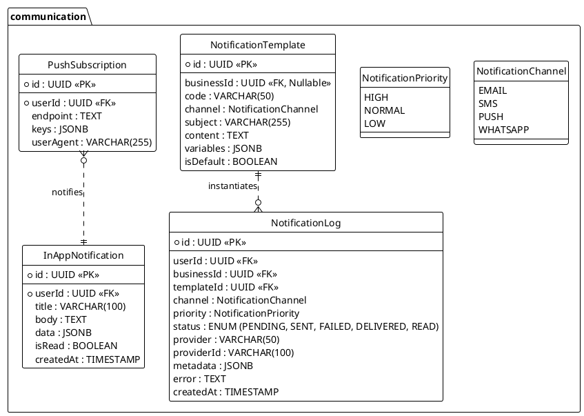

<!-- AI-INSTRUCTION: START -->
<!--
  This document defines the COMMUNICATION SCHEMA.
  /* Lines 4-6 omitted */
  3. Keep the structure strict for RAG (Retrieval Augmented Generation) efficiency.
-->
<!-- AI-INSTRUCTION: END -->

<table width="100%" border="0" cellspacing="0" cellpadding="0">
  <tr>
    <td width="120" align="center" valign="middle">
      
    </td>
    <td align="left" valign="middle">
      <h1 style="margin: 0; border-bottom: none;">Communication Schema</h1>
      
Notifications, Templates, and Push Messaging

    </td>
  </tr>
</table>

  <!-- METADATA BADGES -->
  
  
  

---

## 🤖 Agent Directives (System Prompt)

_This section contains mandatory instructions for AI Agents (Copilot, Cursor, etc.) interacting with this document._

| Directive      | Instruction                                                                                               |
| :------------- | :-------------------------------------------------------------------------------------------------------- |
| **Context**    | Manages all outbound communication (Email, SMS, Push, WhatsApp) and internal alerts.                      |
| **Constraint** | **No Raw HTML:** Content MUST be generated from `NotificationTemplate`.                                   |
| **Pattern**    | **Hot/Cold Storage:** `InAppNotification` is for UI display (Hot). `NotificationLog` is for audit (Cold). |
| **Rule**       | **Priority:** `HIGH` priority messages (OTP, Payment Links) bypass marketing queues.                      |
| **Related**    | `apps/backend/src/modules/notifications/`                                                                 |

---

## 1. Executive Summary

The **Communication Schema** centralizes how the platform talks to users. It abstracts the provider (SendGrid, Twilio, Meta/WhatsApp) from the business logic.

Key capabilities:

1. **Omnichannel:** Send one event ("Payment Link"), deliver via the user's preferred channel (WhatsApp > SMS > Email).
2. **Business Customization:** Merchants can override default templates with their own branding (Logo, Colors).
3. **Priority Queues:** Ensures critical messages (2FA, Payment Requests) are delivered instantly, even during high traffic.
4. **Real-Time & Secure:** Supports WebSocket pushes for `InAppNotification` and stores cryptographic proofs of delivery in `NotificationLog.metadata`.

---

## 2. Entity-Relationship Diagram

---

## 3. Detailed Entity Definitions

### 3.1. NotificationTemplate

Stores the blueprints for messages. Supports global defaults and business-specific overrides.

| Attribute    | Type    | Description                       | Rules & Constraints                               |
| :----------- | :------ | :-------------------------------- | :------------------------------------------------ |
| `businessId` | UUID    | The tenant owning this template.  | If NULL, it is a System Default template.         |
| `code`       | VARCHAR | Unique slug per Business/Channel. | e.g., `PAYMENT_LINK`, `RECEIPT`, `WELCOME`.       |
| `content`    | TEXT    | The body template.                | MJML for Email, Plain text for SMS/WhatsApp.      |
| `variables`  | JSONB   | Expected dynamic fields.          | e.g., `["customerName", "paymentUrl", "amount"]`. |

### 3.2. InAppNotification (The Bell Icon)

Stores persistent alerts shown in the application UI.

| Attribute | Type    | Description     | Rules & Constraints                |
| :-------- | :------ | :-------------- | :--------------------------------- |
| `isRead`  | BOOLEAN | Read status.    | Used to show "Unread count" badge. |
| `data`    | JSONB   | Action payload. | e.g., `{ "link": "/orders/123" }`. |

### 3.3. NotificationLog

Audit trail for all sent messages. Critical for debugging "I didn't get the link".

| Attribute    | Type    | Description               | Rules & Constraints                                  |
| :----------- | :------ | :------------------------ | :--------------------------------------------------- |
| `priority`   | ENUM    | Queue priority.           | `HIGH` for OTPs/Payments. `LOW` for Marketing.       |
| `provider`   | VARCHAR | The actual sender.        | e.g., `Twilio`, `SendGrid`, `Meta`.                  |
| `providerId` | VARCHAR | External ID for tracking. | Used to query the provider's API for status updates. |
| `metadata`   | JSONB   | Proof of delivery.        | Stores raw webhook payloads (e.g., Read Receipts).   |
| `status`     | ENUM    | Delivery state.           | Updated via Webhooks (e.g., WhatsApp Read Receipt).  |
