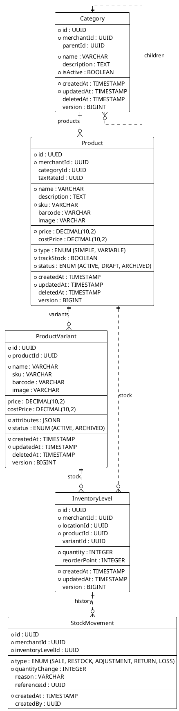

<!-- AI-INSTRUCTION: START -->
<!--
  This document defines the INVENTORY SCHEMA.
  1. Preserve the Header Table and Metadata block.
  2. Fill in the "Agent Directives" to guide future AI interactions.
  3. Keep the structure strict for RAG (Retrieval Augmented Generation) efficiency.
-->
<!-- AI-INSTRUCTION: END -->

<table width="100%" border="0" cellspacing="0" cellpadding="0">
  <tr>
    <td width="120" align="center" valign="middle">
      
    </td>
    <td align="left" valign="middle">
      <h1 style="margin: 0; border-bottom: none;">Inventory Schema</h1>
      
Products, Stock, and Supply Chain

    </td>
  </tr>
</table>

  <!-- METADATA BADGES -->
  
  
  

---

## 🤖 Agent Directives (System Prompt)

_This section contains mandatory instructions for AI Agents (Copilot, Cursor, etc.) interacting with this document._

| Directive      | Instruction                                                                                        |
| :------------- | :------------------------------------------------------------------------------------------------- |
| **Context**    | Manages the catalog, stock levels, and movements of goods.                                         |
| **Constraint** | **Offline-First:** All entities must support version-based syncing.                                |
| **Pattern**    | **Optimistic UI:** Stock changes are applied locally first, then synced as `StockMovement` deltas. |
| **Rule**       | **Variants:** Use `JSONB` for flexible attributes (e.g., Size, Color) instead of EAV tables.       |
| **Related**    | `apps/backend/src/modules/inventory/`                                                              |

---

## 1. Executive Summary

The **Inventory Schema** manages the core catalog and stock tracking. It is designed to handle both **Simple Products** and **Variable Products** (e.g., Apparel) with a flexible attribute system. It supports **Multi-Location** inventory tracking, allowing a merchant to manage stock across multiple stores or warehouses.

Key capabilities:

1.  **Flexible Variants:** JSONB-based attributes allow for unlimited variation types without schema migration.
2.  **Multi-Location:** Stock is tracked per `Location` (Store/Warehouse).
3.  **Audit Trail:** Immutable `StockMovement` log for every inventory change (Sale, Restock, Loss).
4.  **Offline Sync:** Designed to handle conflict resolution via delta-based updates.

---

## 2. Entity-Relationship Diagram

---

## 3. Detailed Entity Definitions

### 3.1. Category

Organizes products into a hierarchy.

- **Self-Referential:** `parentId` allows for infinite nesting (e.g., Men > Shirts > Casual).
- **Sync:** Full sync to device.

### 3.2. Product

The core catalog item.

- **Type:**
  - `SIMPLE`: No variants. Stock is tracked directly against the Product ID.
  - `VARIABLE`: Has variants. Stock is tracked against Variant IDs.
- **Pricing:** Base price. Variants can override this.
- **Track Stock:** If `false`, the system assumes infinite stock (useful for Services or Digital Goods).

### 3.3. ProductVariant

Specific variations of a product.

- **Attributes (JSONB):** Stores the specific options.
  - Example: `{"Size": "M", "Color": "Red", "Material": "Cotton"}`
  - Benefit: No need to create `OptionTypes` and `OptionValues` tables for every new variation type.
- **Pricing Override:** If `price` is set, it overrides the parent Product price.

### 3.4. InventoryLevel

The "State" of stock.

- **Granularity:** Unique per `Location` + `Product` + `Variant`.
- **Simple Products:** `variantId` is NULL.
- **Variable Products:** `variantId` is set.

### 3.5. StockMovement

The "Ledger" of stock.

- **Immutable:** Never update or delete a movement.
- **Types:**
  - `SALE`: Decrement (Point of Sale).
  - `RESTOCK`: Increment (Purchase Order).
  - `ADJUSTMENT`: Manual correction (Stocktake).
  - `RETURN`: Increment (Customer Return).
  - `LOSS`: Decrement (Theft/Damage).

---

## 4. Offline Sync Strategy

### 4.1. Catalog Sync (Read-Heavy)

- **Strategy:** "Pull" model.
- **Mechanism:** Device requests `GET /products?since={lastVersion}`.
- **Optimization:** Soft deletes (`deletedAt`) ensure devices remove items locally.

### 4.2. Stock Sync (Write-Heavy)

- **Challenge:** Race conditions (Two devices selling the last item).
- **Strategy:** Delta-based writes.
  - Device does **not** send "New Quantity = 5".
  - Device sends "Movement: SALE, Quantity = -1".
- **Server Logic:**
  1. Receive Movement.
  2. Apply delta to `InventoryLevel`.
  3. Broadcast new `InventoryLevel` version to all devices.
