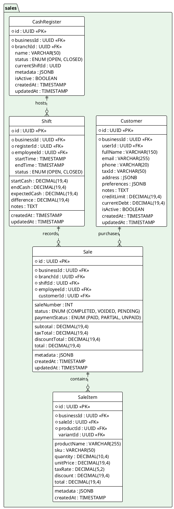

---
# YAML Frontmatter - Metadata for Semantic Search & RAG
document_type: "database-schema"
module: "sales"
status: "approved"
version: "2.0.0"
last_updated: "2025-11-28"
author: "@Architect"

# Keywords for semantic search
keywords:
  - "database"
  - "schema"
  - "sales"
  - "pos"
  - "transactions"
  - "orders"
  - "tickets"
  - "cash-register"
  - "shifts"
  - "customers"

# Related documentation
related_docs:
  api_design: ""
  feature_design: "docs/technical/backend/features/POS-CORE.md"
  ux_flow: "docs/technical/frontend/ux-flows/POS-SALES.md"
  sync_strategy: "docs/technical/architecture/OFFLINE-SYNC.md"

# Database metadata
database:
  engine: "PostgreSQL"
  min_version: "16.0"
  prisma_version: "5.0+"

# Schema statistics
schema_stats:
  total_tables: 5
  total_indexes: 15
  total_constraints: 20
  estimated_rows: "1M-100M"
---

<!-- AI-INSTRUCTION: START -->
<!--
  This document defines the SALES SCHEMA.
  1. Preserve the Header Table and Metadata block.
  2. Fill in the "Agent Directives" to guide future AI interactions.
  3. Keep the structure strict for RAG (Retrieval Augmented Generation) efficiency.
-->
<!-- AI-INSTRUCTION: END -->

<table width="100%" border="0" cellspacing="0" cellpadding="0">
  <tr>
    <td width="120" align="center" valign="middle">
      
    </td>
    <td align="left" valign="middle">
      <h1 style="margin: 0; border-bottom: none;">Sales Schema (POS)</h1>
      
Cash Registers, Shifts, Customers, and Transactions

    </td>
  </tr>
</table>

  <!-- METADATA BADGES -->
  
  
  

---

## Agent Directives (System Prompt)

_This section contains mandatory instructions for AI Agents (Copilot, Cursor, etc.) interacting with this document._

| Directive      | Instruction                                                                                        |
| :------------- | :------------------------------------------------------------------------------------------------- |
| **Context**    | Handles the Point of Sale (POS) operations, including opening/closing shifts and recording sales.  |
| **Constraint** | **Snapshotting:** `SaleItem` MUST store a copy of the product price/name at the moment of sale.    |
| **Pattern**    | **Shift Lifecycle:** Open -> Add Sales -> Count Cash -> Close -> Generate Report.                  |
| **Rule**       | **Immutability:** Sales cannot be deleted. Use `Refund` or `Void` (which creates a counter-entry). |
| **Related**    | `apps/backend/src/modules/sales/`                                                                  |

---

## 1. Executive Summary

The **Sales Schema** captures the core revenue-generating activities. It is tightly integrated with Inventory (to deduct stock) and Payments (to process money).

Key capabilities:

1.  **Cash Control:** Track cash in drawer via `CashRegister` and `Shift`.
2.  **Offline Support:** Sales can be queued locally and synced later.
3.  **Detailed Receipts:** Line-item detail with taxes and discounts.
4.  **Customer Management:** Track purchase history and loyalty.

---

## 2. Entity-Relationship Diagram

---

## 3. Detailed Entity Definitions

### 3.1. Customer

Represents a client of the business. Can be a casual walk-in (unregistered) or a registered regular.

| Attribute     | Type          | Description          | Rules & Constraints                                   |
| :------------ | :------------ | :------------------- | :---------------------------------------------------- |
| `id`          | UUID          | Unique identifier.   | Primary Key.                                          |
| `businessId`  | UUID          | Tenant owner.        | Foreign Key to `business.Business`.                   |
| `userId`      | UUID          | Global Identity.     | Foreign Key to `auth.User`. Optional (for App users). |
| `fullName`    | VARCHAR(150)  | Client name.         | Required.                                             |
| `email`       | VARCHAR(255)  | Contact email.       | Optional. Used for digital receipts.                  |
| `phone`       | VARCHAR(20)   | Contact phone.       | Optional.                                             |
| `taxId`       | VARCHAR(50)   | Fiscal ID.           | RFC/NIT. Required for invoices.                       |
| `address`     | JSONB         | Billing/Shipping.    | `{ "street": "...", "zip": "..." }`.                  |
| `preferences` | JSONB         | Comm settings.       | `{ "receiptChannel": "WHATSAPP", "language": "es" }`. |
| `notes`       | TEXT          | Internal remarks.    | "Likes spicy food", "VIP".                            |
| `creditLimit` | DECIMAL(19,4) | Max allowed debt.    | For "Fiado" (Store Credit).                           |
| `currentDebt` | DECIMAL(19,4) | Outstanding balance. | Updated when sales are `UNPAID`.                      |
| `isActive`    | BOOLEAN       | Status.              | Default `true`.                                       |
| `createdAt`   | TIMESTAMP     | Creation date.       | UTC.                                                  |

### 3.2. CashRegister

A physical or logical point of sale terminal.

| Attribute        | Type        | Description           | Rules & Constraints                          |
| :--------------- | :---------- | :-------------------- | :------------------------------------------- |
| `id`             | UUID        | Unique identifier.    | Primary Key.                                 |
| `businessId`     | UUID        | Tenant owner.         | Foreign Key to `business.Business`.          |
| `branchId`       | UUID        | Location.             | Foreign Key to `business.Branch`.            |
| `name`           | VARCHAR(50) | Terminal name.        | e.g., "Caja Principal", "iPad 2".            |
| `status`         | ENUM        | Operational state.    | `OPEN` (has active shift), `CLOSED`.         |
| `currentShiftId` | UUID        | Active shift pointer. | Optimization to quickly find the open shift. |
| `isActive`       | BOOLEAN     | Soft delete.          | Default `true`.                              |

### 3.3. Shift

Represents a period of time where a specific employee is responsible for a cash drawer.

| Attribute      | Type          | Description              | Rules & Constraints                        |
| :------------- | :------------ | :----------------------- | :----------------------------------------- |
| `id`           | UUID          | Unique identifier.       | Primary Key.                               |
| `businessId`   | UUID          | Tenant owner.            | Foreign Key to `business.Business`.        |
| `registerId`   | UUID          | Terminal.                | Foreign Key to `CashRegister`.             |
| `employeeId`   | UUID          | Responsible staff.       | Foreign Key to `business.Employee`.        |
| `startTime`    | TIMESTAMP     | Opening time.            | UTC.                                       |
| `endTime`      | TIMESTAMP     | Closing time.            | NULL if currently open.                    |
| `startCash`    | DECIMAL(19,4) | Initial float.           | Money in drawer at start.                  |
| `endCash`      | DECIMAL(19,4) | Counted cash.            | Money counted by employee at end.          |
| `expectedCash` | DECIMAL(19,4) | Calculated system total. | `startCash + cashSales - cashWithdrawals`. |
| `difference`   | DECIMAL(19,4) | Discrepancy.             | `endCash - expectedCash`.                  |

### 3.4. Sale

The header of a transaction/ticket.

| Attribute       | Type          | Description        | Rules & Constraints                                    |
| :-------------- | :------------ | :----------------- | :----------------------------------------------------- |
| `id`            | UUID          | Unique identifier. | Primary Key.                                           |
| `businessId`    | UUID          | Tenant owner.      | Foreign Key to `business.Business`.                    |
| `branchId`      | UUID          | Location.          | Foreign Key to `business.Branch`.                      |
| `shiftId`       | UUID          | Shift context.     | Foreign Key to `Shift`.                                |
| `employeeId`    | UUID          | Seller.            | Foreign Key to `business.Employee`. Who made the sale. |
| `customerId`    | UUID          | Client.            | Foreign Key to `Customer`. Optional.                   |
| `saleNumber`    | INT           | Sequential ID.     | Per Business. Friendly ID (e.g., #1045).               |
| `status`        | ENUM          | State.             | `COMPLETED`, `VOIDED` (Cancelled), `PENDING`.          |
| `paymentStatus` | ENUM          | Payment state.     | `PAID`, `PARTIAL` (Layaway), `UNPAID` (Credit).        |
| `total`         | DECIMAL(19,4) | Final amount.      | `subtotal - discount + tax`.                           |
| `createdAt`     | TIMESTAMP     | Transaction time.  | UTC.                                                   |

### 3.5. SaleItem (The Snapshot)

Stores the line items of a receipt.

| Attribute     | Type          | Description              | Rules & Constraints                                                 |
| :------------ | :------------ | :----------------------- | :------------------------------------------------------------------ |
| `id`          | UUID          | Unique identifier.       | Primary Key.                                                        |
| `saleId`      | UUID          | Parent sale.             | Foreign Key to `Sale`.                                              |
| `productId`   | UUID          | Product reference.       | Foreign Key to `inventory.Product`.                                 |
| `variantId`   | UUID          | Variant reference.       | Foreign Key to `inventory.ProductVariant`. Optional.                |
| `unitPrice`   | DECIMAL(19,4) | Price at moment of sale. | **Crucial:** Do not link to `Product.price` for historical reports. |
| `productName` | VARCHAR       | Name at moment of sale.  | Preserves history if product is renamed.                            |
| `quantity`    | DECIMAL(10,4) | Amount sold.             | Supports fractional units (kg).                                     |
| `total`       | DECIMAL(19,4) | Line total.              | `(unitPrice * quantity) - discount`.                                |
