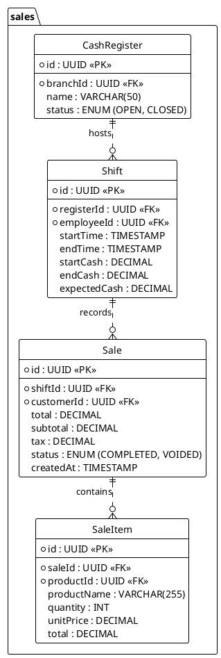

---
# YAML Frontmatter - Metadata for Semantic Search & RAG
document_type: "database-schema"
module: "sales"
status: "approved"
version: "1.0.0"
last_updated: "2025-11-27"
author: "@Architect"

# Keywords for semantic search
keywords:
  - "database"
  - "schema"
  - "sales"
  - "pos"
  - "transactions"
  - "orders"
  - "tickets"
  - "cash-register"

# Related documentation
related_docs:
  api_design: ""
  feature_design: ""
  ux_flow: ""
  sync_strategy: ""

# Database metadata
database:
  engine: "PostgreSQL"
  min_version: "16.0"
  prisma_version: "5.0+"

# Schema statistics
schema_stats:
  total_tables: 10
  total_indexes: 18
  total_constraints: 20
  estimated_rows: "100K-10M"
---

<!-- AI-INSTRUCTION: START -->
<!--
  This document defines the SALES SCHEMA.
  1. Preserve the Header Table and Metadata block.
  2. Fill in the "Agent Directives" to guide future AI interactions.
  3. Keep the structure strict for RAG (Retrieval Augmented Generation) efficiency.
-->
<!-- AI-INSTRUCTION: END -->

<table width="100%" border="0" cellspacing="0" cellpadding="0">
  <tr>
    <td width="120" align="center" valign="middle">
      
    </td>
    <td align="left" valign="middle">
      <h1 style="margin: 0; border-bottom: none;">Sales Schema (POS)</h1>
      
Cash Registers, Shifts, and Transactions

    </td>
  </tr>
</table>

  <!-- METADATA BADGES -->
  
  
  

---

## Agent Directives (System Prompt)

_This section contains mandatory instructions for AI Agents (Copilot, Cursor, etc.) interacting with this document._

| Directive      | Instruction                                                                                        |
| :------------- | :------------------------------------------------------------------------------------------------- |
| **Context**    | Handles the Point of Sale (POS) operations, including opening/closing shifts and recording sales.  |
| **Constraint** | **Snapshotting:** `SaleItem` MUST store a copy of the product price/name at the moment of sale.    |
| **Pattern**    | **Shift Lifecycle:** Open -> Add Sales -> Count Cash -> Close -> Generate Report.                  |
| **Rule**       | **Immutability:** Sales cannot be deleted. Use `Refund` or `Void` (which creates a counter-entry). |
| **Related**    | `apps/backend/src/modules/sales/`                                                                  |

---

## 1. Executive Summary

The **Sales Schema** captures the core revenue-generating activities. It is tightly integrated with Inventory (to deduct stock) and Payments (to process money).

Key capabilities:

1.  **Cash Control:** Track cash in drawer via `CashRegister` and `Shift`.
2.  **Offline Support:** Sales can be queued locally and synced later.
3.  **Detailed Receipts:** Line-item detail with taxes and discounts.

---

## 2. Entity-Relationship Diagram

---

## 3. Detailed Entity Definitions

### 3.1. Shift

Represents a period of time where a specific employee is responsible for a cash drawer.

| Attribute      | Type    | Description              | Rules & Constraints                     |
| :------------- | :------ | :----------------------- | :-------------------------------------- |
| `expectedCash` | DECIMAL | Calculated system total. | `startCash + cashSales - cashRefunds`.  |
| `endCash`      | DECIMAL | Actual counted cash.     | Discrepancy = `endCash - expectedCash`. |

### 3.2. SaleItem (The Snapshot)

Stores the line items of a receipt.

| Attribute     | Type    | Description              | Rules & Constraints                                                 |
| :------------ | :------ | :----------------------- | :------------------------------------------------------------------ |
| `unitPrice`   | DECIMAL | Price at moment of sale. | **Crucial:** Do not link to `Product.price` for historical reports. |
| `productName` | VARCHAR | Name at moment of sale.  | Preserves history if product is renamed.                            |
