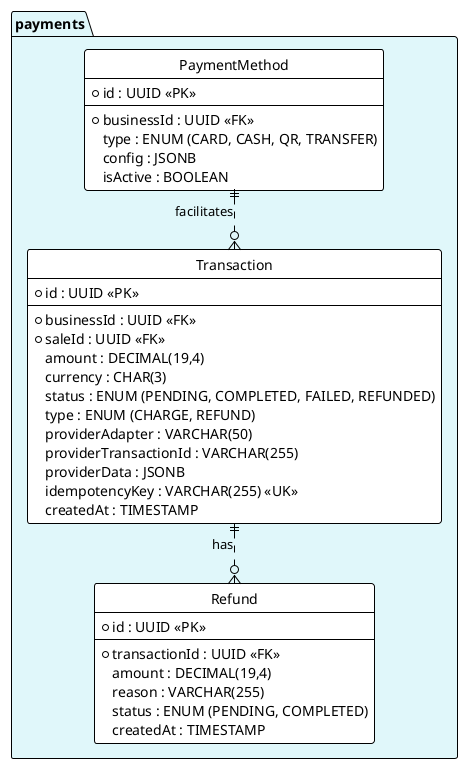

---
# YAML Frontmatter - Metadata for Semantic Search & RAG
document_type: "database-schema"
module: "payments"
status: "approved"
version: "1.0.0"
last_updated: "2025-11-27"
author: "@Architect"

# Keywords for semantic search
keywords:
  - "database"
  - "schema"
  - "payments"
  - "transactions"
  - "payment-providers"
  - "webhooks"
  - "refunds"
  - "multi-country"

# Related documentation
related_docs:
  api_design: ""
  feature_design: ""
  ux_flow: ""
  sync_strategy: ""

# Database metadata
database:
  engine: "PostgreSQL"
  min_version: "16.0"
  prisma_version: "5.0+"

# Schema statistics
schema_stats:
  total_tables: 8
  total_indexes: 14
  total_constraints: 16
  estimated_rows: "100K-10M"
---

<!-- AI-INSTRUCTION: START -->
<!--
  This document defines the PAYMENTS SCHEMA.
  1. Preserve the Header Table and Metadata block.
  2. Fill in the "Agent Directives" to guide future AI interactions.
  3. Keep the structure strict for RAG (Retrieval Augmented Generation) efficiency.
-->
<!-- AI-INSTRUCTION: END -->

<table width="100%" border="0" cellspacing="0" cellpadding="0">
  <tr>
    <td width="120" align="center" valign="middle">
      
    </td>
    <td align="left" valign="middle">
      <h1 style="margin: 0; border-bottom: none;">Payments Schema</h1>
      
Transactions, Gateways, and Reconciliation

    </td>
  </tr>
</table>

  <!-- METADATA BADGES -->
  
  
  

---

## Agent Directives (System Prompt)

_This section contains mandatory instructions for AI Agents (Copilot, Cursor, etc.) interacting with this document._

| Directive      | Instruction                                                                                               |
| :------------- | :-------------------------------------------------------------------------------------------------------- |
| **Context**    | Manages the movement of money. Connects to external gateways (Stripe, Conekta, PayU).                     |
| **Constraint** | **Idempotency:** All transactions MUST have an `idempotencyKey` to prevent double-charging.               |
| **Pattern**    | **Strategy:** The schema supports multiple providers via the `providerAdapter` field.                     |
| **Rule**       | **Immutability:** Transactions are append-only. Failed transactions stay failed; retry creates a new row. |
| **Related**    | `apps/backend/src/modules/payments/`                                                                      |

---

## 1. Executive Summary

The **Payments Schema** is the financial backbone. It abstracts the complexity of multiple payment providers (Conekta for Mexico, PayU for Colombia) into a unified `Transaction` model.

Key capabilities:

1.  **Multi-Provider:** Switch providers without changing the database schema.
2.  **Reconciliation:** Track external IDs (`providerTransactionId`) against internal records.
3.  **Refunds:** Native support for partial and full refunds.

---

## 2. Entity-Relationship Diagram

---

## 3. Detailed Entity Definitions

### 3.1. Transaction

The core record of money movement.

| Attribute         | Type    | Description                  | Rules & Constraints                          |
| :---------------- | :------ | :--------------------------- | :------------------------------------------- |
| `providerAdapter` | VARCHAR | The service used.            | e.g., `ConektaAdapter`, `StripeAdapter`.     |
| `providerData`    | JSONB   | Raw gateway response.        | Stores metadata like card last4, brand, etc. |
| `idempotencyKey`  | VARCHAR | Unique client-generated key. | Prevents duplicate charges on network retry. |

### 3.2. PaymentMethod

Configuration for accepted payment types.

| Attribute | Type  | Description        | Rules & Constraints                     |
| :-------- | :---- | :----------------- | :-------------------------------------- |
| `config`  | JSONB | Provider settings. | e.g., `{ "publicKey": "pk_test_..." }`. |
