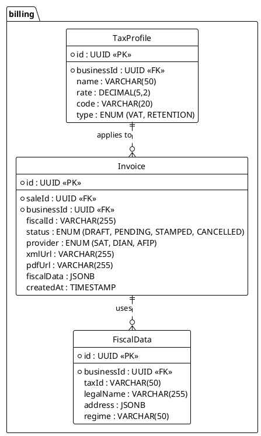

---
# YAML Frontmatter - Metadata for Semantic Search & RAG
document_type: "database-schema"
module: "billing"
status: "approved"
version: "1.0.0"
last_updated: "2025-11-27"
author: "@Architect"

# Keywords for semantic search
keywords:
  - "database"
  - "schema"
  - "billing"
  - "invoices"
  - "receipts"
  - "cfdi"
  - "tax"
  - "accounting"

# Related documentation
related_docs:
  api_design: ""
  feature_design: ""
  ux_flow: ""
  sync_strategy: ""

# Database metadata
database:
  engine: "PostgreSQL"
  min_version: "16.0"
  prisma_version: "5.0+"

# Schema statistics
schema_stats:
  total_tables: 7
  total_indexes: 12
  total_constraints: 14
  estimated_rows: "100K-10M"
---

<!-- AI-INSTRUCTION: START -->
<!--
  This document defines the BILLING SCHEMA.
  1. Preserve the Header Table and Metadata block.
  2. Fill in the "Agent Directives" to guide future AI interactions.
  3. Keep the structure strict for RAG (Retrieval Augmented Generation) efficiency.
-->
<!-- AI-INSTRUCTION: END -->

<table width="100%" border="0" cellspacing="0" cellpadding="0">
  <tr>
    <td width="120" align="center" valign="middle">
      
    </td>
    <td align="left" valign="middle">
      <h1 style="margin: 0; border-bottom: none;">Billing Schema (Fiscal)</h1>
      
Invoicing, Taxes, and Compliance (SAT/DIAN)

    </td>
  </tr>
</table>

  <!-- METADATA BADGES -->
  
  
  

---

## Agent Directives (System Prompt)

_This section contains mandatory instructions for AI Agents (Copilot, Cursor, etc.) interacting with this document._

| Directive      | Instruction                                                                                     |
| :------------- | :---------------------------------------------------------------------------------------------- |
| **Context**    | Handles legal invoicing and tax reporting for different countries (MX, CO, AR, CL).             |
| **Constraint** | **Immutability:** Once an invoice is `STAMPED`, it cannot be modified. Only cancelled.          |
| **Pattern**    | **Adapter:** Uses the same Strategy pattern as Payments to handle different fiscal authorities. |
| **Rule**       | **PDF/XML:** The database stores the _URL_ to the files (S3), not the files themselves.         |
| **Related**    | `apps/backend/src/modules/billing/`                                                             |

---

## 1. Executive Summary

The **Billing Schema** ensures legal compliance. It generates valid fiscal documents (CFDI in Mexico, Factura Electrónica in Colombia) based on sales data.

Key capabilities:

1.  **Multi-Country:** Supports SAT (Mexico), DIAN (Colombia), AFIP (Argentina).
2.  **Async Stamping:** Invoicing is an async process that can take seconds or minutes.
3.  **Tax Profiles:** Configurable tax rates per product/branch.

---

## 2. Entity-Relationship Diagram

---

## 3. Detailed Entity Definitions

### 3.1. Invoice

The legal document.

| Attribute    | Type    | Description                  | Rules & Constraints                                 |
| :----------- | :------ | :--------------------------- | :-------------------------------------------------- |
| `fiscalId`   | VARCHAR | The official government ID.  | UUID (Mexico), CUFE (Colombia).                     |
| `fiscalData` | JSONB   | Snapshot of receiver's data. | Stores the customer's tax info at time of stamping. |

### 3.2. TaxProfile

Configuration for taxes.

| Attribute | Type    | Description          | Rules & Constraints            |
| :-------- | :------ | :------------------- | :----------------------------- |
| `code`    | VARCHAR | Government tax code. | e.g., `002` for IVA in Mexico. |
