---
# YAML Frontmatter - Metadata for Semantic Search & RAG
document_type: "database-schema"
module: "database"
status: "approved"
version: "1.0.0"
last_updated: "2025-11-27"
author: "@Architect"

# Keywords for semantic search
keywords:
  - "er-diagram"
  - "database-schema"
  - "relationships"
  - "entity-relationship"
  - "full-schema"
  - "plantuml"

# Related documentation
related_docs:
  database_schema: ""
  api_design: ""
  feature_design: ""
  ux_flow: ""

# Database metadata
database:
  engine: "PostgreSQL"
  prisma_version: "5.0+"
  schema_stats:
    tables: 30
    indexes: 60
    constraints: 100
    estimated_rows: 1000000
---

# Full Entity-Relationship Diagram

This diagram represents the complete database schema for the Payment System.

```plantuml
@startuml

' CONFIGURACIÓN VISUAL (Clean & Modern)
!theme plain
hide circle
skinparam linetype ortho
skinparam class {
    BackgroundColor White
    ArrowColor #333
    BorderColor #333
}

' LEYENDA DE COLORES
legend right
    | Color | Módulo | Descripción |
    | <#E3F2FD> | **Auth** | Identidad y Seguridad |
    | <#ECEFF1> | **Business** | Estructura Organizacional |
    | <#F3E5F5> | **Communication** | Notificaciones y Mensajería |
    | <#FFF3E0> | **Inventory** | Catálogo y Stock |
    | <#E8F5E9> | **Sales** | Punto de Venta (POS) |
    | <#E0F7FA> | **Payments** | Transacciones Financieras |
    | <#FFEBEE> | **Billing** | Facturación Fiscal |
endlegend

' --- SCHEMA: AUTH ---
package "auth" #E3F2FD {
  entity "User" as user {
    *id : UUID <<PK>>
    --
    email : VARCHAR <<UK>>
    emailVerified : TIMESTAMP
    phone : VARCHAR <<UK>>
    phoneVerified : TIMESTAMP
    firstName : VARCHAR
    lastName : VARCHAR
    displayName : VARCHAR
    avatarUrl : VARCHAR
    locale : VARCHAR
    kycLevel : INT
    kycData : JSONB
    preferences : JSONB
    isActive : BOOLEAN
    createdAt : TIMESTAMP
    updatedAt : TIMESTAMP
    deletedAt : TIMESTAMP
  }

  entity "UserIdentity" as identity {
    *id : UUID <<PK>>
    --
    *userId : UUID <<FK>>
    provider : ENUM (LOCAL, GOOGLE, PHONE)
    providerId : VARCHAR
    credential : VARCHAR
    metadata : JSONB
    lastLogin : TIMESTAMP
    --
    <<UK>> (provider, providerId)
  }

  entity "TwoFactorAuth" as mfa {
    *id : UUID <<PK>>
    --
    *userId : UUID <<FK>>
    type : ENUM (TOTP, SMS, EMAIL)
    secret : VARCHAR
    backupCodes : JSONB
    isEnabled : BOOLEAN
    createdAt : TIMESTAMP
    updatedAt : TIMESTAMP
  }

  entity "TrustedDevice" as device {
    *id : UUID <<PK>>
    --
    *userId : UUID <<FK>>
    deviceIdentifier : VARCHAR
    name : VARCHAR
    userAgent : VARCHAR
    lastUsedAt : TIMESTAMP
    expiresAt : TIMESTAMP
    createdAt : TIMESTAMP
  }

  entity "Session" as session {
    *id : UUID <<PK>>
    --
    *userId : UUID <<FK>>
    trustedDeviceId : UUID <<FK>>
    tokenHash : VARCHAR
    deviceInfo : JSONB
    ipAddress : VARCHAR
    expiresAt : TIMESTAMP
    createdAt : TIMESTAMP
    revokedAt : TIMESTAMP
  }

  entity "AuditLog" as audit {
    *id : UUID <<PK>>
    --
    userId : UUID <<FK>>
    action : VARCHAR
    resource : VARCHAR
    metadata : JSONB
    ipAddress : VARCHAR
    createdAt : TIMESTAMP
  }
}

' --- SCHEMA: BUSINESS ---
package "business" #ECEFF1 {
  entity "Business" as business {
    *id : UUID <<PK>>
    --
    *ownerId : UUID <<FK>>
    legalName : VARCHAR
    taxId : VARCHAR <<UK>>
    country : VARCHAR
    type : ENUM (RETAIL, RESTAURANT, SERVICE)
    fiscalData : JSONB
    branding : JSONB
    features : JSONB
    isActive : BOOLEAN
    createdAt : TIMESTAMP
    updatedAt : TIMESTAMP
    deletedAt : TIMESTAMP
  }

  entity "Employee" as employee {
    *id : UUID <<PK>>
    --
    userId : UUID <<FK>>
    *businessId : UUID <<FK>>
    branchId : UUID <<FK>>
    *roleId : UUID <<FK>>
    alias : VARCHAR
    pinCode : VARCHAR
    status : ENUM (ACTIVE, INVITED)
    createdAt : TIMESTAMP
    updatedAt : TIMESTAMP
    deletedAt : TIMESTAMP
    --
    <<UK>> (businessId, pinCode)
  }

  entity "Role" as role {
    *id : UUID <<PK>>
    --
    businessId : UUID <<FK>>
    name : VARCHAR
    type : ENUM (SYSTEM, CUSTOM)
    permissions : JSONB
    riskLevel : ENUM (LOW, MEDIUM, HIGH, CRITICAL)
    deletedAt : TIMESTAMP
  }

  entity "Branch" as branch {
    *id : UUID <<PK>>
    --
    *businessId : UUID <<FK>>
    name : VARCHAR
    address : JSONB
    timezone : VARCHAR
    openingHours : JSONB
    isDefault : BOOLEAN
    createdAt : TIMESTAMP
    updatedAt : TIMESTAMP
    deletedAt : TIMESTAMP
  }

  entity "ApiKey" as apikey {
    *id : UUID <<PK>>
    --
    *businessId : UUID <<FK>>
    name : VARCHAR
    keyHash : VARCHAR
    scopes : JSONB
    expiresAt : TIMESTAMP
    createdAt : TIMESTAMP
    deletedAt : TIMESTAMP
  }
}

' --- SCHEMA: COMMUNICATION ---
package "communication" #F3E5F5 {
  entity "NotificationLog" as notif {
    *id : UUID <<PK>>
    --
    userId : UUID <<FK>>
    businessId : UUID <<FK>>
    templateId : UUID <<FK>>
    channel : ENUM
    priority : ENUM
    status : ENUM
    provider : VARCHAR
    providerId : VARCHAR
    metadata : JSONB
    error : TEXT
    createdAt : TIMESTAMP
  }

  entity "NotificationTemplate" as template {
    *id : UUID <<PK>>
    --
    businessId : UUID <<FK>>
    code : VARCHAR
    channel : ENUM
    subject : VARCHAR
    content : TEXT
    variables : JSONB
    isDefault : BOOLEAN
  }

  entity "InAppNotification" as in_app {
    *id : UUID <<PK>>
    --
    *userId : UUID <<FK>>
    title : VARCHAR
    body : VARCHAR
    data : JSONB
    isRead : BOOLEAN
    createdAt : TIMESTAMP
  }

  entity "PushSubscription" as push {
    *id : UUID <<PK>>
    --
    *userId : UUID <<FK>>
    endpoint : VARCHAR
    keys : JSONB
    userAgent : VARCHAR
    createdAt : TIMESTAMP
  }
}

' --- SCHEMA: INVENTORY ---
package "inventory" #FFF3E0 {
  entity "Category" as category {
    *id : UUID <<PK>>
    --
    *businessId : UUID <<FK>>
    parentId : UUID <<FK>>
    name : VARCHAR
    isActive : BOOLEAN
    createdAt : TIMESTAMP
    updatedAt : TIMESTAMP
    deletedAt : TIMESTAMP
  }

  entity "Product" as product {
    *id : UUID <<PK>>
    --
    *businessId : UUID <<FK>>
    categoryId : UUID <<FK>>
    name : VARCHAR
    sku : VARCHAR
    barcode : VARCHAR
    price : DECIMAL
    costPrice : DECIMAL
    type : ENUM
    trackStock : BOOLEAN
    status : ENUM
    createdAt : TIMESTAMP
    updatedAt : TIMESTAMP
    deletedAt : TIMESTAMP
  }

  entity "ProductVariant" as variant {
    *id : UUID <<PK>>
    --
    *productId : UUID <<FK>>
    name : VARCHAR
    sku : VARCHAR
    price : DECIMAL
    attributes : JSONB
    status : ENUM
    createdAt : TIMESTAMP
    updatedAt : TIMESTAMP
    deletedAt : TIMESTAMP
  }

  entity "InventoryLevel" as stock {
    *id : UUID <<PK>>
    --
    *businessId : UUID <<FK>>
    *branchId : UUID <<FK>>
    *productId : UUID <<FK>>
    variantId : UUID <<FK>>
    quantity : INT
    reorderPoint : INT
    version : BIGINT
    updatedAt : TIMESTAMP
  }

  entity "StockMovement" as movement {
    *id : UUID <<PK>>
    --
    *businessId : UUID <<FK>>
    *inventoryLevelId : UUID <<FK>>
    type : ENUM
    quantityChange : INT
    reason : VARCHAR
    referenceId : UUID
    createdAt : TIMESTAMP
  }
}

' --- SCHEMA: SALES ---
package "sales" #E8F5E9 {
  entity "Customer" as customer {
    *id : UUID <<PK>>
    --
    *businessId : UUID <<FK>>
    userId : UUID <<FK>>
    fullName : VARCHAR
    email : VARCHAR
    phone : VARCHAR
    taxId : VARCHAR
    address : JSONB
    preferences : JSONB
    notes : TEXT
    creditLimit : DECIMAL
    currentDebt : DECIMAL
    isActive : BOOLEAN
    createdAt : TIMESTAMP
    updatedAt : TIMESTAMP
  }

  entity "CashRegister" as register {
    *id : UUID <<PK>>
    --
    *businessId : UUID <<FK>>
    *branchId : UUID <<FK>>
    name : VARCHAR
    status : ENUM (OPEN, CLOSED)
    currentShiftId : UUID
    metadata : JSONB
    isActive : BOOLEAN
    createdAt : TIMESTAMP
    updatedAt : TIMESTAMP
  }

  entity "Shift" as shift {
    *id : UUID <<PK>>
    --
    *businessId : UUID <<FK>>
    *registerId : UUID <<FK>>
    *employeeId : UUID <<FK>>
    startTime : TIMESTAMP
    endTime : TIMESTAMP
    status : ENUM (OPEN, CLOSED)
    startCash : DECIMAL
    endCash : DECIMAL
    expectedCash : DECIMAL
    difference : DECIMAL
    notes : TEXT
    createdAt : TIMESTAMP
    updatedAt : TIMESTAMP
  }

  entity "Sale" as sale {
    *id : UUID <<PK>>
    --
    *businessId : UUID <<FK>>
    *branchId : UUID <<FK>>
    *shiftId : UUID <<FK>>
    *employeeId : UUID <<FK>>
    customerId : UUID <<FK>>
    saleNumber : INT
    status : ENUM (COMPLETED, VOIDED, PENDING)
    paymentStatus : ENUM (PAID, PARTIAL, UNPAID)
    subtotal : DECIMAL
    taxTotal : DECIMAL
    discountTotal : DECIMAL
    total : DECIMAL
    metadata : JSONB
    createdAt : TIMESTAMP
    updatedAt : TIMESTAMP
  }

  entity "SaleItem" as sale_item {
    *id : UUID <<PK>>
    --
    *businessId : UUID <<FK>>
    *saleId : UUID <<FK>>
    *productId : UUID <<FK>>
    variantId : UUID <<FK>>
    productName : VARCHAR
    sku : VARCHAR
    quantity : DECIMAL
    unitPrice : DECIMAL
    taxRate : DECIMAL
    discount : DECIMAL
    total : DECIMAL
    metadata : JSONB
    createdAt : TIMESTAMP
  }
}

' --- SCHEMA: PAYMENTS ---
package "payments" #E0F7FA {
  entity "Transaction" as txn {
    *id : UUID <<PK>>
    --
    *businessId : UUID <<FK>>
    branchId : UUID <<FK>>
    saleId : UUID <<FK>>
    amount : DECIMAL
    status : ENUM
    providerAdapter : VARCHAR
    idempotencyKey : UUID
    createdAt : TIMESTAMP
    updatedAt : TIMESTAMP
  }

  entity "PaymentMethod" as pay_method {
    *id : UUID <<PK>>
    --
    *businessId : UUID <<FK>>
    name : VARCHAR
    type : ENUM
    deletedAt : TIMESTAMP
  }
}

' --- SCHEMA: BILLING ---
package "billing" #FFEBEE {
  entity "Invoice" as invoice {
    *id : UUID <<PK>>
    --
    *saleId : UUID <<FK>>
    transactionId : UUID <<FK>>
    invoiceNumber : VARCHAR
    uuid : VARCHAR
    status : ENUM
    createdAt : TIMESTAMP
    updatedAt : TIMESTAMP
    deletedAt : TIMESTAMP
  }
}

' --- RELACIONES (Notación Pata de Gallo) ---

' Identity
user ||..o{ identity : "has"
user ||..o| mfa : "protected by"
user ||..o{ device : "trusts"
device ||..o{ session : "originates"
user ||..o{ business : "owns"
user ||..o{ employee : "works as"
user ||..o{ notif : "receives"
user ||..o{ in_app : "has"
user ||..o{ push : "subscribes"

' Business Core
business ||..o{ employee : "employs"
business ||..o{ branch : "has"
business ||..o{ pay_method : "configures"
business ||..o{ apikey : "has"
business ||..o{ notif : "generates"

' Roles
role ||..o{ employee : "assigned to"
business ||..o{ role : "defines"

' Communication
template ||..o{ notif : "instantiates"

' Inventory
business ||..o{ category : "manages"
category ||..o{ category : "parent of"
category ||..o{ product : "contains"
business ||..o{ product : "sells"
product ||..o{ variant : "has"
branch ||..o{ stock : "stores"
product ||..o{ stock : "stocked in"
variant ||..o{ stock : "stocked in"
stock ||..o{ movement : "history"

' Sales
branch ||..o{ register : "has"
register ||..o{ shift : "records"
employee ||..o{ shift : "opens"
shift ||..o{ sale : "includes"
employee ||..o{ sale : "performs"
customer ||..o{ sale : "purchases"
user ||..o{ customer : "linked to"
sale ||..|{ sale_item : "contains"
product ||..o{ sale_item : "sold as"
variant ||..o{ sale_item : "sold as"
sale ||..o| txn : "paid with"
business ||..o{ txn : "processes"
branch ||..o{ txn : "processes"

' Billing
sale ||..o| invoice : "billed as"
txn ||..o| invoice : "related to"

@enduml
```

