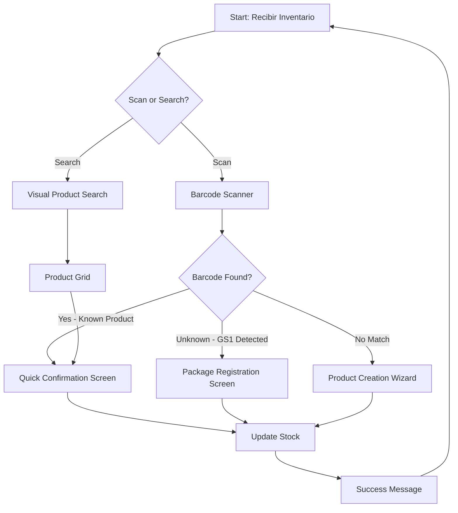
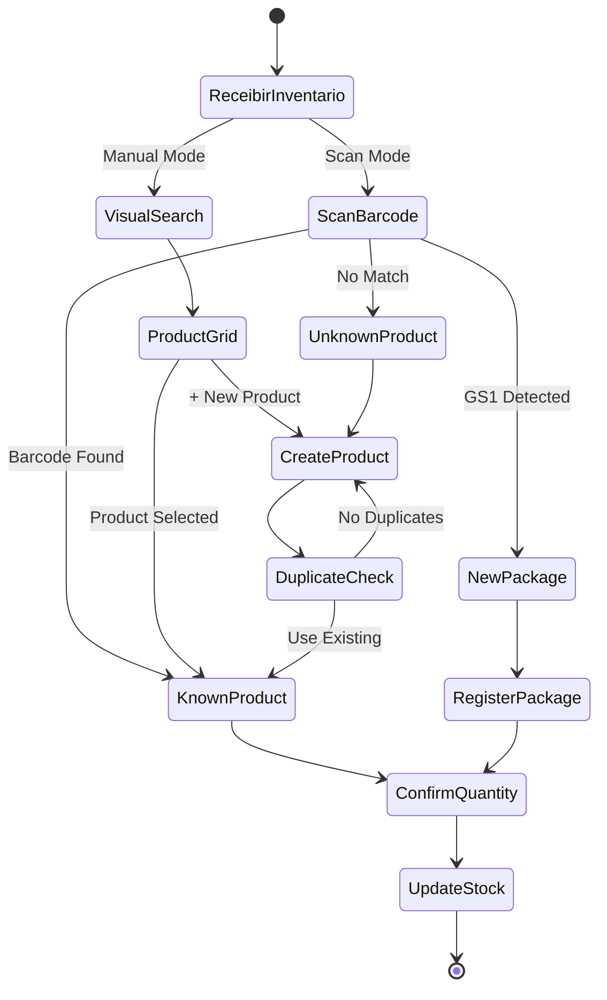

---
# YAML Frontmatter - Metadata for Semantic Search & RAG
document_type: "ux-flow"
module: "inventory-ui"
status: "approved"
version: "1.0.0"
last_updated: "2025-11-27"
author: "@Frontend"

# Keywords for semantic search
keywords:
  - "ux"
  - "user-flow"
  - "barcode-scanning"
  - "product-creation"
  - "inventory"
  - "mobile"
  - "validation"
  - "duplicate-detection"
  - "visual-search"

# Related documentation
related_docs:
  database_schema: "docs/technical/backend/database/04-INVENTORY-SCHEMA.md"
  api_design: ""
  feature_design: ""
  sync_strategy: ""

# UX-specific metadata
ux_metadata:
  platform: "both"
  framework: "Angular 21+"
  total_screens: 8
  accessibility_level: "WCAG AA"
  user_roles: ["merchant", "cashier", "admin"]
  key_interactions:
    ["barcode-scan", "product-search", "form-validation", "duplicate-detection"]
---

<!-- AI-INSTRUCTION: START -->
<!--
  This document defines the UX FLOW for Inventory Barcode Scanning and Product Creation.

  PURPOSE: Document user interaction flows, validation screens, and UI behavior ONLY.

  SCOPE:
  - Barcode scanning scenarios (known/unknown products)
  - Visual product selection (no scanner)
  - Product creation wizard
  - Duplicate detection and disambiguation
  - Size/variant management UI

  OUT OF SCOPE (belongs in other docs):
  - Database schema > docs/technical/backend/database/04-INVENTORY-SCHEMA.md
  - API contracts > to be created
  - Business logic algorithms > feature design docs
-->
<!-- AI-INSTRUCTION: END -->

<table width="100%" border="0" cellspacing="0" cellpadding="0">
  <tr>
    <td width="120" align="center" valign="middle">
      
    </td>
    <td align="left" valign="middle">
      <h1 style="margin: 0; border-bottom: none;">UX Flow: Inventory Barcode Scanning & Product Creation</h1>
      <p style="margin: 0; color: #6e7681; font-size: 1.1em;">User Experience Flow Documentation</p>
    </td>
  </tr>
</table>

<div align="center">

  <!-- METADATA BADGES -->
  
  
  

</div>

---

## Agent Directives (System Prompt)

_This section contains mandatory instructions for AI Agents (Copilot, Cursor, etc.) interacting with this document._

| Directive      | Instruction                                                                               |
| :------------- | :---------------------------------------------------------------------------------------- |
| **Context**    | This document defines the UX flow for barcode scanning and product creation in inventory. |
| **Constraint** | ONLY document user-facing interactions. NO database schema, NO API implementation.        |
| **Pattern**    | Use ASCII mockups for screens. Document all validation rules and error states.            |
| **Related**    | DB Schema: `docs/technical/backend/database/04-INVENTORY-SCHEMA.md`                       |

---

## 1. Executive Summary

This document defines the **user experience flow** for inventory management, specifically focusing on:

1. **Barcode Scanning** - 3 scenarios (known product, new package, unknown product)
2. **Visual Product Selection** - Grid-based search for merchants without scanners
3. **Product Creation Wizard** - Guided flow for adding new products
4. **Duplicate Detection** - Smart suggestions to prevent duplicates
5. **Variant Management** - Size/color selection UI

**Key UX Principles:**

- **Fast Path:** Known products require only 3 taps (Scan → Quantity → Confirm)
- **Visual Confirmation:** Always show product image for verification
- **Smart Suggestions:** Auto-detect packages and suggest existing products
- **Error Prevention:** Warn about duplicates before creation
- **Offline-First:** All actions work offline and sync later

---

## 2. User Flows Overview



---

## 3. Barcode Scanning Scenarios

### 3.1. Scenario A: Known Product, Known Barcode

**Trigger:** User scans barcode `7501234567890`

**System Response:**

```text
┌─────────────────────────────────────┐
│  Producto Identificado             │
│                                     │
│  Sabritas Adobadas 45g           │
│   SKU: SAB-ADO-45                │
│                                     │
│ Cantidad a recibir:                 │
│ [  5  ] piezas     Cambiar unidad│
│                                     │
│ Stock actual: 24 pcs                │
│ Nuevo stock: 29 pcs                 │
│                                     │
│ [ Cancelar ]     [  Confirmar ]   │
└─────────────────────────────────────┘
```

**User Actions:**

1. Scan barcode (camera or USB scanner)
2. Adjust quantity if needed (default: 1)
3. Tap "Confirmar"

**Validation Rules:**

- Auto-fills product info from database
- Shows current stock for context
- Allows quantity adjustment before confirming
- Fast path: Scan → Quantity → Confirm (3 taps)

**Error States:**

- **Network Offline:** Show warning "Cambios se sincronizarán cuando vuelvas a conectar"
- **Negative Stock After Confirmation:** Show alert "Stock insuficiente" (if this is a sale transaction)

---

### 3.2. Scenario B: Known Product, Unknown Barcode (New Package Type)

**Trigger:** User scans box barcode `17501234567897` (not in database)

**System Behavior:**

1. Search barcode in database → Not found
2. Detect GS1 format (starts with '1')
3. Extract embedded GTIN → `7501234567890`
4. Search product with primary barcode `7501234567890` → Found
5. Show package registration screen

**System Response:**

```text
┌─────────────────────────────────────┐
│ WARNING  Nuevo Código Detectado          │
│                                     │
│ Código escaneado:                   │
│ 17501234567897                      │
│                                     │
│ ¿Es este producto?                  │
│ ┌─────────────────────────────────┐ │
│ │  Sabritas Adobadas 45g         │ │
│ │   SKU: SAB-ADO-45               │ │
│ │   Stock: 24 pcs                 │ │
│ └─────────────────────────────────┘ │
│                                     │
│ Este código representa:             │
│ Cantidad: [ 12 ] [v Piezas]        │
│                                     │
│ Opciones:                           │
│ ○ Caja (12 piezas)                 │
│ ○ Paquete (6 piezas)               │
│ ○ Otro: [____]                     │
│                                     │
│  Guardar este código para futuro │
│                                     │
│ [ Buscar Otro ] [  Confirmar ]    │
└─────────────────────────────────────┘
```

**User Actions:**

1. Verify visual match (product image shown)
2. Select package type or enter custom quantity
3. Toggle "Guardar para futuro" (default: ON)
4. Tap "Confirmar"

**System Actions After Confirmation:**

1. Create `Barcode` record (17501234567897 → Product ID, qty: 12)
2. Create `UnitConversion` record (box → pcs, factor: 12)
3. Update stock: +12 pcs
4. Create `StockMovement` record

**Validation Rules:**

- Suggest most likely product based on GS1 GTIN
- Show product image for visual confirmation
- User defines package quantity (default suggestions: 6, 12, 24)
- Option to save barcode for future or skip (one-time scan)

**Edge Cases:**

- **Wrong Product Match:** User taps "Buscar Otro" → Go to manual product search
- **No GTIN Extracted:** Treat as Scenario C (unknown product)

---

### 3.3. Scenario C: Unknown Product (First Time)

**Trigger:** User scans barcode `9876543210987` (not in database, no GTIN match)

**System Response:**

```text
┌─────────────────────────────────────┐
│ [NEW] Producto No Encontrado           │
│                                     │
│ Código: 9876543210987               │
│                                     │
│ ¿Deseas buscarlo en línea?         │
│ [ [SEARCH] Buscar ]  [ [EDIT] Crear Manual ]  │
└─────────────────────────────────────┘
```

**Branch A: Online Search (Optional)**

If user taps "[SEARCH] Buscar":

```text
┌─────────────────────────────────────┐
│ [SEARCH] Resultados de Búsqueda           │
│                                     │
│ 1. [] Doritos Nacho 170g          │
│    Marca: Sabritas                  │
│    Categoría: Botanas               │
│                                     │
│ 2. [] Doritos Nacho 100g          │
│    Marca: Sabritas                  │
│    Categoría: Botanas               │
│                                     │
│ [ Ninguno Coincide ]                │
└─────────────────────────────────────┘
```

**User Actions:**

- Select matching product → Pre-fill creation form
- Tap "Ninguno Coincide" → Go to manual creation

---

**Branch B: Manual Product Creation**

```text
┌─────────────────────────────────────┐
│ [EDIT] Nuevo Producto                   │
│                                     │
│ Nombre *                            │
│ [Sabritas Amarillas 45g         ]  │
│                                     │
│ Categoría *                         │
│ [v Botanas                      ]  │
│                                     │
│ Código de Barras                    │
│ [9876543210987                  ]  │
│  Este código es el principal      │
│                                     │
│ Marca                               │
│ [Sabritas                       ]  │
│                                     │
│  [Tomar Foto] o [Elegir Imagen]  │
│                                     │
│ ─────── Inventario ────────         │
│                                     │
│ Cantidad Recibida *                 │
│ [  12  ] [v Piezas]                │
│                                     │
│ ─────── Precios ───────────         │
│                                     │
│ Precio de Venta                     │
│ $ [  15.00  ]                       │
│                                     │
│ Costo (Opcional)                  │
│ $ [  8.00   ]                       │
│                                     │
│ ─────────────────────────           │
│                                     │
│ [ Cancelar ]     [  Guardar ]    │
└─────────────────────────────────────┘
```

**Required Fields:**

- ✓ Nombre (Product Name)
- ✓ Categoría (Category)
- ✓ Cantidad Recibida (Quantity to add)

**Optional Fields:**

- Código de Barras (auto-filled from scan)
- Marca (Brand)
- Imagen (Photo - camera or gallery)
- Precio de Venta (Selling Price - can set later)
- Costo (Cost Price - can set later)

**Validation Rules:**

- Name min length: 3 characters
- Category must be selected from existing list
- Quantity must be > 0
- Price/Cost must be ≥ 0 (if provided)
- Image max size: 5MB

**System Actions After "Guardar":**

1. Create `Product` record
2. Create `Barcode` record (link to product)
3. Create `InventoryLevel` record (initial stock)
4. Create `StockMovement` record (RESTOCK type)
5. Upload image to CDN (if provided)

**Success Message:**

```text
┌─────────────────────────────────────┐
│  Producto Creado                   │
│                                     │
│  Sabritas Amarillas 45g           │
│  + 12 piezas                        │
│                                     │
│ [ Ver Producto ] [ Recibir Más ]    │
└─────────────────────────────────────┘
```

---

## 4. Visual Product Selection (No Barcode Scanner)

**Use Case:** Merchant doesn't have barcode scanner OR product has no barcode

**Trigger:** User taps "Recibir Inventario" → "Buscar Producto"

**UI Screen:**

```text
┌─────────────────────────────────────┐
│ [SEARCH] Buscar Producto                  │
│ [Sabritas            ] [SEARCH] [SETTINGS]        │
│                                     │
│ Filtros Rápidos:                    │
│ [ Todos ] [Botanas] [Bebidas] [+]  │
│                                     │
│ ┌──────┐ ┌──────┐ ┌──────┐         │
│ │    │ │    │ │    │         │
│ │Sabri-│ │Sabri-│ │Doritos│        │
│ │tas   │ │tas   │ │Nacho │         │
│ │Adoba-│ │Amari-│ │170g  │         │
│ │das   │ │llas  │ │24pcs │         │
│ │45g   │ │45g   │ │      │         │
│ │24pcs │ │18pcs │ │      │         │
│ └──────┘ └──────┘ └──────┘         │
│                                     │
│ [ + Crear Nuevo Producto ]          │
└─────────────────────────────────────┘
```

**Features:**

- **Search Bar:** Real-time fuzzy search by product name
- **Category Filters:** Quick filter buttons for common categories
- **Visual Grid:** Product cards with image thumbnail
- **Stock Indicator:** Shows current stock below product name
- **Infinite Scroll:** Load more products on scroll
- **Sorting Options:** Recent, A-Z, Low Stock First

**User Actions:**

1. Type product name in search bar OR use category filters
2. Tap product card → Go to Quick Confirmation Screen (same as Scenario A)
3. OR tap "+ Crear Nuevo Producto" → Go to Product Creation Wizard

**Accessibility:**

- Search bar has `aria-label="Buscar producto"`
- Product cards are keyboard navigable
- Screen reader announces stock levels

---

## 5. Duplicate Detection & Disambiguation

**Problem:** User tries to create "Sabritas Amarillas" but similar products exist

**Trigger:** User enters product name in creation wizard, system detects fuzzy match

**UI Screen:**

```text
┌─────────────────────────────────────┐
│ WARNING  Productos Similares Encontrados │
│                                     │
│ ¿Es alguno de estos?                │
│                                     │
│ ┌─────────────────────────────────┐ │
│ │  Sabritas Adobadas 45g        │ │
│ │    SKU: SAB-ADO-45              │ │
│ │    Stock: 24 pcs                │ │
│ └─────────────────────────────────┘ │
│                                     │
│ ┌─────────────────────────────────┐ │
│ │  Sabritas Limon 45g           │ │
│ │    SKU: SAB-LIM-45              │ │
│ │    Stock: 18 pcs                │ │
│ └─────────────────────────────────┘ │
│                                     │
│ ┌─────────────────────────────────┐ │
│ │  Sabritas Amarillas 170g      │ │
│ │    SKU: SAB-AMA-170             │ │
│ │    Stock: 0 pcs                 │ │
│ └─────────────────────────────────┘ │
│                                     │
│ [  Es Uno de Estos ]               │
│ [  No, Es Diferente ]              │
└─────────────────────────────────────┘
```

**Disambiguation Strategy:**

- **Fuzzy Search Algorithm:** Levenshtein distance < 3
- **Show Product Images:** Visual confirmation
- **Suggest Specificity:** If user selects "No, Es Diferente", suggest adding size/variant:
  - Auto-suggest: "¿Agregar tamaño al nombre?"
  - Pre-fill: "Sabritas Amarillas 45g"
- **Learn from Barcodes:** If barcode GTIN matches existing product, auto-link

**User Actions:**

1. **If match found:** Tap product card → Add stock to existing product
2. **If no match:** Tap "No, Es Diferente" → Continue creation with suggested name improvement

---

## 6. Size/Variant Management UI

### 6.1. Simple Products (Recommended for Small Shops)

**Approach:** Treat each size as separate product

**Example:**

```text
Products:
├─ Sabritas Amarillas 45g   (SKU: SAB-AMA-45)
├─ Sabritas Amarillas 170g  (SKU: SAB-AMA-170)
└─ Sabritas Amarillas 340g  (SKU: SAB-AMA-340)
```

**UX Implications:**

- Each appears as separate card in product grid
- Each has own barcode(s)
- Simple to understand for small merchants
- Easy POS selection

---

### 6.2. Variable Products (Advanced - Fashion/Complex SKUs)

**Approach:** One parent product with multiple variants

**Parent Product UI:**

```text
┌─────────────────────────────────────┐
│ Producto: Sabritas Amarillas       │
│ Tipo: Variable (3 tamaños)         │
│                                     │
│ Variantes:                          │
│ ┌──────────────────────────────┐   │
│ │ 45g   │ SKU: SAB-AMA-45      │   │
│ │       │ Stock: 24 pcs        │   │
│ │       │ Precio: $10.00       │   │
│ └──────────────────────────────┘   │
│ ┌──────────────────────────────┐   │
│ │ 170g  │ SKU: SAB-AMA-170     │   │
│ │       │ Stock: 18 pcs        │   │
│ │       │ Precio: $25.00       │   │
│ └──────────────────────────────┘   │
│ ┌──────────────────────────────┐   │
│ │ 340g  │ SKU: SAB-AMA-340     │   │
│ │       │ Stock: 6 pcs         │   │
│ │       │ Precio: $45.00       │   │
│ └──────────────────────────────┘   │
│                                     │
│ [ + Agregar Variante ]              │
└─────────────────────────────────────┘
```

**When Scanning Barcode:**

- System identifies parent product
- Shows variant selector
- User picks size → Confirms quantity

**Recommended For:**

- Fashion (Size, Color)
- Electronics (Storage, Color)
- NOT recommended for small retail (too complex)

---

## 7. Error States & Edge Cases

### 7.1. Camera Permission Denied

**Screen:**

```text
┌─────────────────────────────────────┐
│ [ALERT] Permiso de Cámara Requerido       │
│                                     │
│ Para escanear códigos de barras,   │
│ necesitamos acceso a tu cámara.    │
│                                     │
│ [ Activar Cámara ]                  │
│ [ Usar Búsqueda Manual ]            │
└─────────────────────────────────────┘
```

**Actions:**

- "Activar Cámara" → Open browser/app settings
- "Usar Búsqueda Manual" → Go to Visual Product Selection

---

### 7.2. Network Offline During Product Creation

**Behavior:**

- Form remains functional (offline-first)
- Show warning banner: "Sin conexión - Los cambios se guardarán cuando vuelvas a conectar"
- Product saved to local IndexedDB
- Sync queue created
- When online → Auto-sync to server

---

### 7.3. Barcode Scanner Not Detected

**Fallback:**

- Use device camera as scanner
- Show "Tap to scan with camera" button
- If camera also unavailable → Force manual search

---

### 7.4. Duplicate Barcode (Different Product)

**Scenario:** User tries to assign barcode `12345` to Product A, but it's already assigned to Product B

**Error Screen:**

```text
┌─────────────────────────────────────┐
│ [ERROR] Error: Código Duplicado             │
│                                     │
│ Este código ya está asignado a:    │
│                                     │
│ ┌─────────────────────────────────┐ │
│ │  Coca-Cola 600ml             │ │
│ │    SKU: COCA-600              │ │
│ └─────────────────────────────────┘ │
│                                     │
│ ¿Qué deseas hacer?                  │
│                                     │
│ [ Usar Producto Existente ]         │
│ [ Cambiar Código ]                  │
│ [ Cancelar ]                        │
└─────────────────────────────────────┘
```

---

## 8. Performance & Optimization

### 8.1. Image Optimization

- **Capture:** Max 1920x1080
- **Compression:** WebP format, quality 80%
- **Lazy Load:** Product grid uses intersection observer
- **CDN:** Images served from Cloudinary/AWS S3

### 8.2. Search Performance

- **Debounce:** 300ms delay on search input
- **Fuzzy Search:** Client-side using Fuse.js (first 100 results)
- **Server Search:** If > 100 products, delegate to backend
- **Cache:** Recently searched products cached in memory

### 8.3. Offline Sync

- **Storage:** IndexedDB for products and pending changes
- **Sync Strategy:** Background sync API
- **Conflict Resolution:** Last-write-wins with version field
- **Visual Indicator:** Show sync status icon (synced/pending/error)

---

## Appendix A: Change Log

| Date       | Version | Author    | Changes                                                        |
| :--------- | :------ | :-------- | :------------------------------------------------------------- |
| 2025-11-27 | 1.0.0   | @Frontend | Initial creation - extracted UX flows from INVENTORY-SCHEMA.md |

---

## Appendix B: Screen Flow Diagram



---

## Appendix C: Accessibility Checklist

- [x] All images have alt text
- [x] Form labels properly associated with inputs
- [x] Keyboard navigation works for all interactive elements
- [x] Focus indicators visible
- [x] Color contrast meets WCAG AA standards
- [x] Screen reader announces important state changes
- [x] Error messages are descriptive and actionable
- [x] Touch targets are at least 44x44px
- [x] Form validation provides immediate feedback

---

**Document Status:** Approved
**Last Review:** 2025-11-27
**Next Review:** 2026-02-27
