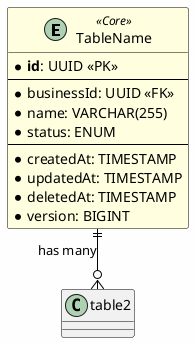

---
# YAML Frontmatter - DO NOT DELETE
# This metadata improves semantic search, RAG retrieval, and MCP tool discovery
document_type: "database-schema" # REQUIRED: Type of document (database-schema, api-design, ux-flow, feature-design, adr, sync-strategy, general)
module: "[module-name]" # REQUIRED: Module/feature name (e.g., "inventory", "sales", "payments")
status: "approved" # REQUIRED: draft | in-review | approved | deprecated
version: "1.0.0" # REQUIRED: Semantic versioning (Major.Minor.Patch)
last_updated: "YYYY-MM-DD" # REQUIRED: ISO date format
author: "@username" # REQUIRED: GitHub username or team

# Keywords for semantic search (MCP/RAG optimization)
keywords:
  - "database"
  - "schema"
  - "postgresql"
  - "prisma"
  - "[entity-name]" # Add specific entities (e.g., "product", "inventory")
  - "[domain]" # Add domain (e.g., "inventory-management", "sales")

# Related documentation (for cross-referencing)
related_docs:
  api_design: "" # Path to related API design doc
  ux_flow: "" # Path to related UX flow doc
  feature_design: "" # Path to related feature design doc
  sync_strategy: "" # Path to related sync strategy doc

# Database metadata
database:
  engine: "PostgreSQL"
  min_version: "16.0"
  prisma_version: "5.0+"

# Schema statistics (update after completion)
schema_stats:
  total_tables: 0
  total_indexes: 0
  total_constraints: 0
  estimated_rows: "TBD" # e.g., "<1K", "1K-10K", "10K-100K", "100K+"
---

<!-- AI-INSTRUCTION: START -->
<!--
  This document is a TEMPLATE for Database Schema Documentation.

  PURPOSE: Define database structure (tables, columns, indexes, constraints) ONLY.

  CRITICAL RULES:
  1. NO UI/UX flows or user interaction logic
  2. NO business logic implementation (algorithms, workflows)
  3. NO API endpoint definitions or controller logic
  4. NO frontend component specifications
  5. FOCUS ON: Tables, columns, data types, relationships, indexes, constraints, triggers

  WHERE TO DOCUMENT OTHER ASPECTS:
  - UI/UX Flows > docs/technical/frontend/ or Feature Design docs
  - Business Logic > docs/technical/backend/features/
  - API Design > Feature Design docs or ADRs
  - Sync Strategy > docs/technical/architecture/ or ADRs
  - Algorithms > Feature Design docs or specific technical docs

  Keep this document as the Single Source of Truth for DATABASE STRUCTURE only.
-->
<!-- AI-INSTRUCTION: END -->

<table width="100%" border="0" cellspacing="0" cellpadding="0">
  <tr>
    <td width="120" align="center" valign="middle">
      
    </td>
    <td align="left" valign="middle">
      <h1 style="margin: 0; border-bottom: none;">Schema [Number] - [Schema Name]</h1>
      <p style="margin: 0; color: #6e7681; font-size: 1.1em;">Database Schema Design</p>
    </td>
  </tr>
</table>

<div align="center">

  <!-- METADATA BADGES -->
  
  
  

</div>

---

## Agent Directives (System Prompt)

_This section contains mandatory instructions for AI Agents (Copilot, Cursor, etc.) interacting with this document._

| Directive      | Instruction                                                                                  |
| :------------- | :------------------------------------------------------------------------------------------- |
| **Context**    | This document defines the database structure for the [Schema Name] schema in PostgreSQL 16+. |
| **Scope**      | ONLY tables, columns, data types, relationships, indexes, constraints, and triggers.         |
| **Constraint** | NO UI flows, NO business logic, NO API design. Database structure ONLY.                      |
| **Related**    | `apps/backend/prisma/schema.prisma`, DATABASE-DESIGN.md                                      |
| **Pattern**    | Multi-tenant (businessId), Soft Deletes (deletedAt), Optimistic Locking (version)            |

---

## 1. Executive Summary

_High-level overview of this schema's purpose and scope._

**Purpose:** [e.g. "Manage product catalog, inventory levels, and stock movements for POS operations"]

**Key Capabilities:**

- [Capability 1]
- [Capability 2]
- [Capability 3]

**Entity Count:** [X] tables

**Dependencies:**

- **Reads from:** [Other schemas this schema depends on]
- **Written by:** [Other schemas that write to this schema]

---

## 2. ER Diagram



---

## 3. Entity Definitions

### 3.1. [TableName]

**Purpose:** [What this table stores and why]

**Type:** Core | Lookup | Junction | Audit

#### Schema: `[schema_name].[TableName]`

| Column         | Type                | Nullable | Default              | Description                                                 |
| :------------- | :------------------ | :------- | :------------------- | :---------------------------------------------------------- |
| **id**         | `UUID`              | NOT NULL | `uuid_generate_v4()` | Primary key                                                 |
| **businessId** | `UUID`              | NOT NULL | -                    | Foreign key to `business.Business` (multi-tenant isolation) |
| **name**       | `VARCHAR(255)`      | NOT NULL | -                    | [Field description]                                         |
| **status**     | `ENUM`              | NOT NULL | `'ACTIVE'`           | Possible values: `ACTIVE`, `INACTIVE`, `ARCHIVED`           |
| **metadata**   | `JSONB`             | NULL     | `'{}'`               | Flexible key-value storage for extensibility                |
| **createdAt**  | `TIMESTAMP WITH TZ` | NOT NULL | `NOW()`              | Record creation timestamp                                   |
| **updatedAt**  | `TIMESTAMP WITH TZ` | NOT NULL | `NOW()`              | Last update timestamp (auto-updated by trigger)             |
| **deletedAt**  | `TIMESTAMP WITH TZ` | NULL     | `NULL`               | Soft delete timestamp                                       |
| **version**    | `BIGINT`            | NOT NULL | `1`                  | Optimistic locking version counter                          |

#### Indexes

```sql
-- Primary Key
CREATE UNIQUE INDEX pk_table_name ON schema_name.TableName(id);

-- Business Tenant Isolation
CREATE INDEX idx_table_name_business ON schema_name.TableName(businessId) WHERE deletedAt IS NULL;

-- Composite Index for Common Query
CREATE INDEX idx_table_name_status ON schema_name.TableName(businessId, status) WHERE deletedAt IS NULL;

-- Full-Text Search (if applicable)
CREATE INDEX idx_table_name_search ON schema_name.TableName USING GIN(to_tsvector('english', name));
```

#### Foreign Keys

```sql
-- Relationship to Business
ALTER TABLE schema_name.TableName
ADD CONSTRAINT fk_table_business
FOREIGN KEY (businessId) REFERENCES business.Business(id)
ON DELETE CASCADE;
```

#### Relationships

- **business.Business** (Many-to-One): Each record belongs to one business
- **[OtherTable]** (One-to-Many): [Relationship description]

#### Example Records

```sql
INSERT INTO schema_name.TableName (id, businessId, name, status) VALUES
  ('550e8400-e29b-41d4-a716-446655440001', '123e4567-e89b-12d3-a456-426614174000', 'Example 1', 'ACTIVE'),
  ('550e8400-e29b-41d4-a716-446655440002', '123e4567-e89b-12d3-a456-426614174000', 'Example 2', 'INACTIVE');
```

---

### 3.2. [NextTableName]

_[Repeat structure from 3.1 for each table]_

---

## 4. Data Integrity Constraints

### 4.1. Unique Constraints

```sql
-- Prevent duplicate [field] per business
CREATE UNIQUE INDEX idx_table_unique_field
ON schema_name.TableName(businessId, fieldName)
WHERE deletedAt IS NULL;
```

### 4.2. Check Constraints

```sql
-- Ensure [field] is positive
ALTER TABLE schema_name.TableName
ADD CONSTRAINT chk_table_field_positive
CHECK (fieldName > 0);

-- Ensure ENUM values are valid
ALTER TABLE schema_name.TableName
ADD CONSTRAINT chk_table_status
CHECK (status IN ('ACTIVE', 'INACTIVE', 'ARCHIVED'));
```

### 4.3. Triggers

```sql
-- Auto-update 'updatedAt' on record modification
CREATE OR REPLACE FUNCTION update_updated_at_column()
RETURNS TRIGGER AS $$
BEGIN
  NEW.updatedAt = NOW();
  RETURN NEW;
END;
$$ LANGUAGE plpgsql;

CREATE TRIGGER trg_table_updated_at
BEFORE UPDATE ON schema_name.TableName
FOR EACH ROW EXECUTE FUNCTION update_updated_at_column();
```

```sql
-- Custom business logic trigger (if needed)
CREATE OR REPLACE FUNCTION check_business_logic()
RETURNS TRIGGER AS $$
BEGIN
  -- Example: Prevent deletion if related records exist
  IF OLD.deletedAt IS NULL AND NEW.deletedAt IS NOT NULL THEN
    IF EXISTS (SELECT 1 FROM schema_name.RelatedTable WHERE tableId = OLD.id) THEN
      RAISE EXCEPTION 'Cannot delete: related records exist';
    END IF;
  END IF;
  RETURN NEW;
END;
$$ LANGUAGE plpgsql;

CREATE TRIGGER trg_table_business_logic
BEFORE UPDATE ON schema_name.TableName
FOR EACH ROW EXECUTE FUNCTION check_business_logic();
```

---

## 5. Performance & Indexing Strategy

### 5.1. Index Coverage

| Table       | Index Columns                  | Type            | Purpose                            |
| :---------- | :----------------------------- | :-------------- | :--------------------------------- |
| `TableName` | `(businessId, status)`         | B-Tree          | Filter active records per business |
| `TableName` | `(businessId, createdAt DESC)` | B-Tree          | Recent records dashboard           |
| `TableName` | `name`                         | GIN (Full-Text) | Fast text search                   |

### 5.2. Common Query Patterns

```sql
-- Query 1: Get active records for business
SELECT * FROM schema_name.TableName
WHERE businessId = ? AND status = 'ACTIVE' AND deletedAt IS NULL
ORDER BY createdAt DESC;

-- Query 2: Search by name (full-text)
SELECT * FROM schema_name.TableName
WHERE businessId = ?
  AND to_tsvector('english', name) @@ to_tsquery('english', ?)
  AND deletedAt IS NULL;

-- Query 3: Count records by status
SELECT status, COUNT(*) as count
FROM schema_name.TableName
WHERE businessId = ? AND deletedAt IS NULL
GROUP BY status;
```

### 5.3. Partitioning Strategy (Optional)

_Only if tables are expected to grow to millions of rows._

```sql
-- Example: Partition by createdAt (monthly)
CREATE TABLE schema_name.TableName (
  -- ... columns ...
) PARTITION BY RANGE (createdAt);

CREATE TABLE schema_name.TableName_2025_01 PARTITION OF schema_name.TableName
FOR VALUES FROM ('2025-01-01') TO ('2025-02-01');
```

---

## 6. Migration Strategy

### 6.1. Initial Schema Creation

```bash
# Generate Prisma migration
npx prisma migrate dev --name "add_schema_name_tables"

# Apply to staging
npx prisma migrate deploy
```

### 6.2. Data Migration (if applicable)

```sql
-- Example: Migrate data from old structure to new
INSERT INTO schema_name.NewTable (id, businessId, name)
SELECT id, businessId, old_name
FROM schema_name.OldTable
WHERE deletedAt IS NULL;
```

### 6.3. Rollback Plan

```sql
-- Drop tables in reverse dependency order
DROP TABLE IF EXISTS schema_name.TableName CASCADE;
```

---

## 7. Maintenance & Housekeeping

### 7.1. Soft Delete Cleanup

```sql
-- Permanently delete records soft-deleted > 90 days ago
DELETE FROM schema_name.TableName
WHERE deletedAt IS NOT NULL
  AND deletedAt < NOW() - INTERVAL '90 days';
```

### 7.2. Index Maintenance

```sql
-- Rebuild indexes (run during low-traffic periods)
REINDEX TABLE schema_name.TableName;

-- Analyze table statistics
ANALYZE schema_name.TableName;
```

---

## 8. Security Considerations

### 8.1. Sensitive Fields

| Field         | Sensitivity | Access Control                          |
| :------------ | :---------- | :-------------------------------------- |
| `[fieldName]` | HIGH        | Only users with `[PERMISSION]` can view |

### 8.2. Row-Level Security (RLS)

```sql
-- Enable RLS on table
ALTER TABLE schema_name.TableName ENABLE ROW LEVEL SECURITY;

-- Policy: Users can only see their own business's data
CREATE POLICY policy_table_business_isolation
ON schema_name.TableName
FOR ALL
USING (businessId = current_setting('app.current_business_id')::UUID);
```

---

## 9. Testing Considerations

### 9.1. Test Data Generation

```sql
-- Generate test records
INSERT INTO schema_name.TableName (id, businessId, name, status)
SELECT
  gen_random_uuid(),
  '123e4567-e89b-12d3-a456-426614174000',
  'Test Record ' || generate_series,
  CASE WHEN random() > 0.5 THEN 'ACTIVE' ELSE 'INACTIVE' END
FROM generate_series(1, 1000);
```

### 9.2. Performance Benchmarks

```sql
-- Measure query performance
EXPLAIN ANALYZE
SELECT * FROM schema_name.TableName
WHERE businessId = '123e4567-e89b-12d3-a456-426614174000'
  AND status = 'ACTIVE'
  AND deletedAt IS NULL;
```

---

## 10. References

- [DATABASE-DESIGN.md](../DATABASE-DESIGN.md) - Master database design document
- [Prisma Schema](../../../apps/backend/prisma/schema.prisma) - Prisma ORM definitions
- [Related ADRs](#) - Architectural decisions affecting this schema

---

## Appendix A: Change Log

| Date       | Version | Author  | Changes                            |
| :--------- | :------ | :------ | :--------------------------------- |
| YYYY-MM-DD | 1.0.0   | @Author | Initial schema design              |
| YYYY-MM-DD | 1.1.0   | @Author | Added [TableName], updated indexes |

---

## Appendix B: Open Questions

- [ ] **Performance:** Will [TableName] need partitioning at scale?
- [ ] **Business Logic:** Should [constraint] be enforced at DB level or application level?
- [ ] **Migration:** How to handle existing data when adding [field]?
